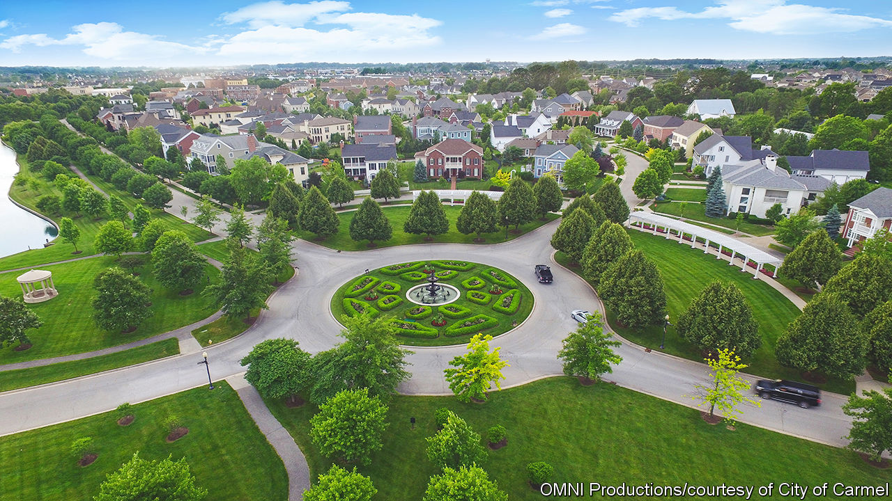

###### Roundabout magic

# What Carmel, Indiana, can teach America about urbanism 

##### Growth is popular, if it is well planned 

 

> Sep 29th 2022 

In 1995, when Jim Brainard, then a lawyer, fought the Republican primary to become the mayor of Carmel, Indiana, his city was a modest suburb of Indianapolis with a population of around 35,000 people. Walking around its sprawling tract housing, and talking to residents about what they wanted for their town, he found a theme. People said things like: “I wish I could walk to a restaurant.” On winning the primary, knowing that he wouldn’t face much opposition in the general election, Mr Brainard devoted himself to studying urban planning. “I have a theory that our architecture got very boring and bad about the time we all got in cars and stopped walking around looking at it,” he says.

Since Mr Brainard became mayor Carmel’s population has almost tripled, to over 100,000 people. A few decades ago it had only a small central “historic district”. Now it has an actual “downtown” full of apartments, restaurants and shops, as well as a fancy music auditorium and two theatres. In summer families rock up on bicycles to watch children’s films projected on a screen in a new square. Nearby streets are lined with terraced houses that resemble Victorian ones, even though they were built in this century. Visitors on foot do not have to cross enormous expanses of tarmac to get anywhere. 

A majority of Americans now live in suburbs. But while their residents are changing much like America, becoming more diverse, older and with a wider range of incomes, many of the suburbs themselves have barely changed in decades. Most new housing in America is built either in brand new tracts at the edge of big cities or in apartments in the centre. With the right policies, however, America’s suburbs could produce plenty more housing, argues Alan Mallach, a fellow at the Centre for Community Progress, a non-profit. They have more land, are close to jobs, and already have infrastructure in place. Carmel offers lessons on how to achieve that. It is also a case study of the enormous power a single mayor can have to create change, if he or she can sell it.

The key to Mr Brainard’s power was not only the realisation that many people like to live in more walkable neighbourhoods but also that providing them can save the city money. Low-density suburbs cost a lot to maintain: when houses are further apart they need longer roads and sewage lines, and the bin men have to travel further between each one. A single mile of road can cost $15m to build, and must be maintained. A new block of flats, by contrast, adds far less to a city’s expenses, and yet their residents still pay property taxes. Even terraced houses cost a lot less.

In the past 20 years Carmel has taken advantage of this using “tax increment financing”. To illustrate how this works, Mr Brainard points to an ageing strip mall which the city has purchased. Its nine acres of land, most of which is used for parking and is empty much of the time, currently generates around $61,000 in tax revenue each year. The city is working with a developer who will rebuild it with five-storey apartments and shops, with parking underground. This costs a lot upfront (the city has to subsidise the parking to get the developers on board) but Mr Brainard reckons that when it is finished it will generate $3m per year in property taxes. Even after servicing the loan, that will leave a hefty chunk behind for the city. “Sprawl kills cities,” he says.

Unlike suburbs in places such as New Jersey or outside Washington, Carmel is densifying without the benefits of a decent regional public-transport system. That requires hiding the cars underground. But it also brings in one of Mr Brainard’s other innovations, the roundabout. The city now has 145 of them, far more than any other American city. Because they slow down cars and make “T-Bone” collisions less likely, roundabouts are safer. The city’s traffic-death rate is a fifth of the rate nationwide. But because cars do not get stuck at lights, roundabouts also increase capacity. That allows the city to grow without needing to widen its roads. In a few places it has even narrowed them. It has shrunk one that goes through the centre from five lanes to just two. Now the city sells t-shirts boasting about its roundabouts.

How big could Carmel get? Asked this, Mr Brainard jokingly notes that Manhattan supports 1.6m people on half of the land area. Increasing its population 30 times might be difficult: even with underground garages and roundabouts, all those cars still take up space. In reality, Carmel looks more like a richer version of Milton Keynes, a city of 200,000 people in southern England that is also famous for its roundabouts. But growth works. Drawn by the new residents, employers have moved in too, and more people now commute to work in Carmel than leave it each day. With housing getting less affordable in big cities, and many suburbs struggling with the costs of ageing infrastructure, it provides a promising model of how to improve. A few mayors could make a trip to Indiana to see how to do it. ■

