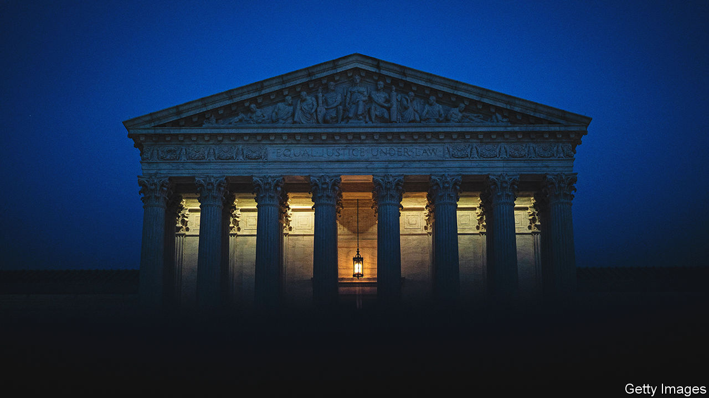

###### Back to the bench

# What to expect from the new SCOTUS term 

##### Rulings on gay rights, affirmative action and elections will make some Americans very cross 

 

> Sep 29th 2022 

Three months after scrapping abortion rights, fortifying the right to bear arms and bulldozing the church-state wall, the Supreme Court’s six-justice conservative majority will take to the bench on October 3rd to reconsider more areas of American law and life. Sprinkled among the 27 cases the court has agreed to hear in its new term (about half of its eventual docket) are a few that—like last year’s crop—offer opportunities to overhaul decades-old principles.

Among the longest-enduring precedents under review are decisions permitting universities to consider race in admissions. In  (1978) and  (2003), the justices told admissions committees they cannot set racial quotas but may consider applicants’ race as one factor among many to achieve the “educational benefits that flow from a diverse student body”. 

In a pair of cases involving Harvard University and the University of North Carolina being argued on October 31st, Edward Blum, a conservative campaigner, argues that  is “grievously wrong” and should be overturned. After ending up one vote short six years ago in , Mr Blum has brighter prospects with revamped tactics, a new organisation, Students for Fair Admissions (SFFA), and a court that has been transformed by Donald Trump’s three appointees. 

SFFA argues that Harvard “crudely” considers racial identity, favours black and Hispanic applicants and discriminates against Asian-Americans by giving them “by far the worst scores” in soft metrics like “integrity”, “courage” and “kindness”. Harvard contends race plays no part in these ratings. Both universities argue—in line with conservative justices’ concern with the original meaning of the constitution—that the framers of the 14th amendment “embraced measures that took race into account”, such as the Freedmen’s Bureau (providing land, education and other aid to African-Americans), “far more expansively” than the limited uses of race in their admissions procedures.

Race is also at the centre of , a case coming up on October 4th that asks what section 2 of the Voting Rights Act of 1965 (VRA) says about redistricting battles in Alabama and beyond. In January a federal district court found that Alabama’s new congressional map discriminated against black voters, who make up about 27% of the population, by including only one black-majority district among its seven. It ordered the legislature to redraw the map with a second black-majority district. Over dissents from the three liberal justices and Chief Justice John Roberts, the Supreme Court promptly blocked that order. Now the court will revisit a complex test laid out in , a 1986 case explaining when a map falls foul of the VRA by diluting minority voters’ power.

According to Michael Li of the Brennan Centre for Justice, a think-tank, the justices risk turning the vra on its head by holding that it is “somehow racially discriminatory” to “remedy racial discrimination”. But Mr Li worries more about what a win for the plaintiffs in the affirmative-action cases might mean for voting rights. If the 14th Amendment is read to require strict race-neutrality, state-level rules for electoral maps to keep so-called “communities of interest” together may be lost, too.

An even more radical outcome is possible in , a case asking whether state legislatures may dictate the terms of congressional elections unburdened by provisions in their state constitutions or rulings of their state courts.  stems from a gerrymandered map drawn to ensure that in North Carolina—where Democrats and Republicans poll evenly in national elections—ten of the 14 congressional districts would go to Republicans. When the North Carolina Supreme Court deemed the map a violation of the state constitution’s “free elections clause”, Republican legislators balked and asked the us Supreme Court to declare them all-but autonomous under the constitution.

Most scholars consider the “independent state legislature theory” illogical and inconsistent with the text and history of the constitution. But four justices flirted with it in the run-up to the 2020 presidential election—possibly making  contingent on the vote of Justice Amy Coney Barrett, who has not yet expressed a view. Richard Pildes, a law professor at New York University, says a victory for the plaintiffs could “massively destabilise” federal elections. Curbs on partisan gerrymandering would be just one type of rule to fall. Mr Pildes notes that a host of other voter-initiated amendments and state-constitutional provisions—including mail-in voting rules, voter-ID requirements and Alaska’s ranked-choice voting—“might all suddenly be unconstitutional”.

Then, in a rehash of a 2018 clash between LGBT rights and religious scruples,  involves Lorie Smith, a website designer who wants to start making websites for straight—but not gay or lesbian—weddings. This time the First Amendment claim against Colorado’s anti-discrimination law involves freedom of speech, not the free exercise of religion. According to Amanda Shanor of the University of Pennsylvania, this framing poses tricky questions for the justices.

Less ideological but equally fraught cases include disputes over California’s strict rules for raising pigs (which might make life difficult for pork producers in other states) and what counts as “fair use” in a copyright case involving an Andy Warhol portrait based on a photograph of Prince, the musician. Justice Ketanji Brown Jackson takes over for her former boss, Stephen Breyer, amid a flurry of contentious cases, historically low approval for the Supreme Court among the public and swirling questions about its legitimacy. ■

