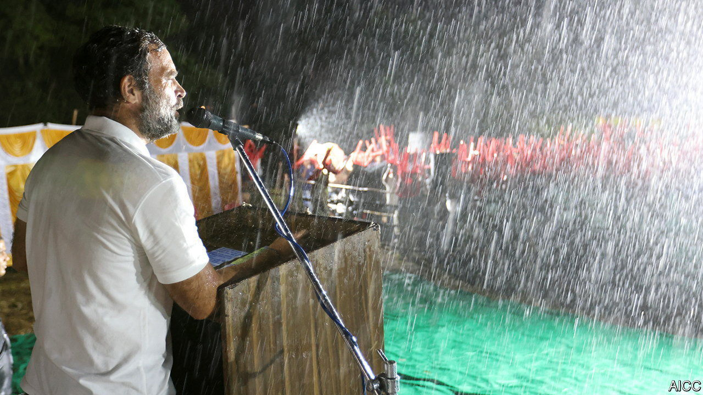

###### Pantomime politics

# India’s Congress party seems determined to prove its critics right 

##### The Gandhi family and their toadies appear unable to relinquish any power 

 

> Oct 6th 2022 

IT seemed like a test in a hero’s journey, that ancient Indo-European narrative form. On October 2nd Rahul Gandhi was delivering a message of love and brotherhood to his countryfolk in the state of Karnataka when the heavens opened. Unperturbed, the sodden princeling of the country’s main opposition party, the Congress, carried on. He was on only the 25th day of his five-month, 3,570km  (Unite India march), a bid to revive his struggling party as the counterweight to the ruling Bharatiya Janata Party (BJP) of Narendra Modi, the prime minister. “Neither rain, heat, nor storms can stop this ,” he extemporised. 

Alas for Mr Gandhi, his message of unity failed to get through to his own party members. As he was getting soaked in Karnataka, his family’s lieutenants back in Delhi, India’s capital, were busy with another round of the self-sabotage that has hobbled the Congress for years. 

The latest brouhaha arose from what was, in theory, a good idea. In August the party announced that, for the first time in over 20 years, it would hold elections to choose a new president, rather than allow Mr Gandhi, his sister Priyanka and their mum Sonia, who have long run the Congress as a , to anoint one. The hope was that a talented politician not called Gandhi might be able to repair the image of the party, which voters associate with nepotism and incompetence. It has lost 90% of seats in national elections in which it directly faced off against the BJP since 2014, according to a database maintained by Ashoka University near Delhi.

India’s baroque democracy has plenty of strong regional parties which can, and often do, best the BJP in state elections. But they have little clout or organising power at the national level. With the next general election less than two years away, the ability of the Congress to lead a credible coalition against the BJP is crucial. For all its , it remains the only other party with a national presence. 

Yet its ineptitude at winning elections extends to conducting them, too. Shashi Tharoor, a charismatic MP and former diplomat who is not part of the Gandhis’ inner circle, announced his candidacy early on. But it quickly became apparent that Mrs Gandhi, the matriarch, favoured Ashok Gehlot, the chief minister of the big, poor north-western state of Rajasthan. Party rules meant that Mr Gehlot would have had to step down from his post in Rajasthan before taking over as Congress president. This prompted resistance from members of his state’s legislature, who opposed the party high command’s favoured successor for his job. On September 29th Mr Gehlot withdrew his candidacy, preferring to keep his current powerful job rather than become a figurehead bossed around by miscellaneous Gandhis.

Mr Gehlot’s sudden exit from the contest left the top brass scrambling for a replacement. Though the party stresses that the leadership endorses no candidate, few doubt that Mallikarjun Kharge, an 80-year-old Congress veteran, is the Gandhis’ man. He will now face off against Mr Tharoor on October 17th, and will probably win. 

Mr Gandhi himself appears equivocal about leading the party. He resigned from the presidency and handed it back to his mother after  in 2019. Yet he has failed to nurture talent or create an effective party machinery. Nor has he used his power to enforce an actual democratic contest for the presidency. On October 2nd Mr Kharge, cheered on by the party establishment, suggested to Mr Tharoor that it would be best if the party found a “consensus candidate”, implying that Mr Tharoor should withdraw. None of the Gandhis contradicted him. The next day a Congress bigwig told the Wire, an online news site, that any winner would in any case be the “lesser” leader to Mr Gandhi.

The farce will roll on for another few days yet. Mr Modi and his supporters, at least, will get a chuckle out of it. For the many Indians who would like to see a viable opposition, it is another act in the long-running tragedy of the Congress party. ■

