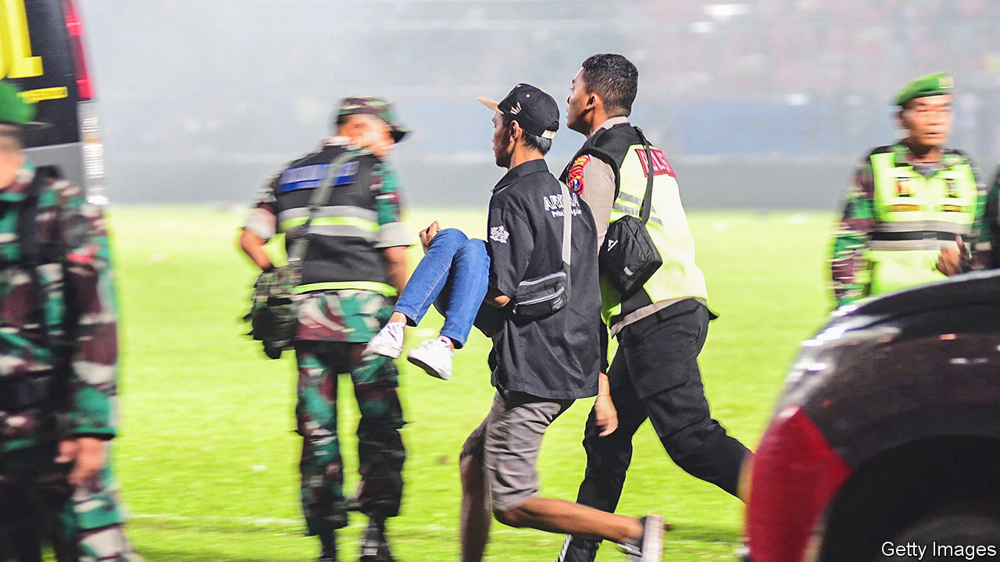

###### A nation at a loss

# Indonesia’s football tragedy puts the spotlight on its police force 

##### It is widely seen as unaccountable and too powerful 

 

> Oct 6th 2022 

After a painful 3-2 defeat to their arch-rivals Persebaya Surabaya on home turf in Malang, a city on the Indonesian island of Java, Arema Football Club’s players might have been dreading the customary talking-to from the manager. Instead, the dressing room in their Kanjuruhan Stadium became a place to line up corpses. Players cradled the bodies of dying fans. Out in the corridors, tear gas choked the air. 

The pandemonium began just after the final whistle blew on October 1st, when some 3,000 Arema fans ran on to the pitch. Videos show police in riot gear chasing them off the field, beating some with batons. Police then fired round after round of tear gas into the stands, in an apparent attempt to disperse the crowd. That it did, but not without triggering a stampede for the exit. By the time the chaos subsided, at least 131 people had died, including 33 children. It is the worst sporting disaster to occur anywhere in nearly six decades. 

Indeed, the tragedy in Malang is nearly identical to one in 1964, when Peruvian police responded with tear gas to a pitch invasion during a match against Argentina, causing a stampede that killed 328 people. FIFA, football’s global governing body, has long banned the use of tear gas at its tournaments. Yet the rules are mere “guidelines” when it comes to domestic fixtures such as the one in Malang. Making matters worse, local officials had sold 4,000 tickets over Kanjuruhan’s capacity of 38,000. And though the stadium usually opens its exits ten minutes before the end of a game, this time they stayed locked.

Indonesian football already had a reputation for danger. Hooliganism is rife. When rival clubs square off, as in this case, only supporters of the home side are permitted to attend. Many fan groups prepare for skirmishes anyway. Between 1995 and this month, 86 people had died at football matches in Indonesia, usually in clashes between fans, according to Save Our Football, a campaign group. 

The tragedy highlights a deeper problem. Indonesia’s national police—Polri for short—has  since the military retreated from public life after democratisation in 1998. Budgets have grown, but accountability has not. Polri is seen by many Indonesians as heavy-handed, ineffective and corrupt. Allegations surfaced this year that Ferdy Sambo, an influential policeman, had arranged the murder of his aide and covered it up. It took widespread outrage, and many interventions by the president, Joko Widodo (better known as Jokowi), before Polri held a proper investigation. “This is a cultural problem,” says Dominique Nicky Fahrizal of the Centre for Strategic and International Studies, an American think-tank.

Jokowi has paused all football pending a fresh review of stadium security. The scale of the calamity suggests that someone will have to be held responsible. The head of Polri has sacked the Malang police boss and suspended nine other officials from their posts. The 18 cops who fired tear gas are under investigation. The government has announced it will form a “fact-finding team”, which will report back to the president within a month explaining what went wrong and who is to blame. 

Yet it will do little to diminish the power of Polri. Jokowi, who entered politics as an outsider with no military ties, has  even more than is typical for a president. Polri is “actively building legal cases against government opponents, silencing critics and persecuting those who threaten the president’s power”, writes Made Supriatma of the ISEAS-Yusof Ishak Institute, a think-tank in Singapore. The police expect to receive impunity in exchange for such favours, says Jacqui Baker, a lecturer at Murdoch University in Australia. Promising pushes for reform after the Sambo scandal have lost momentum. 

Jokowi’s normally sky-high approval ratings have sagged in recent months, as inflation bites and voters fume at his cuts to fuel subsidies. Providing justice for the victims of Malang would be a big boost. But any deeper reform would be politically difficult. In Indonesia’s flawed democracy, it can be a dangerous game if the police do not believe you are on their side.■

