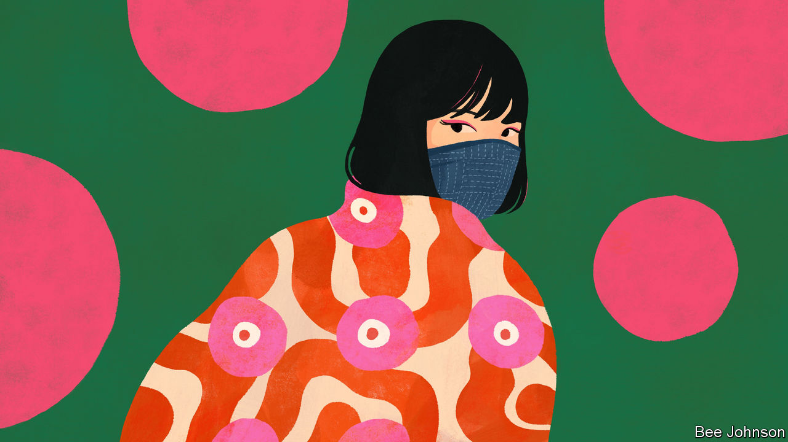

###### Cover story

# Many Japanese are still reluctant to go unmasked 

##### Why get a face lift when you can get a face covering? 

 

> Oct 6th 2022 

ZAWACHIN, a Japanese celebrity, has long been known for her stylish face masks. When she started her career a decade ago, wearing masks helped draw attention to her lavishly made-up eyes. With time, masks became part of her brand, and she carved out a niche as a “mask influencer”. The pandemic brought her passion to the masses. Now she not only promotes new masks, she also advises those suffering from “mask addiction” on how to take them off.

Even before covid-19 arrived, mask use was common in Japan. Many wore them as a barrier against pollen during hay-fever season or to protect others when sniffly. During the pandemic, the practice , though the government has never enforced a mask mandate. It looks set to continue. A recent survey showed that half of Japanese would like to keep wearing masks as much as possible, regardless of medical advice or rules. 

Some reckon the attachment to masks is a function of social conformity. Since mask-wearing has become common practice, no one wants to be the one to buck the trend. “In Western countries if there’s coercion, people feel their freedom is invaded, but in Japan people feel it is fair if everyone is doing it,” says Yonaha Jun, a cultural critic. 

Japanese communicative culture may place a greater emphasis on the eyes than the mouth. Consider emoticons (or their newer avatar, emoji), says Yamaguchi Masami of Chuo University: in the West, the shape of the mouth changes the expression, such as :-P or :-D. In Japan, the eyes do: (&gt;&lt;) or ^^. Ms Yamaguchi, who has conducted studies on how facial expressions are perceived, reckons that people in East Asia tend to spend relatively more time looking at the eyes of a speaker, while Westerners focus more on the mouth. Masks, she argues, are thus less of an impediment to socialising. 

Moreover, young people have discovered that masks can be useful for covering up unflattering features, blemished skin or crooked teeth. Men can get away without shaving, and women without putting on make-up. Some young women believe masks make their eyes seem larger and prettier.

A new lexicon has emerged. Some call masks “”, or “face underwear”, reflecting how essential they have become. Among adults, a “”, or “mask beauty” is someone who looks beautiful in a mask; a “”, or “mask fraud”, is someone who looks good with one on, but less so with it off. Fear of being deemed a mask fraud is another reason to keep the things on.

Zawachin’s advice is to take it slowly. “It takes a lot of courage to take it off all at once,” she says. Try spending a few days with the mask below your nose, then shift to wearing it below your lips, and finally below your chin. Eventually, she suggests, it will start to feel normal to live without a mask. ■


