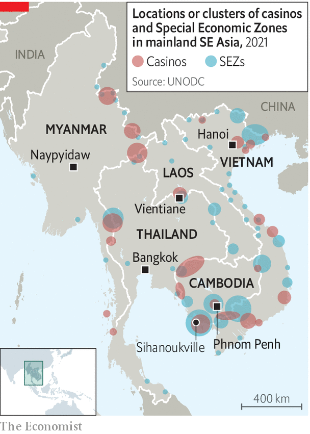

###### Victims fleecing victims

# The gangs that kidnap Asians and force them to commit cyberfraud 

##### Syndicates in Cambodia and Myanmar have coerced thousands into scamming others 

 

> Oct 6th 2022 

THINGS WERE looking up for Bilce Tan. The 41-year-old Malaysian had lost his job at the height of the pandemic and had spent months looking for work. Then in May, a fantastic opportunity came his way. After multiple interviews, a Malaysian company offered him a job as a business-development lead at their office in Sihanoukville, a resort town in Cambodia. The company would pay him 12,000 ringgit ($2,588) a month—far more than he could make in Malaysia. The benefits included free room and board at an apartment block that boasted a gym. Mr Tan accepted. 

It was not long after he arrived in Sihanoukville that Mr Tan began to feel uneasy. At the resort where his employers had their office, armed guards patrolled the boundaries. The walls were topped with barbed wire. During training, his instructors taught him how to defraud people online. When he protested, his bosses shrugged. There was no way out of the compound, they told him. He was trapped. 

Mr Tan’s story is a common one. Over the past few years, tens of thousands of Asians have been lured to casinos and resorts in Cambodia, Laos and Myanmar, only to find that their “employers” are in fact criminals who force their “new hires” to work in illegal online-gambling or scamming outfits.

The cons are sophisticated. Mr Tan was furnished with fake social-media accounts, ten mobile phones, a list of targets and information about their assets, relationships and education, as well as scripts tailored to different types of prey. His handlers taught him how to win over vulnerable people like pensioners and single parents by chatting with them every day. 

His trainers also supplied him with photos and videos to support the back stories of his many personas. Once the mark’s trust had been gained, the real scam began. Rather than asking for money directly, as in a traditional sting, he urged the victim to deposit cryptocurrencies in an investment platform manipulated by the criminals. The sums involved grew bigger and bigger. Often the mark would, at first, be able to make small withdrawals. Satisfied that the platform was legitimate, the target would deposit ever more. Then, one day, the invented persona would disappear, leaving behind a baffled and broke victim. (Mr Tan claims he never managed to con anyone.)

The 1,200 victims of similar scams known to the Global Anti-Scam Organisation, a support group, have collectively lost $250m. Twice that amount was lost by those who contacted CipherBlade, an investigation firm, last year. Total losses for 2021 may have been in the tens of billions, since the “vast majority” of victims do not report the crime, reckons CipherBlade. Precise estimates are impossible, but the International Justice Mission, an ngo, guesses that syndicates in Cambodia take in some $12bn a year from online fraud. 

 


The schemes are organised by ethnic-Chinese gangs, which sometimes collaborate with their local counterparts, says Jeremy Douglas of the United Nations Office on Drugs and Crime. At first the criminals invested in casinos—ideal venues for money-laundering. When the Chinese authorities cracked down on illicit domestic gambling a decade ago, the syndicates moved their operations south, finding a hospitable environment in the lawless eastern bits of Myanmar and the scores of  across Indochina (see map), where local authorities seem to believe that they lack jurisdiction. 

With the closure of borders at the onset of the pandemic, the casinos’ patrons, most of whom were Chinese, vanished. So the syndicates went online and cast a wider net, targeting the Chinese diaspora and anyone else with money, wherever they lived. They quickly turned their sights on Americans, Australians, Europeans and the middle classes of South-East Asia, too. But to hook them, they would need digitally savvy workers who could speak English or South-East Asian languages. 

The syndicates procured their workforce by entrapping people like Mr Tan. Though some work willingly, many are held against their will. According to the Cambodian government, the syndicates employ between 80,000 and 100,000 foreigners—probably a conservative estimate, says Jacob Sims of IJM. Most are deceived into travelling to Cambodia. 

The first reports of human trafficking emerged in local media in early 2021. IJM conducted its first rescue in April of that year. Since then, foreign embassies in Cambodia have been working frantically to extract their citizens. Some are released when their families pay thousands of dollars in ransom. Others manage to escape. A few throw themselves off balconies. The governments of at least eight Asian countries have warned their citizens about too-good-to-be-true jobs in Cambodia. 

At first the Cambodian government stuck its head in the sand. But with pressure from China and other countries mounting, Hun Sen, the prime minister, last month announced a crackdown on “illegal gambling”, an umbrella term for criminality associated with . Since then the authorities in Sihanoukville and Phnom Penh, the capital, have conducted raids on the biggest compounds, arresting hundreds of people. But even if Cambodia does manage to boot out the cyber-scammers, they will simply relocate to more-welcoming spots in Laos or Myanmar. 

Free and safely back in Malaysia, Mr Tan is one of the lucky ones. Yet he struggles to see it that way. Before he escaped, his captors took his bank cards and phone. They then locked him out of his bank accounts, preventing him from accessing his life savings. Before he had a chance to explain to his wife that he had been kidnapped, she blocked his number. His former captors began posting her personal information online. She believes Mr Tan was responsible and now wants a divorce. Mr Tan escaped. But, like victims the world over, he too has paid a steep price. ■

