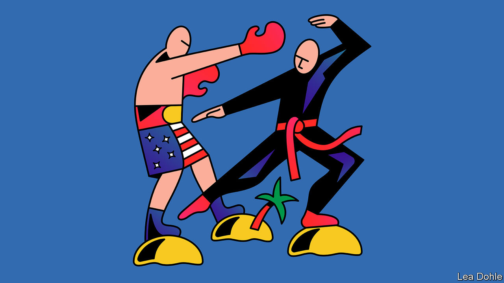

###### Banyan

# What Pacific island states make of the great-power contest over them 

##### China and America are both trying to woo the tiny countries. They will not easily be swayed 

 

> Oct 6th 2022 

TO STRATEGIC PLANNERS in Beijing and Washington, the newest locus of an intense great-power contest between China and the United States and its allies is self-evident: the vast southern sweep of the Pacific Ocean and its island states. The West first grew concerned in 2018, when a government-directed Chinese bank said it would fund the construction of a wharf in Vanuatu, north-east of Australia. The government in Canberra, Australia’s capital, feared it might be a precursor to a Chinese naval base in the region (it wasn’t). Then, three years ago, Chinese financial and other blandishments led Kiribati and the neighbouring Solomon Islands to switch their diplomatic allegiance from Taiwan, with which they had had ties for decades.

This April, China signed a security agreement with the Solomon Islands, allowing ship visits and the deployment of armed police and military personnel (if invited), again causing alarm in Australia. In May China’s foreign minister, Wang Yi, embarked on  in an attempt to get them to sign up to a “China-Pacific Island Countries Common Development Vision”—a new geopolitical bloc, in short. Proposals included closer co-operation on policing and cyber-security as well as freer trade.

America was caught napping. President Joe Biden’s administration has been trying to make up lost ground since. In July the vice-president, Kamala Harris, addressed the , the region’s pre-eminent grouping, promising deeper engagement. And in late September the White House launched its first Pacific islands strategy at a two-day summit with Pacific leaders hosted by Mr Biden in Washington. It involves opening new embassies and offering $810m in fresh assistance, including help for protection against unregulated fishing and the impact of rising seas. The strategy is to incorporate the South Pacific into an “Indo-Pacific” security framework designed to counter China’s rise.

For all that this unfolding contest seems new to its protagonists, the Pacific islands themselves remember previous eras when their external relationships were determined by great powers. In the 19th century Britain and France competed for Tahiti and the scattered islands of modern French Polynesia. Germany and Britain struggled for control over Fiji, Samoa and the east of the island of New Guinea. Americans were behind the Pacific’s first coup, in Hawaii in 1893 (they annexed the islands soon after). 

Japan acquired most of Micronesia after the first world war. The Battle of Guadalcanal on and around the Solomons’ main island saw some of the second world war’s most bitter fighting. During the cold war, the Soviet Union’s fishing deals with Kiribati and Vanuatu provoked the same kinds of security concerns in the West that Chinese actions do today.

Bearing that history in mind helps with an understanding of Pacific nations’ sense of vulnerability today—and their deep pride. They resent being played, especially when they are not consulted. Perhaps Mr Wang should not have been surprised when nations collectively rejected his proposal—China had not bothered to run it by them. 

By the same token, perhaps Western hawks have misread the Solomon Islands’ security agreement. For all that murky Chinese money seems to have been deployed to ensure political support for its promoter, the prime minister, Manasseh Sogavare, his concern was not to interpose his country in the great-power game but was, rather, domestic: preventing a repetition of  in the capital, Honiara, last year.

Judged by the islands’ willingness to sign up to his programme, Mr Biden has fared better than Mr Wang. But signing up is not much of a commitment, and certainly no cast-iron vote for an American-led order. After all, trade is hugely more desirable than aid, and China offers much more potential for that. Meanwhile, the island states have seen promises of American re-engagement in the past, including when Mr Biden was vice-president, amount to little.

Still, Mr Biden has taken a big step by acknowledging that whereas America sees security in hard-power terms, Pacific islands see it very differently, in terms of  and development. And as a result, Pacific states are not being treated, as Fiji’s attorney-general put it, as “small dots spotted from plane windows of leaders en route to meetings where they spoke about us rather than with us”. That is welcome. But a dismal history does not offer great confidence that it will endure. ■


