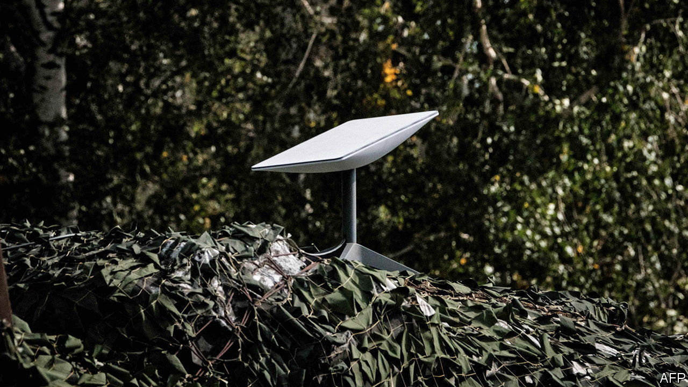

###### Tweet and sour

# Elon Musk’s foray into geopolitics has Ukraine worried 

##### His Starlink internet service has been crucial to the war effort 

 

> Oct 6th 2022 

He was a hero, who went out of his way to keep Ukraine functioning as Russian tanks streamed across its borders. Early in the war Elon Musk gave it access to his Starlink satellite-internet service. But the entrepreneur’s saintly status in Ukraine took a hit this week, after a clumsy foray into geopolitics. On October 3rd he asked his followers on Twitter whether they approved of a four-point “peace plan” to end the war. The proposals appeared to mirror Kremlin talking points, urging Ukraine to accept Russia’s annexation of Crimea, rule out joining NATO and acquiesce to new votes on secession in the parts of the country Russia has occupied. Some bits of Ukraine, he later added, “prefer Russia”. The Kremlin called the initiative “positive”.

Mr Musk’s followers were less keen, voting the idea down 59:41. So was Volodymyr Zelensky, Ukraine’s president, who asked his followers whether they preferred the Elon Musk who supports Ukraine to the one who backs Russia. (They did, 79:21.)

Beyond social media, though, Ukrainian officials are taking Mr Musk’s initiative seriously. They believe his plan was the product of communication with Russia’s president, Vladimir Putin. One worries that Mr Putin might inveigle Mr Musk into withdrawing access to Starlink. He says that Mr Musk has already rejected a Ukrainian request to make use of Starlink in Crimea. Another official says Ukraine has been having problems with Starlink since September 30th. 

Starlink uses satellites in low orbit to beam high-speed internet to portable terminals, of which there are now 20,000 in Ukraine. Most have been paid for by Western governments, but Mr Musk has contributed by waiving the usual monthly fees. Mykhailo Fedorov, a deputy prime minister who appealed to Mr Musk on Twitter two days into the war to get Ukraine back online, says, “It changed the course of the war to Ukraine’s advantage.” 

Starlink has kept Ukraine’s trains running. It has helped get liberated territories back online. It has been used to transmit government communications, including, on occasion, Mr Zelensky’s nightly broadcasts. But it has been most crucial as a secure form of communication on the battlefield, a soldier says, for everything from mobile command posts to drones. Ignore the tweets, he argues: “Starlink is our oxygen, you can’t just turn it off. If we tell Musk [to] piss off and take his Starlinks with him, our army would collapse into chaos.” ■


