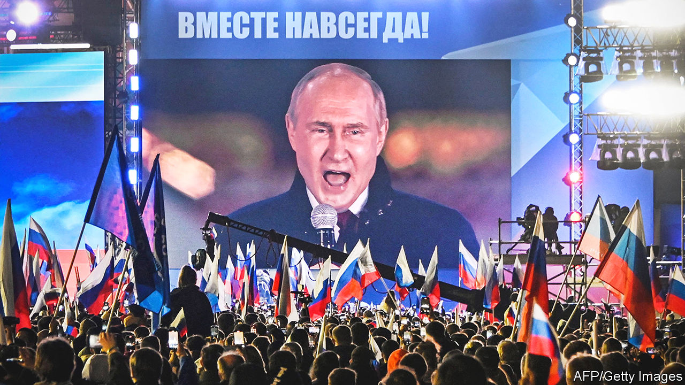
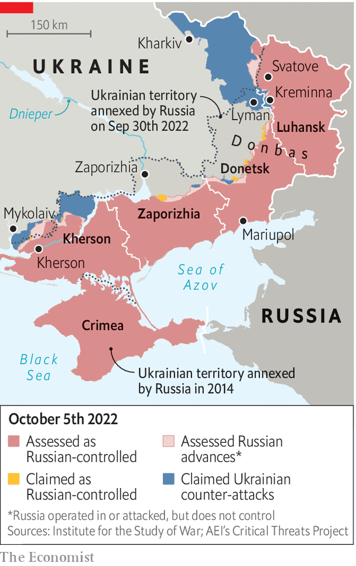
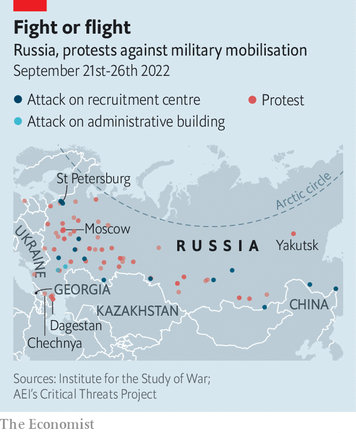
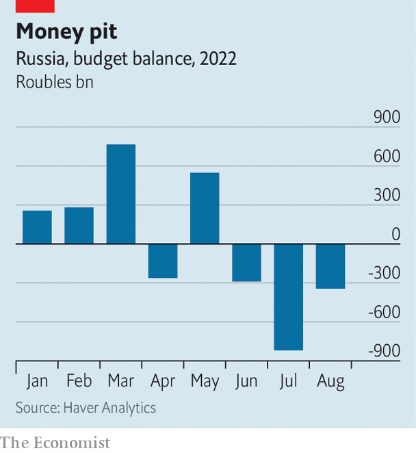

###### Putin at bay

# Ukraine’s military success is reshaping Russia as well as the war 

##### Support for Vladimir Putin’s regime is narrowing fast 

 

> Oct 6th 2022 

“RUSSIA, RUSSIA, Russia,” chanted Vladimir Putin on September 30th, as he announced  of four Ukrainian provinces: Donetsk, Luhansk, Zaporizhia and Kherson. But within hours his newly expanded country began shrinking. The Ukrainian army , at the two extremes of a vast front stretching from the Black Sea in the south to the Donbas region in the east (see map). “Not since the initial part of Operation Barbarossa in the second world war has the Russian army had such a terrible series of reverses on the battlefield,” says Mick Ryan, a retired Australian general.

 


The war is by no means over. Russia still occupies some 15% of Ukrainian territory. Its army will soon swell as  of some 300,000 reservists announced last month gathers pace. But for the first time in seven months of war, time and momentum are on Ukraine’s side. 

On October 1st Ukrainian tanks rolled into Lyman, a strategic hub in Donetsk. Later that evening six Ukrainian battalions pierced enemy lines 200 miles (320km) away, in the northern part of Kherson. By the time Russian soldiers were making appeals for emergency air support via social media, the Ukrainians had advanced at least 12 miles. “The enemy has superiority in everything,” wrote Igor Girkin, who led Russia’s first invasion of Donbas, in 2014, “even using aviation.” By October 6th Russian forces had fallen even farther back towards the city of Kherson.

In Donbas (which comprises the provinces of Donetsk and Luhansk), Ukraine is tantalisingly close to routing its enemy. It is bearing down on weak Russian defensive lines near the towns of Kreminna and Svatove in northern Luhansk. A member of Ukraine’s military intelligence predicts that Russia will soon be forced to retreat from Kreminna to save artillery and other equipment. Svatove is an equally important target, as the site of large ammunition stores and a gateway to the rest of Luhansk. Pushing the Russians back to the lines that existed before the start of the current fighting in February would not be difficult after taking the town, the source said.

The battle for Kherson is even more significant. The province forms one end of a “land bridge” linking the Crimean peninsula, which Russia seized from Ukraine in 2014, to Russia. It is also the source of much of Crimea’s water. The city of Kherson is one of Ukraine’s main ports on the Black Sea, and the gateway to the others; the loss of it puts all Ukraine’s maritime trade in jeopardy.

Mr Putin has reportedly insisted that his generals hold Kherson city at all costs. Ukraine has been exploiting this stubbornness by destroying bridges and so pinning Russian troops down in what appear to be indefensible positions with their backs against the Dnieper river. The Russian forces there are now in danger of encirclement with no obvious way to retreat. Surrender may be their only option.

After  over the summer, the war has acquired a sudden fluidity. “Ukraine is dictating the operational tempo at the moment,” says a Western official. Ukrainian generals believe they can achieve more victories in the three-to-four weeks before Russia’s newly mobilised soldiers begin to appear in force. “We can get a lot done in that time—and by that I mean liberating Kherson or northern Luhansk,” says the military source. “When the mobilised guys join the battle, we will be so prepared it will be like pouring water on red-hot metal. They will simply evaporate.”

But Ukraine’s onslaught may soon slow down. Its army has been on the offensive for over a month, devouring ammunition and exhausting troops. Winter is coming. As the ground grows wetter and muddier, heavy armoured vehicles will be confined to roads. That tends to disadvantage attackers, as Russia found in the bogs north of Kyiv in March. It also impedes armies like Ukraine’s, with many wheeled, rather than tracked, vehicles. Bad weather makes it harder to use drones to spot targets for artillery, too. Combat operations will therefore “freeze” around the beginning of November, says Pekka Toveri, a former chief of Finnish military intelligence. 

Yet, even if ground offensives stop, Ukraine will use its American-supplied  to hammer Russian barracks and depots. Recent videos on social media, the Western official notes, show shivering Russian recruits lighting fires in fields at night in sub-zero temperatures: “That is not going to be a situation where you have high morale over the winter.” Another video shows reservists from the Omsk region asking when they will be paid; local officials reply that they do not have the funds.

Ukrainian troops, in contrast, have been given ample cold-weather gear by nato countries and domestic donors. They also have more night-vision goggles, allowing them to take advantage of shorter days. The result may be that Russian forces are run ragged by spring. 

Mr Putin might nevertheless hope to grind out a victory through sheer mass, exploiting Russia’s three-to-one advantage over Ukraine in fighting-age men. Newly mobilised recruits will be used to relieve forces that have not had a rest for seven months. They could also bring depleted battalions up to strength and, eventually, create new units to go back on the offensive. Christopher Dougherty, a former Pentagon planner now at CNAS, a think-tank, says the war is testing whether a relatively small army using “information-age tech” can defeat a much bigger force with tactics from the “industrial era”.

Some European officials worry that Russia will manage to create lots of basic infantry units that could, at the very least, man defensive positions. But most doubt that Russia can train, equip and supply hundreds of thousands of fresh troops. It has large reserves of Soviet-era equipment, says General Toveri, “but luckily most of it is crap.” Two-thirds of those stocks have been stored in the open, he adds, and the rest cannibalised for parts. The new recruits may prove little more than “human speed bumps”, says General Ryan. 

Even if Mr Putin’s reservists cannot turn the tide, can they stave off defeat, thereby turning the war into a contest of political and economic attrition? After losing Kharkiv province in September, Russia attacked Ukrainian dams and power stations. That Russia has fired very few precision missiles in recent months suggests that its stockpiles are “either depleted or at minimal levels”, says Konrad Muzyka, a military analyst. But it could make life even more miserable for ordinary Ukrainians. And the longer the war, the greater the damage to Ukraine’s economy, which is expected to contract by 35% this year. 

Wedging strategy

In addition to attempting to batter Ukraine into submission, Russia might also still hope to peel off some of its Western backers. European officials suspect that  in the Baltic Sea on September 26th were carried out by Russia as a warning that it could strike at other pipelines, compounding Europe’s energy crisis. Mr Putin’s  at the use of nuclear weapons are also meant to intimidate.

Yet Ukraine’s advances in Luhansk and Kherson have not yet prompted escalation. Nor have there been unusual movements of nuclear forces. “We haven’t seen any changes in their nuclear posture,” noted Jens Stoltenberg, the secretary-general of NATO, shortly after Mr Putin’s speech. 

What is more, the main weapon Mr Putin has deployed against Europe so far—a throttling of gas exports—seems to have misfired. Europe’s gas shortage remains serious, but its governments have promised to spend some $500bn to insulate citizens from price spikes. The continent’s gas storage is more than 89% filled, which is above average for this time of year. A new terminal for gas imports has already opened in the Netherlands; two more are due to open in Germany later this year.

Western public opinion is even warming towards the war. In late September 74% of Germans told pollsters they favoured maintaining support for Ukraine “despite our rising energy prices”, up from 70% in July. A plurality—and majorities among supporters of each of the parties in the ruling coalition—even supported sending tanks, something which the German government has resisted. Another recent survey shows that the share of Americans concerned that support for Ukraine might lead to a war with Russia has declined from 49% in May to 32% in September. The eu is finalising another round of sanctions on Russia, including an oil-price cap—a step previously resisted by several members. 

Critically, Western arms are still flowing to Ukraine. On October 4th America announced its latest consignment, including four more HIMARS launchers, 16 howitzers and GPS-guided artillery rounds that surpass anything in Russia’s arsenal. France and Denmark are in talks to send Ukraine as many as a dozen new CAESAR howitzers.

 


In fact, the question is not so much nato’s will to support Ukraine, but its capacity. The current offensives are consuming ammunition at a prodigious rate. In some cases, the barrels of Ukrainian artillery pieces have melted from overuse. A European official warns that supplies will inevitably dwindle after six months or so—just at the point when fresh Russian units may be entering the war. 

But whatever the practical constraints, the war has prompted a profound shift in the West’s view of Ukraine that diminishes Mr Putin’s chances of sowing division. In February Ukraine was widely seen as a typically corrupt former Soviet state that would inevitably get thumped by Russia. By June it was officially welcomed as a candidate for membership of the European Union. The  of Ukraine’s offensive in Kharkiv proved that it could best Russia on the battlefield. The proportion of Germans who think that Ukraine will win the war rose from 26% in August to 42% in September. NATO officers who once questioned whether Ukraine’s soldiers would make good use of the alliance’s weapons now laud their tactics.

Meanwhile, Russia’s defeats on the battlefield are causing rifts within Mr Putin’s circle. Two close henchmen, Ramzan Kadyrov, the warlord who runs Chechnya, and , who heads a mercenary force called Wagner Group, have launched a synchronised public attack on Sergei Shoigu, the defence minister, Valery Gerasimov, the chief of the general staff, and the officers they command. The general who failed to hold Lyman, said Mr Kadyrov on October 1st, “should be sent to the front lines to wash off his shame with blood.” Senior members of the Duma, Russia’s parliament, have joined the criticism.

There are growing signs of dissent within the broader populace, too. Alla Pugacheva, the most famous pop diva of the Soviet era, took to Instagram to lament “our boys dying for illusory goals”. The mobilisation of reservists was dubbed “mogilisation” on social media. (is Russian for ”grave”.) It prompted widespread protests and arson attacks against military recruitment centres, especially in the poor areas dominated by ethnic minorities that have furnished a disproportionate share of Russia’s troops. In Dagestan, a largely Muslim region of some 3m people, women rallied repeatedly against the conscription of more of their sons and brothers.

That Mr Putin, in annexing parts of Ukraine after , seemed to be endorsing regional separatism and self-determination, is not lost on such places. Volodymyr Zelensky, Ukraine’s president, has tried to rally Russia’s minorities against the war. In a video filmed in front of a memorial to Imam Shamil, who fought against the Russian conquest of the Caucasus in the 19th century, he pleads, “Peoples of the Caucasus! All peoples on the territory of Russia! You have no reason to be among these many who still serve the one who wants this war. You do not have to die in Ukraine. Your sons do not have to die in Ukraine. You have no such obligation. Not to your parents, not to your children, not to your future, not to the future of your land.”

On October 4th associates of , a jailed opposition leader, announced they were re-activating their network around Russia, which had been banned by the Kremlin as an extremist organisation. They called on supporters to join the anti-war effort by any means possible, from distributing leaflets to torching enlistment offices.

But the anti-mobilisation protests have already died down, thanks in part to harsh policing. In a country where tolerance for any criticism of the government is evaporating, the main form of dissent is foot-dragging. The mobilisation has prompted . More than 200,000 men have fled to Kazakhstan, another 70,000 to Georgia. Some 66,000 have taken refuge in the eu, despite the decision by Latvia and Estonia to shut their borders to Russian draft-dodgers.

This flight, in turn, will exacerbate Russia’s economic problems. Only 25% of Russians have passports. Those leaving are relatively educated and wealthy urbanites. Hundreds of thousands more are hiding from the draft inside the country, having left their jobs and their home addresses. These middle managers, bureaucrats and office clerks are mainstays both of the government and private enterprise.

 


Before the mobilisation, Vladislav Inozemtsev, an economist, was expecting the economy to shrink by about 5% this year; he now expects twice as big a contraction. The government’s accounts are looking sickly, too. It has swung from a big monthly surplus at the start of the war to a nagging deficit, as expenditures have risen and revenues have shrunk (see chart).

The cumulative effect of all this is to call into question Mr Putin’s popular support. He previously enjoyed the backing not only of militant nationalists, but the bulk of ordinary Russians, on whom the war in Ukraine was having little impact. The mobilisation has both split that coalition and undermined Mr Putin’s reputation for competence.

There is no sign of any immediate threat to Mr Putin’s rule, although Moscow is rife with rumours of impending martial law and border closures. Fatalistic acceptance is widespread, just as it was during the pandemic, when perhaps 1m Russians perished without any uproar. But a businessman describes a growing sense of his vulnerability by quoting from “The Jungle Book”, a classic British children’s novel that is apparently a favourite of Mr Putin: “When a leader of the Pack has missed his kill, he is called the Dead Wolf as long as he lives, which is not long.” Even if that proves wishful thinking, no one would have said it a few months ago. ■


