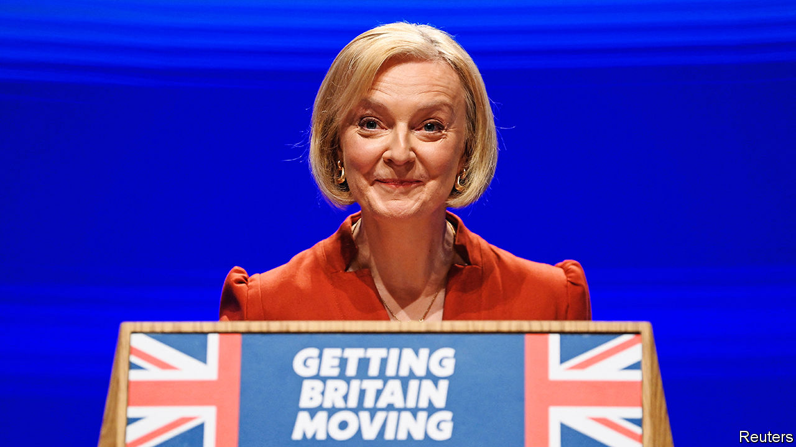
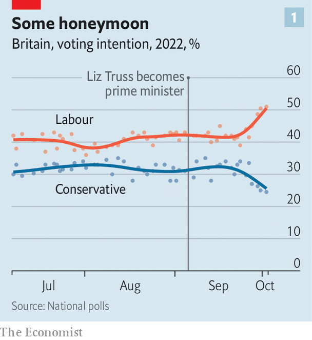
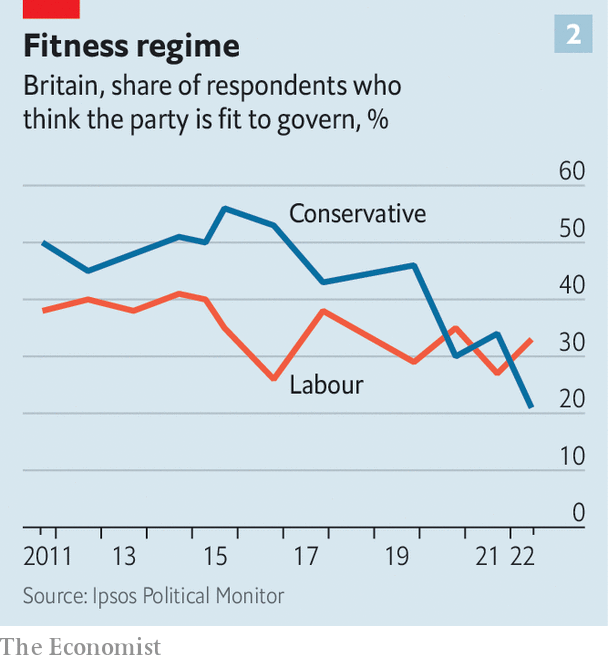

###### Fourth time unlucky

# A chaotic conference fractures Liz Truss’s young premiership 

##### Twelve years in power catch up with the Conservatives 

 

> Oct 5th 2022 

Liz Truss pitched herself as the heir to Boris Johnson. She was loyal to him and to the manifesto on which he had won a vast victory in 2019. She shared his optimism about Britain. The only difference was that she would do things better, bringing delivery and discipline where he had offered scandal and drift: Johnsonism without Johnson. Party members liked what they saw, and made her party leader and thus prime minister. 

In office she has done the opposite. She has repudiated the central planks of Mr Johnson’s government: a difficult but electorally successful fusion of fiscal discipline and state intervention. But she has adopted many of the most damaging traits of Mr Johnson’s way of governing. The result has been a swift return to the bitter internal warfare that has dogged the Tories for much of the past decade. The party’s support in the polls has cratered; so, in spectacular fashion at the party’s conference in Birmingham on October 2nd-5th, did the Conservatives’ capacity to govern. 

Mid-term reinvention has sustained the Conservative Party—switching leader and creed while holding power, changing the government before the electorate could force change at the ballot box. That process has found its limits in Ms Truss, the party’s fourth leader in 12 years, whose government has immediately imploded. 

On September 23rd Kwasi Kwarteng, the chancellor, unveiled the  in 50 years, including abolishing the  in the pound for earnings over £150,000 ($170,000). Coupled with Mr Kwarteng’s decision to fire Sir Tom Scholar, the top civil servant at the Treasury, and the refusal to commission forecasts from the Office for Budget Responsibility, a watchdog, the market response was a sharp sell-off of government bonds. The Bank of England will now increase rates even more sharply than it would otherwise have done.

As a result, Ms Truss has immediately surrendered two huge tracts of electoral real estate. Voters felt able to indulge Mr Johnson’s appetite for redistribution and state intervention because he was publicly constrained by Rishi Sunak, his chancellor and a fiscal disciplinarian. Due to her expansive budget and her advocacy of tax cuts for the rich, Ms Truss has sundered the party’s reputation for both economic competence and fairness. “This government has rejected everything that Boris won the last election on,” Rachel Wolf, the co-author of the manifesto of 2019, told a conference panel. Labour has filled the void with its own agenda of public ownership and balanced budgets. 

 


That has initiated a collapse in Tory poll ratings (see chart 1). Polls conducted in the past week show an average lead for Labour of 23.7%. Ms Truss’s net approval rating of -59 is worse than Mr Johnson at his lowest, said YouGov, a pollster, on October 5th. The loss of the Tories’ historic edge on handling the economy means it is hard to see a scenario in which Labour do not form the next government, says James Johnson, a former Downing Street pollster. Many MPs think a wipeout beckons.

The central task of Ms Truss’s government now is regaining the confidence of Britain’s creditors by filling the large fiscal hole left by the budget. The hard choices that requires, coupled with the collapse in the party’s poll ratings, unleashed insurrection at the conference in Birmingham. On October 2nd Ms Truss yielded to MPs who warned they would not support her budget, and abandoned the 45p tax cut. “They have lost control of the politics, and the authority has gone,” said one rebel. She has a small window to win back her party when Parliament reconvenes on October 11th. One malcontent gives her only a one-in-five chance of success; more likely, they say, she will be forced from office by the end of the year. 

 yet it has strong echoes of the past 12 years. It owes much to Mr Johnson’s style: heroic optimism about the speed with which the government can direct economic activity and outright dismissal of sceptics as naysayers. (In her conference speech on October 5th she took aim at an “anti-growth coalition” whose members include a nameless elite who “taxi from North London town houses to the BBC studio”.) In truth, the plans for low-regulation “investment zones” are barely more sketched out than Mr Johnson’s “levelling up” programme. “She thinks she can just assert things, and make them true,” says one critic. 

If that is a familiar story, her costly blunder in sidelining the OBR and the Treasury also followed an approach taken by Mr Johnson towards institutions that check executive caprice. Moody’s, a credit-rating agency, had warned back in 2020 that the erratic Brexit negotiations under his watch were part of a pattern of institutions becoming weaker and policymaking more unpredictable. 

The collapse in cabinet government that began during the Brexit negotiations under Theresa May also accelerated remarkably in Birmingham. The old principle that cabinet deliberates in private and is unified in public is dead. Ms Truss’s options for filling the fiscal hole left by her budget are constrained after a pair of cabinet ministers declared that welfare budgets must keep pace with inflation.

As for the party, the rebellion in Birmingham was so fast and effective because the struggles of the Brexit years and Mr Johnson’s recent downfall have given its plotters plenty of practice. The 45p rebels marshalled their numbers via phone-calls and spreadsheets far faster than the government whips could. 

In a happy party, grandees are a stabilising force; in an unhappy one, they are ringleaders. The uprising was led not by a young radical but by Michael Gove, a veteran of three cabinets and numerous other feuds. Suella Braverman, the home secretary, accused his gang of a “coup”. That carries little weight given how she trades on her time as one of the hardliners who paralysed Mrs May’s government. 

Ms Truss appears to have learnt nothing from her predecessors’ downfalls; she made little effort to win round an unruly party. Her position was already weak: although the members’ choice, she won the support of fewer MPs during the leadership contest than Mr Sunak. But she made little effort to include his supporters in the cabinet. Many MPs feel she has no mandate for a new direction.

Her prospects of succeeding where Mr Johnson failed, and convincing MPs to vote for sweeping reforms to planning law on which her “growth plan” partly rests, look slim. Loyalist cabinet ministers argue that the collapse in Conservative polling strengthens an all-or-nothing case to push ahead; for MPs fearful of losing their seats because of a backlash against new developments, there is much less incentive to back Ms Truss on such measures. With the government’s polling on the floor, the House of Lords will feel no compulsion to approve measures that were not outlined in Mr Johnson’s manifesto, says one rebel.

 


All this means that relations with businesses, which were strained under Mrs May and Mr Johnson, show little sign of improving. Although Ms Truss declared her love for enterprise in her main conference-hall speech, the annual business reception on the sidelines of the event was a tense affair. Mr Kwarteng gave a perfunctory address; one boss told ministers that the growth plan amounted to nought. A declaration by Andrew Griffith, the finance minister, that the government wanted to see more “risk-taking” in business was met with dark humour. “In one day, this party has destroyed its reputation in the City,” said one attendee of the mini-budget. 

Mr Johnson’s victory of 2019 instilled a hubristic belief in the party that a new leader gave the Tories an opportunity to present themselves as a wholly new government, and that voters would not notice or care about infighting and decay. But they did. For all the electoral success, the sentiments that underpinned voting intention were being slowly eroded. 

The proportion of voters thinking the Conservative party was “fit to govern” steadily declined from a high of 56% in September 2015, after Mr Cameron’s second victory, to a low of 21% just before Mr Johnson left office (see chart 2). Those who thought the government did a “good job” of economic management fell similarly over the same period, from 56% to 27%. That long-standing malaise now appears to have fed through, swiftly and dramatically, to the Conservatives’ national polling. ■

