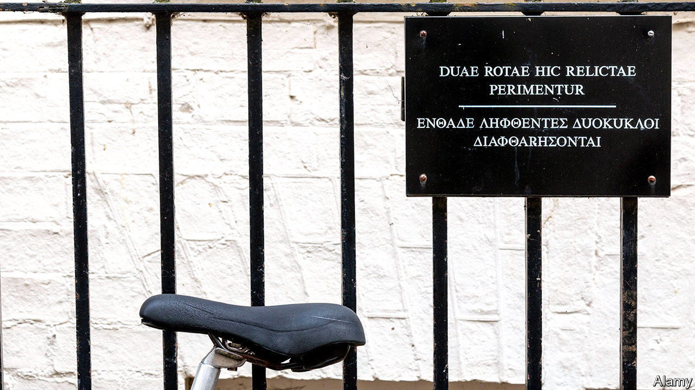

###### Latin lovers

# A £4m scheme to bring Latin into British state schools begins 

##### A subject seen as being for “posh white boys” tries to extend its reach 

 

> Oct 6th 2022 

Evelyn Waugh, a novelist, valued his classical education. Not because it enabled him to understand ancient languages: Waugh could remember no Greek, write no Latin and enjoyed reading neither. But it did enable him to excel in a more important exercise: spotting and judging those who knew less than he. Such people (“most Americans and most women”) betrayed their deprivation with sentences of “inexcusable vulgarity”. “I do not,” he wrote, “regret my superficial classical studies.” 

Latin occupies an odd place in English curriculums. One part proper subject, two parts smug social shibboleth, to have chanted “amo, amas, amat” in a Latin class has long implied membership of another kind of class altogether. The decline and almost fall of Latin in state schools in the 20th century did not diminish its social cachet, because numbers in fee-paying independent schools remained high. In 2020 eight times more pupils sat Latin GCSE at Eton, a posh school, than in the entirety of Northumberland. Waugh considered Latin the mark of a gentleman. Mary Beard, a professor of classics at Cambridge University, puts it more briskly: it gets seen as a subject for “posh white boys”. 

This harms it—a bit—and helps it—a lot. Posh white boys tend to do quite well for themselves. A famous example recently left Downing Street; as he left, Boris Johnson mumbled that he was like Cincinnatus, a reference to a retiring Roman that both alarmed classicists (Cincinnatus returned as a dictator) and appealed to them (they got the joke).

Classicists may lament the passing of the subject’s golden age, but it declined for good reasons. A Britain alternately warmed by the white heat of technology and chilled by fear of the cold war had to prioritise science over dead languages. In 1960 Oxford and Cambridge dropped Latin O-Level as an entry requirement. Good thing too, says Professor Beard: not to have changed would have been “bloody stupid”. 

Changes continue to be made. Cambridge University has just introduced a four-year classics degree for those who have studied no Latin at school. And while he was in office Mr Johnson tried to make the subject more accessible via the Latin Excellence Programme, a £4m ($4.6m) scheme to bring it to 40 state schools. 

Which is why, on a rainy Monday in September, in Pimlico Academy in London, children sit in a lesson that would have felt familiar to Waugh. The verb “esse” is chanted; etymologies are discussed; the word “conjugate” is used fearlessly. Its pupils would have felt less familiar to him, however: almost half of pupils in the school are on free school meals; 15% have English as an additional language; many are even female. 

Employers and universities still like to see Latin, explains Ian Patterson, the academic head at Pimlico: there is a “prestige attached to it”. The pupils like it too: shouting “sum, es, est”, they think, is fun. But Latin is about more than verbs: it makes them feel clever too, says one pupil, as “not lots of people learn it.” Waugh could hardly have put it better himself. ■

