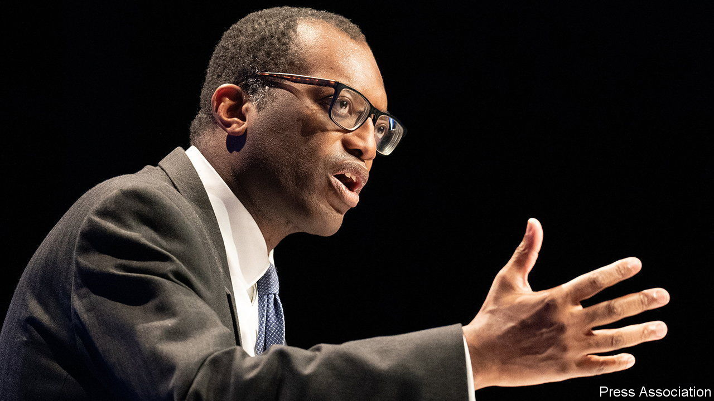

###### Office for Budget Responsibility

# Britain’s fiscal watchdog is caught up in a political storm 

##### All eyes are on the Office for Budget Responsibility 

 

> Oct 6th 2022 

When KWASI KWARTENG unveiled the biggest package of tax cuts in half a century on September 23rd, something was missing. Ordinarily the Office for Budget Responsibility (OBR), a fiscal watchdog, accompanies budget announcements with a forecast of the health of the public finances. But its services were rejected by the chancellor, and without the OBR’s conclusions to look at, investors drew their own. Now Mr Kwarteng is scrabbling to make amends. The OBR’s forecasts, along with its assessment of whether the government is meeting new medium-term fiscal commitments, may now be published before the end of the month.

The OBR was set up by George Osborne, a former chancellor, in 2010 to provide detailed economic forecasts, an assessment of whether the government is on track to meet its fiscal targets, and scrutiny of the government’s costings of individual tax and spending measures. He said then that it would leave the government “nowhere to hide the debts, no way to fiddle the figures, and no way of avoiding the difficult choices that have been put off for too long”. 

Now that Mr Kwarteng has decided to embrace such scrutiny, the OBR’s pointy heads will be busy over the coming weeks. One task will be to scrutinise the Treasury’s estimated cost of the planned tax cuts and analyse their indirect effects on the growth of the economy. Another will be to look at the impact of new (yet-to-be-announced) supply-side reforms. The government argues that these will enhance growth, making the fiscal outlook rosier. The OBR will be sceptical. Although the watchdog does give credit to policies backed by solid evidence, where that is lacking it tends to wait and see what effects they have.

Mr Osborne chose not to make the OBR as strong as it could be. It can neither offer opinions on the merits of government policy, nor ignore policies that the government would struggle to implement, such as deep unspecified cuts to public services. It does not decide the rules against which to assess the government’s fiscal performance, a loophole that Mr Kwarteng may exploit by, for example, delaying the time by which he has to meet his goal of a falling debt-to-GDP ratio. But the OBR’s independence is now central to the credibility of the government’s fiscal plan. The new chancellor has inadvertently strengthened the institution he tried to sidestep. ■

