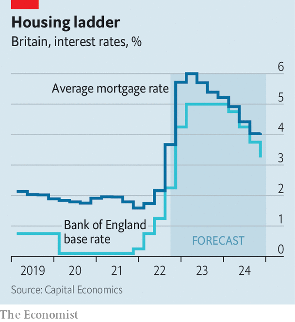

###### In a fix

# Britain’s mortgage market is adjusting to higher interest rates 

##### But it will be a painful process for existing and wannabe homeowners 

 

> Oct 6th 2022 

“A little turbulence” is how Kwasi Kwarteng, the chancellor of the exchequer, later described the effects of the now-notorious “mini-budget” which he delivered on September 23rd. In the housing market Mr Kwarteng has unleashed a bonanza of bumpiness. 

According to Moneyfacts, a data firm, between September 23rd and October 4th over 40% of mortgage products disappeared from the market as lenders avoided getting on the wrong side of spiking interest rates. Demand has surged for those products that remained available. Paul Timmins of Quick Mortgages, a broker, says that most customers used to get in touch perhaps a month before their fixed-rate mortgage was due to expire. Now he is hearing from panicking customers as much as a year before.

 


Interest rates were on the rise long before Mr Kwarteng’s fiscal statement. On January 31st the average rate on new mortgages was 1.59%; by August 31st that had risen to 2.56%. But recent increases have been much faster. Between September 1 and October 3rd expectations for where the Bank of England’s base rate, which influences mortgage rates, will be in two years rose by 1.5 percentage points. Andrew Wishart of Capital Economics, a consultancy, expects average new mortgage rates of 6% in the first quarter of next year (see chart). That would be the fastest annual jump since 1989. 

The risk is that this jump in rates will set off a nasty downward spiral. Some people may be unable to keep repaying their mortgages, prompting a rise in repossessions. Mr Wishart predicts arrears to rise from 0.7% of mortgages now to 1.6% in 2024. Rather than falling behind on dearer mortgage payments, other households will pull back on spending elsewhere. Prospective buyers will find themselves unable to afford what they could before. That, combined with a darkening macroeconomic backdrop, will push down house prices, making homeowners feel poorer and further crimping their spending. 

Some reassurance comes from the fact that lending standards have been relatively stringent, at least compared with those before the global financial crisis of 2007-08. For example, stress-testing to see if borrowers can withstand a big change in their mortgage rate has been much more common. Because house prices have risen by over 25% since June 2020, it would take a large correction to propel lots of borrowers into negative equity. Those unfortunate enough to be struggling with their interest payments should get a sympathetic reception from their banks, who do not want the bad press of evicting people.

Even so, higher interest rates will hurt. Mr Wishart expects average mortgage costs to grow from 2% of total household income to over 5% by mid-2024. That shock will be concentrated on the third of British households that have an outstanding mortgage on a home they own. Neal Hudson of Residential Analysts, a consultancy, reckons that currently around 300,000 mortgages each quarter are coming to the end of their fixed-rate period, rising to 375,000 in the second quarter of next year. Yet even for those who do not have to remortgage immediately, spending now will be dampened in anticipation of much higher bills in future. 

House prices already seem to be turning. Mr Timmins has noticed a sharp drop-off in enquiries from new customers over the past month as affordability constraints bite. Although Nationwide’s house-price index showed that prices in September were 9.5% higher than a year earlier, monthly growth has stalled. Gabriella Dickens of Pantheon Macroeconomics, a consultancy, calls it “the start of a prolonged fall”. In May 2021 Jon Cunliffe, deputy governor of the Bank of England, cited evidence showing that a one-percentage-point increase in the bank’s policy rate would lower house prices by 6-9%.

If prices plummet uniformly then those in the toughest bind will be those who bought recently (meaning they have not had the benefit of rises in house prices), as well as homeowners in London, where recent price increases have been relatively modest and where the ratio between loans and incomes tends to be highest. Mr Hudson estimates that a 20% fall in house prices would leave nearly 10% of mortgages in London larger than the value of the underlying property.

From the perspective of monetary policymakers at the Bank of England, whose next meeting is due in early November, higher interest rates are meant to cause pain. They are worried about high inflation becoming embedded in the economy, a concern that the government’s fiscal splurge will only have exacerbated. But they usually prefer to pull policy levers slowly and thoughtfully. The next increase is likely to be a wrench. ■

