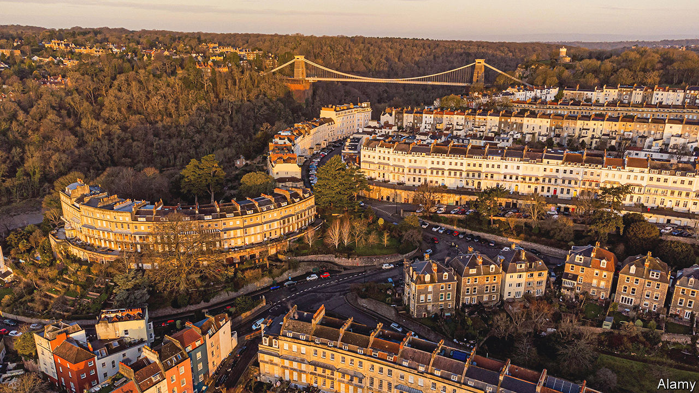
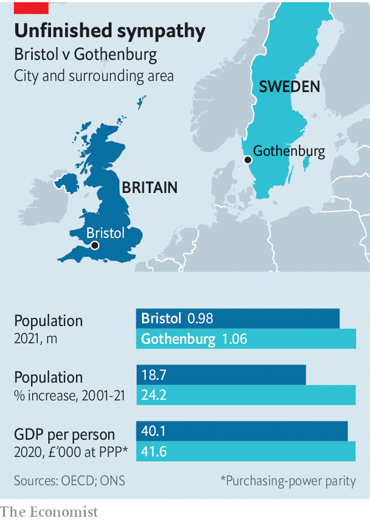

###### Urban governance

# British cities have far too little power, and it’s holding them back 

##### A comparison of Bristol and Gothenburg 

 

> Oct 6th 2022 

Dan norris has a nice job. Last year he was elected mayor of the West of England, an area of almost 1,000 square kilometres centred on Bristol. His personal mandate of 125,000 votes is larger than any mp’s, giving him a high local media profile and a lot of clout. He gets to dispense goodies, including a pot of £540m ($610m) for public transport that Britain’s central government awarded to the West of England in April. Mr Norris says that people are nicer to him than they were when he was an mp. 

His patch is a comfortable one, too. Britain has ten metropolitan mayoralties, all but one created since 2017. Successive Conservative regimes have seen elected “metro mayors” as problem-solvers who can stimulate growth; the current levelling-up secretary, Simon Clarke, has called himself a “huge believer”. Many of the mayors oversee places that are poorer than average, but Mr Norris does not. Output per person in his area’s hotspot, Bristol, is 19% higher than the national average. 

All seems well, then—until you compare Mr Norris’s domain to a similar area in another European country. Set Bristol next to Gothenburg in Sweden and its weaknesses become clear. So does the real cause of its problems. Bristol, and by extension all British metropolises, do not have the means or the incentives to transform their fortunes. Until they do, a government hungry for growth is likely to be disappointed. 

 


The two cities each have about half a million inhabitants, and are part of functional urban areas—as defined by the oecd, a club of mostly rich countries—that are twice as populous (see chart). They have about the same gdp per person. Both are coastal cities, situated west of their countries’ capitals. They are cosmopolitan, open-minded and occasionally riotous. But the two cities, and the metropolises around them, are governed and funded completely differently. And that makes all the difference in the world. 

The northern part of Gothenburg’s city centre resembles a giant construction site. That is due to the West Link, an underground extension to the existing railway which will make it far easier and quicker to reach the city centre from the suburbs. Nearby, cars and trams stream into and out of central Gothenburg over the newly built 440-metre-long Hisingen bridge. Some of the vehicles are heading for Lindholmen, an emerging business district where Scandinavia’s tallest building is rising. 

Gothenburg has many other infrastructure plans. A new tram line will be built under the Gota river. The existing tram network of 12 lines is being expanded and modernised. A recently approved urban plan, which has been advertised on billboards around the city (“Vi har en plan!”), envisages a transformed public transport system with more circular routes. Per Wingqvist, the head of mobility, says the city is already thinking about another major railway, which might be built around the year 2070. 

Bristol has good railway connections to the rest of England and Wales. But it has neither a municipal tram network nor an underground railway. In 2004 the government in Westminster offered money for a tram line, which might have been the first of many. But local politicians could not agree a route, and the opportunity was lost. They still do not agree. Mr Norris wants to look again at trams. Marvin Rees, mayor of the city of Bristol (a soon-to-be-abolished office), argues that only an underground railway could carry enough people. A railway line will probably be built between the city and Portishead, to the west. But that will only take Bristol back to where it was: a Victorian railway along the route was closed to passengers in 1964. 

Buses were deregulated and privatised by central-government fiat in the 1980s, as in most British cities. That stripped local politicians of powers—Mr Norris complains that he does not even control the bus stops—and left Bristol and its neighbours with a confusing variety of transport options. Ticket pricing is complicated and changeable. The main railway station is a 20-minute walk from the main bus station. By contrast, Gothenburg’s transport app sells tickets that can be used interchangeably on trams, buses, trains and ferries, and tells you when everything is due to arrive. The Swedish city’s transport network is easier to negotiate than Bristol’s even for a monoglot English-speaker. 

The gulf between the two cities is even larger when it comes to planning and housing. Both acknowledge that they struggle to build enough homes, but Gothenburg manages to put up more than 4,000 a year, over twice as many as Bristol. Just beyond the city boundary, in Molndal, AstraZeneca is building so many offices, laboratories and homes that the number of people employed on the pharmaceutical firm’s campus is expected to rise from 2,800 to about 10,000. The company’s boss in Sweden, Katarina Ageborg, says local officials were “flexible and easy to work with”. Besides, the area is not spectacularly beautiful, she says, waving at a landscape of suburbs and pine forests. 

Building on the outskirts of Bristol is extremely hard, no matter what the landscape looks like. Local politicians zealously police the huge 717-square-kilometre green belt, a no-build zone around the city and its near neighbour, Bath. Mr Norris has tried to persuade them to agree on a plan that would prioritise certain places for new housing and offices, to no avail. Talks collapsed earlier this year amid much anger. 

Both urban areas are adding people, but Gothenburg has the edge. Its population is growing faster than Bristol’s, and 0.3 percentage points a year faster than Sweden’s as a whole, on average. Gothenburg’s gdp has grown more quickly than Bristol’s too—a remarkable feat given the failure a decade ago of Saab Automobile, a carmaker that employed many local inhabitants.

Britons have long admired Scandinavian countries, especially Sweden. “Sweden deserves her reputation. In so many ways she is ahead of the rest of us,” argued Paul Britten Austin, who wrote several books on the subject from the 1950s. A common theme is that Swedes are careful and consensual, not given to rancour or violent swings in policy. 

That picture is not at all true of Gothenburg, where political disputes are often vicious. A congestion charge that was introduced to pay for the West Link is deeply unpopular. Axel Josefson, the head of the municipal council (the closest office that Gothenburg has to a mayor), argues that the city is severely under-policed and that the government in Stockholm distributes too little money for major infrastructure projects. “Our feeling is that we pay more than we get,” he says. 

Still, Mr Josefson answers a question about whether Gothenburg has the powers and resources to solve its own problems straightforwardly: “In general, yes.” The city levies an income tax of 21%, while the region of which it is part tacks on another 11% (the national income tax, paid only by high earners, is 20%). As well as planning and transport, the city and region handle education, welfare and health care. Overall, 37% of tax in Sweden is raised locally. Swedish cities and regions have become mightier, grabbing powers from central government and accounting for a growing share of the tax take. 

Gothenburg and its neighbours smile on development not because they are cool and rational but out of self-interest: more people means more taxpayers. They build roads and tram lines to keep the economy humming. Although the national government chips in for the biggest infrastructure projects, cities have plenty of skin in the game. Almost half of the financing for the West Link railway comes from Gothenburg and other local governments, mostly from the congestion charge. “As a city we have a lot of say,” says Mr Wingqvist. “But it comes at a high price.”

In Britain just 6% of taxes are raised locally. Local authorities levy taxes linked to the value of property and keep some business rates, but these do not fund all their operations—and they are in charge of much less than Swedish local authorities. They have less incentive to allow home-building. In 2011 the central government tried to prod them with a “new homes bonus” but this has become stingier over time. Cities and metropolitan areas rely on the national Treasury to pay for almost everything—even things like transport, over which they supposedly have control. 

The system of bidding for Treasury cash has made British cities into perpetual supplicants. “Governments announce pots of money and then ask local authorities to fight for them,” says Mr Rees. As a result, local politicians and officials spend their time competing for what money is available rather than thinking about what their cities really need. And some of the pots are comically small. Onward, a think-tank, pointed out earlier this year that the national government had invited local authorities to bid for cash to build public toilets for disabled people. Bristol was awarded £123,814 for three toilets. 

The central issue

Mr Rees thinks that the problem is a fundamental one. British prime ministers come to power promising to unleash growth, and invariably assume they can do it from the centre: “They think that there’s a bunch of levers around Whitehall that they can pull and get outcomes.” Cities and metropolises, which understand the local restraints on growth, are then invited to help deliver the government’s vision. Nobody is particularly interested in what they think, or what they might be able to do if they could manage their own affairs. ■

