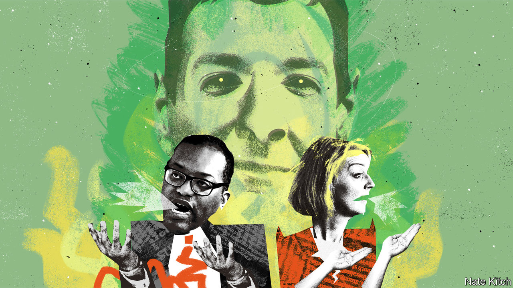

###### Bagehot

# Liz Truss turns to accidental austerity 

##### How the government embraced death-cult Osbornomics 

 

> Oct 6th 2022 

Long dead she may be, but the Iron Lady lives on at the Conservative Party’s conference. Margaret Thatcher and other former Conservative leaders are deified at the annual jamboree, which took place this year in Birmingham. Fringe events are held at the Thatcher theatre. Men born in the early 2000s dress like 1980s throwbacks in pinstripe suits and tribute braces. A psychedelic picture of Benjamin Disraeli leers out from a tote bag, alongside the faces of Boris Johnson and St Maggie herself. Attendees can even buy a Winston Churchill baby bib.

Strangely, the face of George Osborne, who was chancellor of the exchequer under David Cameron from 2010 to 2016, appears on no tea towels or tote bags. Yet it is his policies that Liz Truss’s new government has started aping. The announcement on September 23rd of unfunded cuts to corporation tax, income tax, stamp duty and national insurance has left behind a hole in the budget of £43bn ($49bn; 1.5% of GDP). Unless Ms Truss reverses course, filling it could well require spending cuts to rank alongside Mr Osborne’s efforts to slash the state. Dreams of a 1980s-style supply-side revolution appear already to be in tatters. “Ms Truss wanted to be Thatcher,” says Dan Tomlinson, an economist at the Resolution Foundation, a think-tank. “She’s ending up imitating Osborne.”

This would not, however, be a straight copy of the Osborne years. The Conservatives are heading for an Osborne-style revolution without the support of MPs, voters or markets and against a far less benign economic backdrop. In short, it is a death-cult version of the Osborne era. 

Start with the politics. In 2010 the Conservatives were a well-disciplined party, hungry for power after 13 years out of office, willing to do unpopular things. In 2022 blood-soaked former cabinet ministers stalk from one event to another with the soft smiles of serial killers. Even current members of cabinet sound off about potential spending cuts they don’t like. Penny Mordaunt, a former (for now) leadership rival of Ms Truss, has publicly demanded that the government increase in-work welfare payments in line with inflation, at a cost of about £11bn in the first year. Craig Oliver, the government’s chief spinner during the Osborne years, coined the nifty term “prebellion” in response. 

Mr Osborne left space to surprise voters on the upside. The former chancellor pushed through stealth tax cuts, raising personal allowances so that people took home more money even when the headline rates stayed the same. By comparison, his successor as chancellor, Kwasi Kwarteng, talks noisily about tax cuts that will leave people no better off. By 2026, for each £1 ($1.12) in tax cuts, a household will lose £2 via freezes on various tax thresholds, according to the Institute for Fiscal Studies, a think-tank. Couple this with rising energy bills and mortgage costs, and people may not feel richer even if the government’s plan to boost growth works and the economy is flying. 

The British government is used to marking its own homework when it comes to its finances. Chancellors were broadly left to set (and tweak) their own fiscal rules on spending while the market nodded along. Mr Kwarteng no longer enjoys the benefit of the doubt, after picking fights with the Treasury, criticising the Bank of England and ignoring the Office for Budget Responsibility, a watchdog. Government-bond markets are not supposed to be startled when a chancellor speaks, in the same way that the chancellor’s red box is not supposed to spring open and his packed lunch fall out. And yet the “fiscal event” on September 23rd sent gilt yields rocketing and sterling plunging. Investors will now decide whether Mr Kwarteng’s fiscal rules are credible. Markets will ponder whether structural reforms are able to muster a parliamentary majority, like a Club Med economy during the euro-zone crisis.

Previous radical programmes by Conservative governments have benefited from a rosier economic backdrop. Thatcher benefited as revenues from North Sea oil and gas poured into the Treasury’s coffers. Mr Osborne was helped by inflation and interest rates both bobbing along near to historic lows globally. Now the Conservatives face an energy crisis, rocketing inflation and interest rates lurching upwards, too. 

After 12 years of Conservative rule, moreover, there is no scapegoat. During the 2010s Mr Osborne shifted the blame onto Labour at any opportunity. Once Teflon, the Conservatives are now flypaper: whatever is thrown at them sticks. During one interview with the bbc this week the chancellor was asked about the “Kwarteng premium” on people’s mortgages. Mr Kwarteng huffed that interest rates had shot up globally, thanks to central-bank decisions in America. It was to no avail. Call-ins are stuffed with furious homeowners facing large bills. 

Curious George

Voters put up with austerity, rather than supporting it. The Conservatives failed to win a majority in 2010, instead governing with the Liberal Democrats, and then barely scraped to a small majority in 2015. Only Boris Johnson’s vision of big-state Conservatism proved truly popular with voters in the 2019 general election, handing the party an 80-seat majority, its biggest since Thatcher. Those who voted for it are in for a shock, much as Lib Dem voters were flummoxed by the austerity measures implemented in their name during their time as Mr Osborne’s coalition partners. In 2010 the Lib Dems had 7m votes; in 2015 they won 2.5m.

A return to a near-suicidal version of the Osborne years explains why pessimism permeated every corner of the Birmingham conference. Under Ms Truss the party is doomed, runs the consensus view of several former ministers. And yet the mood among the merchandise stalls was almost giddy. One attendee, a man of the cloth no less, summed it up best: “It’s like a wake, but no one’s sure if the corpse is the Conservative Party or just Liz Truss’s ministry. And like every good wake, everyone’s getting smashed.” ■


