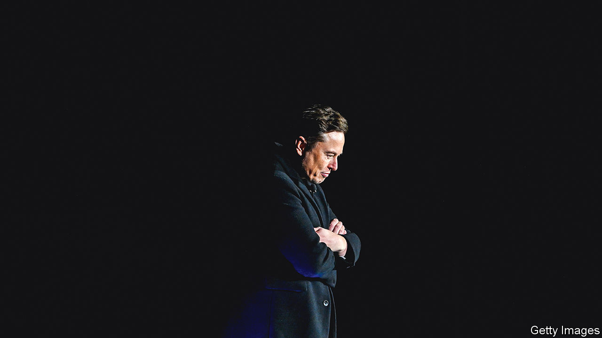

###### A social saga

# Elon Musk is buying Twitter. Really. Probably 

##### The reluctant suitor avoids a trial, but inherits a world of commercial and legal woes 

 

> Oct 5th 2022 

The deal is on! Isn’t it? With Elon Musk’s courtship of Twitter, it is hard to know. In April the world’s richest man agreed to join the social network’s board, only to change his mind a week later. He then signed a deal to buy the company, but within days was tweeting insults at its leaders. In July he said the deal was off, prompting Twitter to sue. On October 3rd he said he would buy it after all.

Does Mr Musk mean it this time? Markets think so: Twitter’s shares leapt from $43 to $52, just shy of Mr Musk’s offer of $54.20. Twitter shareholders had already okayed the takeover and antitrust regulators see no problem, so the acquisition could close within days.

If it does, Twitter will have won the world’s highest-stakes game of chicken. Mr Musk claimed he was backing out because Twitter had more “bots”, or fake users, than it had disclosed (it denies this). But he surely regretted spending $44bn on a company whose value by July had fallen below $30bn, amid a rout of tech stocks. Many thought Twitter might offer Mr Musk a discount, to avoid fighting him in court. Instead it is Mr Musk who has blinked.

His case looked doomed: the bots argument was always thin. And whereas Mr Musk might have hoped to pay only a termination fee of $1bn, the judge repeatedly sided with Twitter in pre-trial hearings, raising expectations that she would order Mr Musk to cough up the full $44bn should he lose.

He might have rolled the dice, but the trial’s discovery process was proving damaging. On September 28th the court released 33 pages of cringe-worthy text messages between the magnate and his business pals. “You have my sword,” promised Jason Calacanis, a would-be Twitter investor, quoting “The Lord of the Rings”. “Put me in the game coach!”

If dodging the trial solves one problem for Mr Musk, owning Twitter will present others. Advertising, Twitter’s revenue source, has been hit by war in Europe and broken supply chains in Asia. Twitter’s staff mistrust Mr Musk and will like him even less when he starts slashing costs. He will need a new chief executive after a public spat with the incumbent, Parag Agrawal, one of few to emerge from the debacle with his reputation intact.

Trouble is brewing in Washington, too. On October 3rd the Supreme Court said it would hear two cases about social media. One, against Google’s YouTube, seeks to make tech platforms responsible for the content their algorithms recommend. The other, against Twitter, argues that platforms abet terrorism by hosting sympathetic material. Either case could destroy the way Twitter and other social networks operate. Mr Musk has all this to look forward to—and for only $44bn.■


