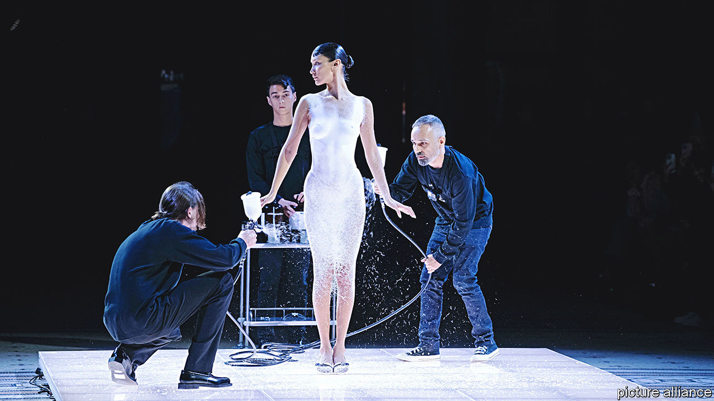
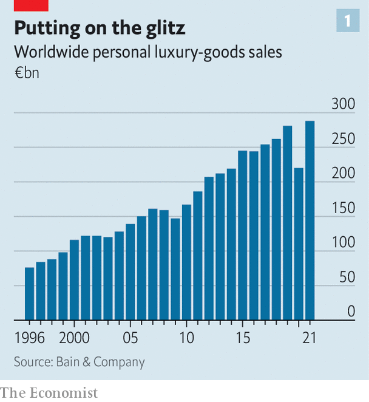
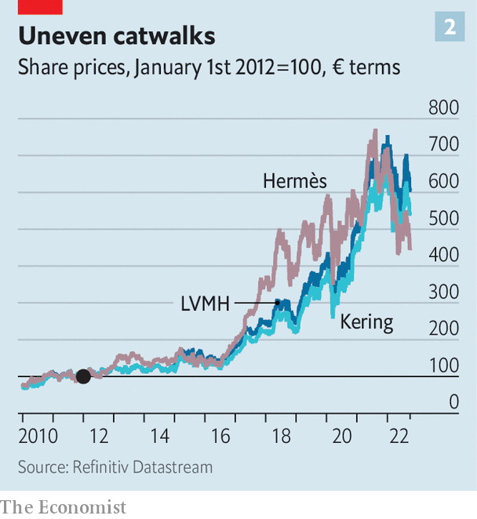
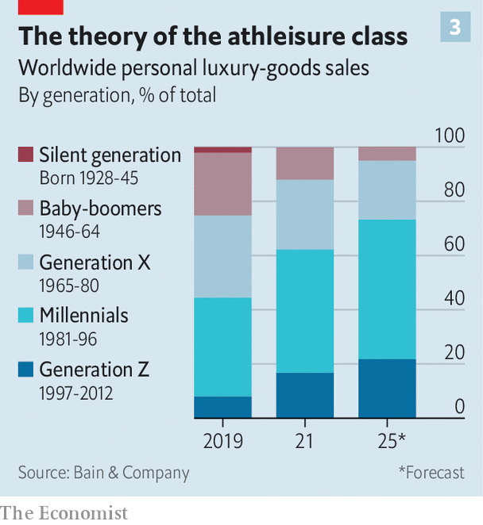

###### A new look

# Fashion gets a modern makeover 

##### A $700bn industry flirts with new materials, new countries—and new clients 

 

> Oct 6th 2022 

Paris fashion week always makes heads turn. Two events that took place during this year’s extravaganza, which concluded on October 4th, made it dizzying. On September 29th a crocodile-skin Hermès handbag became the priciest ever to be auctioned at Sotheby’s. It was the apotheosis of old-school luxury: timeless, leather-bound and, at €352,800 ($346,800), eye-poppingly expensive. The next day Coperni, a French fashion house barely ten years old, showed off luxury’s whizzier side by spraying a nearly nude supermodel with an ingenious and animal-friendly material that coalesced into a snug white number (see picture). 

 


This tug of war between tradition and novelty is nothing new in luxury fashion. It is now becoming true of its makers’ business models, too. A post-pandemic rebound in sales of personal luxury goods, to nearly €300bn (see chart 1), conceals rising volatility within the industry. Investors who used to treat large luxury groups such as lvmh, Hermès and Kering as pretty much of a piece are now differentiating between them (see chart 2) as they adapt—or not—to the new tastes of new shoppers in new places. In the process, an industry with a market value of some $700bn is getting a new look.

The first change in the luxury market is geographic. Last century fashion houses sailed the winds of globalisation from Europe and America to Japan and then, in the past decade, China. As the Chinese economy slows and the Communist Party turns the screws on the ultra-rich, firms are looking elsewhere for growth opportunities, particularly to the oil-soaked Persian Gulf, whose well-heeled shoppers are growing richer on the back of high fossil-fuel prices. They are happy to splurge some of that wealth on fancy fashion—and are becoming more adventurous in their purchases. This year Loro Piana, an lvmh label, collaborated with an Emirati artist to create a special Ramadan collection for its Middle Eastern shops. 

 


The Gulf’s luxury hub, Dubai, may also be the world’s last true entrepot, welcoming of anyone from anywhere, as long as their pockets are deep. The flagship shop in Dubai of Louis Vuitton, lvmh’s leading brand, is popular with Russian shoppers, who for reasons of geopolitics are finding it harder to spend their cash in London, Milan, Paris or New York.

The luxury groups are eyeing other underexplored places, from Nigeria and South Africa to India and Indonesia, albeit tentatively for now. In a more profound shift, they are increasingly thinking of markets in terms of cities rather than countries, says Anita Balchandani of McKinsey, a consultancy. In March Gucci (owned by Kering) opened a boutique in Austin, full of rich techies who during the pandemic left nannyish California for less locked-down, lower-tax Texas. In December Louis Vuitton opened a menswear shop in Miami, a city popular with crypto bros. As wealthy Chinese were confined to their home cities by their government’s strict covid-19 policies, luxury brands doubled down on outlets in second-tier places such as Chengdu and Nanjing. 

Regardless of where they live and shop, buyers are getting younger—a second change facing pedlars of poshness. Between 2019 and 2021 Generation Z, those born between 1997 and 2012, increased its share of global spending on bling from 8% to 17%—much faster than mere generational turnover would imply. Together with Millennials (born in 1981-96), it already accounts more than half of luxury purchases. Bain, another consultancy, expects an increase to three-quarters by 2025.

The rejuvenation of its clientele has far-reaching consequences for the industry, for the young have different ideas about what makes something luxury. Long-established brands which, like Hermès, stress craftsmanship and heritage have to think about attracting shoppers who care more about self-expression and selfies. 

This is leading labels to redefine the role of the creative director. The position has always been critically important to fashion houses. But whereas its occupants used primarily to act as guardians of a brand’s image, now they are artistic visionaries with the freedom to redefine it. Alessandro Michele, Gucci’s creative director since 2015, has made the 101-year-old label synonymous with his signature animal and jungle motifs. Ideally directors come with a cult following, like Maximilian Davis, a 26-year-old black designer who was appointed to the job at Salvatore Ferragamo in March (in an attempt to modernise, the brand has dropped the eponymous founder’s first name from the logo). Brands are also looking for talent beyond couturiers. Virgil Abloh, who until his death last year was Louis Vuitton’s creative director for its men’s collections, started out designing streetwear.

The creative directors, in turn, are helping redefine what counts as luxury, starting with materials. Fur is out; Kering announced a ban from all its brands last year. Synthetic alternatives are in, even if not all are as high-tech as Coperni’s spray-on dress. Stella McCartney, a self-styled vegetarian designer, makes bags from fabric derived from mushrooms rather than leather. In 2019 Prada launched a collection made of yarn recycled from waste, with which it plans to replace all its petroleum-based nylon. The same year Chanel invested in a biotech company developing synthetic silk. All this allows labels to present themselves as environmentally sustainable, a selling point with the Gen-Zs.

 


Besides new materials, luxury is embracing new styles. This summer Gucci launched a collaboration with Adidas, a mass-market sportswear brand. The collection includes trainers, tracksuits and, lest someone worry about things getting too downmarket, a reassuringly lavish $17,500 dress. Citigroup, a bank, estimates that Balenciaga, long a resolutely haute-couture brand (also part of Kering), now derives 15-20% of sales from sneakers. 

To rope in aspirational shoppers, labels are offering smaller items at correspondingly lower prices. Jacquemus, a fast-growing independent brand, is selling tiny bags; Prada, an Italian house, key rings; and Kering’s Bottega Veneta, credit-card holders. Shopping assistants at (Prada-owned) Miu Miu report strong sales of $200 hair clips, hardly cheap but a steal next to the label’s $2,000-plus dresses. 

All this creative and commercial commotion is unnatural for the luxury industry, which “doesn’t like radical changes”, as Thomas Chauvet of Citigroup points out. The risk of missteps is high. Investments in places like Cape Town, Jakarta, Lagos and Mumbai, or even Austin and Miami, may take years to bear fruit—and they may never catch up with Beijing and Shanghai. To young ears attuned to the slightest hint of greenwashing, sustainability talk can sound rich coming from companies whose products are by definition never a necessity (and which used to incinerate unsold goods rather than discount them and cheapen the brand). 

Most important, attracting a new generation of shoppers before their prime earning (and spending) years with lower-cost little luxuries may put off the core super-rich customers, who still covet exclusivity above all. As one luxury chief executive sums it up, products ultimately need to be “more precious, more sophisticated”, so that you can sell fewer at higher prices. “That’s the equation of luxury.” This much hasn’t changed. ■


