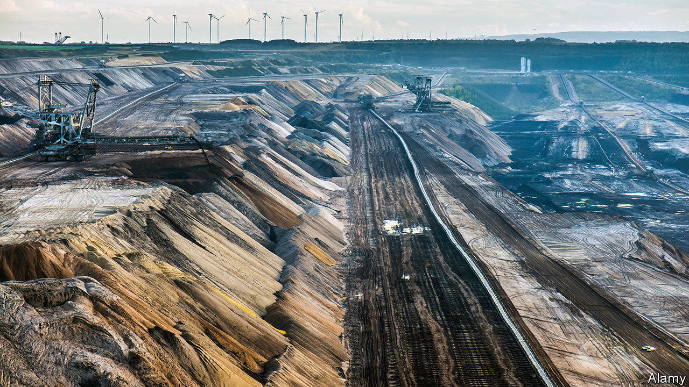

###### Cleaning up its act

# RWE, Germany’s biggest power company, is going green 

##### But are its plans ambitious enough? 

 

> Oct 6th 2022 

It has been one of Europe’s dirtiest companies for more than a century; now rwe is aiming to be among the cleanest. Germany’s largest power generator has recently taken two big steps towards this goal. On October 1st it agreed to buy the renewable-energy business of Consolidated Edison (ConEd), an American utility, for $6.8bn. Three days later it signed an agreement with Germany’s regional and federal governments to bring forward plans to stop generating electricity with lignite, an especially filthy sort of coal, by eight years to 2030. But is this enough to burnish its green credentials?

rwe has become a household name in its home country as an operator of nuclear plants and lignite mines—which has made it the target of many a protest over the years. In 2019, for instance, activists camping in dozens of treehouses stopped it from clearing what was left of the Hambacher forest, a once-vast tract of woodland in western Germany, in order to continue mining lignite. The recent announcements are part of a much bigger realignment. In November last year it unveiled plans to invest €50bn ($50bn) to increase renewable-power capacity from 25 to 50 gigawatts (gw) within eight years, about a third of its current total.

In combination, the two recent deals show that rwe is on the right path, says Vincent Aryal of JPMorgan Chase, a bank. ConEd’s 3GW renewable business will make rwe America’s fourth-largest provider of green energy, but also comes with a pipeline of wind and solar projects of over 7gw. The agreement in Germany raises the prospect that rwe could exit from coal even earlier than 2030. Markus Krebber, the firm’s boss, told analysts that its lignite business is likely to be hived off as a non-profit foundation as soon as the current energy crisis ends and German politicians have the time to give regulatory approval.

Yet some investors argue that rwe is not ambitious enough. Other big European utilities have more sweeping plans, says Benedikt Kormaier of Enkraft, an activist fund which owns a small stake in rwe. Enel, an Italian firm, and Iberdrola, a Spanish one, want to reach 129gw and 95gw, respectively, in green power-generation capacity by 2030. This, combined with the fact that it will have a large legacy business for some years, means that rwe’s valuation is lower than it should be, notwithstanding the prospect of a very profitable year and its rising share price, says Mr Kormaier. The financing of the ConEd deal shows this, he points out. The Qatar Investment Authority (qia), the country’s sovereign-wealth fund, contributed €2.4bn of cash for the deal and will henceforth own 9% of rwe. But it only paid about half the multiple for its stake in rwe that rwe shelled out for ConEd’s renewable business.

Perhaps the qia is a beneficiary of the wheeling and dealing between Germany and Qatar. When Chancellor Olaf Scholz toured the Middle East in September, Qatar was one of the stops. Germany’s government hopes that the resource-rich Gulf state will one day provide exports of liquefied natural gas to replace imports from Russia. With qia now becoming rwe’s largest shareholder, the gas is more likely to start flowing.■


