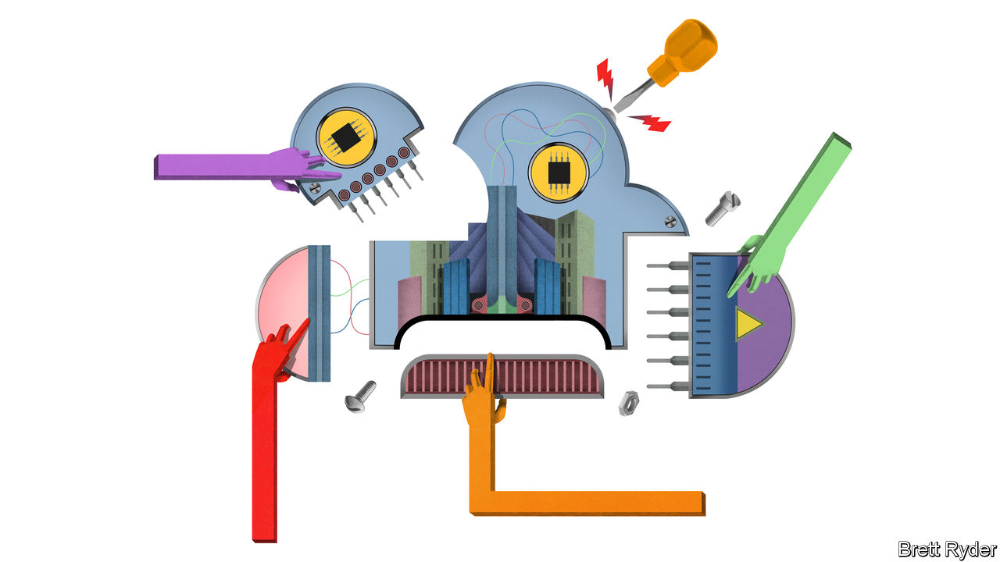

###### Schumpeter

# The cloud is the fiercest front in the chip wars 

##### Data-centre chips were once a stale monopoly. Now the business is brimming with competition 

 

> Oct 6th 2022 

It is easy to think of the computing cloud as the placeless whereabouts of the latest Netflix series, your Spotify playlists, millions of wanton selfies and your digital assistant. It is even easier to ignore it altogether, at least until Alexa alerts you that your storage space is filling up and helpfully offers to rent you extra room, of which there always appears to be more available. Necessary, disembodied and, for $9.99 a month, to all intents and purposes limitless: it is the ether of the digital age. This ether, though, has a very unethereal side—the vast data centres where all this information is physically stored and, increasingly, processed by powerful computers known as servers. The semiconductor hardware that makes the servers powerful is fast becoming the hardest-fought front in the battle over the $600bn global market for computer chips.

Rooms of servers began to replace computer mainframes in the 1990s. Back then, they were owned by companies and installed on their premises. They mostly ran on chips made by ibm and hp, the big tech of the day. These were supplanted by processors from Intel, which by the mid-2000s translated its dominance of pc semiconductors into a near monopoly of the server market. Things started to change once again around a decade ago, when Amazon began selling some of its spare server capacity. Microsoft and Google followed suit and the cloud-computing industry took shape. As the cloud has billowed, so has Intel’s competition. 

Today the market for server processors is getting bigger, more crowded and more complex. (The business of memory chips, which store data rather than crunch it, is distinct, more commoditised and less lucrative.) Intel, which both designs and manufactures semiconductors, derives 33% of its revenues from server chips, up from 29% in 2016. Specialist chip designers that do not do their own manufacturing are expanding their server-chip businesses even more quickly. Data centres now account for 39% of the sales of Nvidia, up from 7% six years ago. For amd, another American chip designer, the figure has jumped from 17% to 23% between 2020 and 2021. The big cloud providers, including Amazon and Google, are getting in on the game by designing their own processors, often based on blueprints from Arm, a Japanese-owned firm which licenses off-the-shelf designs that clients can tailor to their needs. The designs are then etched onto silicon by contract manufacturers, most notably tsmc of Taiwan, which are also increasing their server-chip capacity.

Two factors explain the competitive storm. The first is the market’s size and growth. Data-centre chips are a bright spot in an otherwise dark year for the semiconductor industry, which is in the grip of a cyclical downturn that has wiped two-fifths from the market value of the world’s chipmakers this year. Whereas sales of PCs and smartphones, and the chips inside them, are expected to fall this year, server demand is forecast to rise. Synergy Research Group, a firm of analysts, expects the cloud giants to build more than 300 new data centres around the world by 2024. The biggest of these could house at least 100,000 servers apiece. That will require an awful lot of chips. According to idc, another research firm, cloud and on-premise data centres will buy $71bn-worth of semiconductors in 2022, up from $42bn in 2019. Sales may grow by nearly half in the next five years or so, twice as fast as the chip industry as a whole. Most of that growth will come from processors rather than memory chips.

The second reason for the upheaval is the growing sophistication of what the cloud does. It no longer acts merely like a large external hard drive. It is bursting with new capabilities that require different chip architectures. In some cases, that means repurposing existing technology. Nvidia’s cloud business is built atop its graphics processing units (gpus), specialised chips used to make computer animation lifelike. It turns out that gpus, which were first designed in the 1990s to improve video games, are also excellent at running artificial-intelligence (AI) models. Intel recently launched its first set of stand-alone gpus to compete with Nvidia as well as amd, which also makes them. 

Cumulo-nimble

All-new designs are also emerging. The cloud giants, looking to boost performance and cut costs, are busily adapting Arm’s energy-efficient designs. Amazon’s Arm-derived Graviton chips are being sown across many of its server farms. Google is doing the same with its Tensor Processing Units. Microsoft is working on custom designs for its Azure cloud. In 2020 Nvidia offered to buy Arm for $40bn, in large part to beef up its cloud offering. That deal collapsed in February amid antitrust scrutiny, but the company nevertheless plans to launch a general-purpose server chip next year to take on Intel more directly. 

One clear winner from the cloud boom is TSMC. It is the only company currently able to manufacture the bleeding-edge processors most sought-after by the cloud providers. Intel hopes that its recent technological advances and entry into the contract-manufacturing business—together with $52bn in new American subsidies for domestic chipmaking—will help close the gap with the Taiwanese company and win back some of that custom (though the firm’s consistently underperforming share price suggests that investors have their doubts).

Ironically for a hardware business, another big chunk of the cloud-chip spoils may end up with firms that offer the best software. Nvidia’s popular programming language, cuda, already makes it easier for developers to boost the performance of its chips. For now, the cloud giants seem content to work with Nvidia rather than try to compete with its specialised software. But they are first and foremost software firms, so this peaceful co-existence may not last for ever. All this should worry incumbents like Intel and Nvidia. For cloud users, it almost certainly means better, cheaper and ever more invisible services. ■


