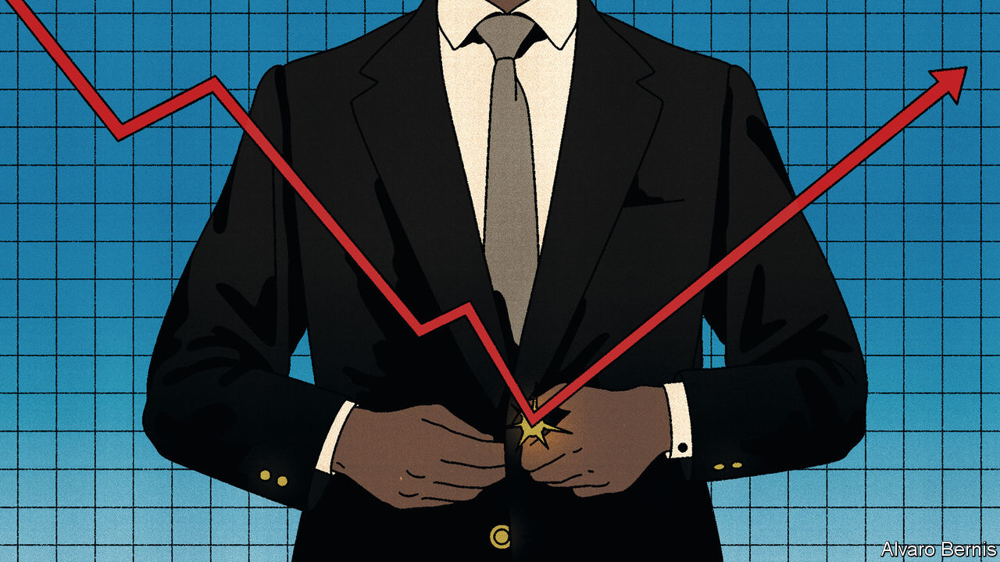
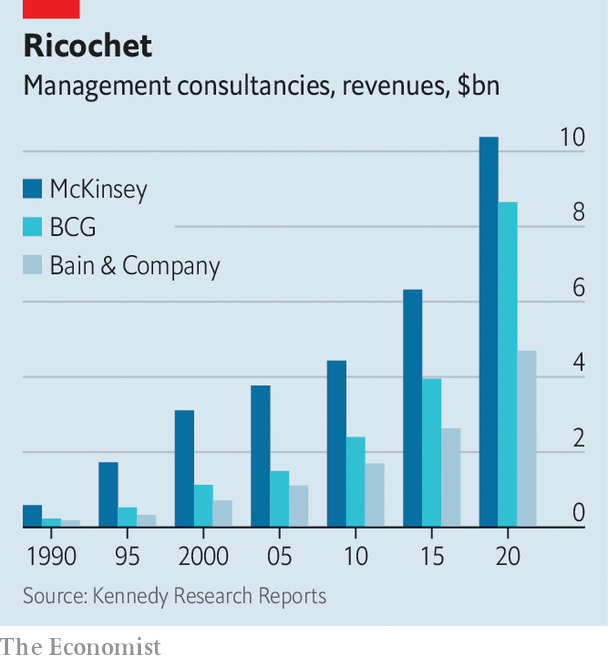

###### Bulletproof suits

# Where next for management’s consiglieri? 

##### Forget the scandals. McKinsey and its peers are more powerful than ever 

 

> Oct 4th 2022 

The ceo-whisperers of Bain &amp; Company, Boston Consulting Group (bcg) and McKinsey, the trio at the pinnacle of management consulting, are accustomed to operating in the shadows. Of late, though, they have been thrust into the light by . Bain has come under fire for gutting South Africa’s tax office. bcg has been criticised for its close ties to Saudi Arabia’s autocratic de facto ruler, , and for allegedly profiting from corruption in . In a new exposé published on October 5th, “When McKinsey Comes to Town”, Walt Bogdanich and Michael Forsythe of the  pile on with a harrowing account of decades of dishonourable exploits at McKinsey, the . 

Allegations covered in the book include helping opioid manufacturers peddle their products to addicts, encouraging insurers to slash claims payouts to motorists and profiting from ill-gotten contracts with state-owned companies in , a charge for which the country’s prosecutors announced criminal proceedings on September 30th. McKinsey says that the book “fundamentally misrepresents our firm and our work” and that “the charges filed against our South Africa office are meritless and we will defend against them.” 

Still, it had previously apologised for its work with South African state-owned enterprises and its support of the opioid industry, beefed up risk and legal functions, and put in place tighter rules for signing off projects before they begin. Last year, as the scandals were piling on, it defenestrated its boss, who appears to have paid the price for goings-on that mostly happened before his watch. Bain has also said sorry for its work with South African taxmen, introduced new layers of governance and set up a whistleblower hotline. bcg has said that its work in Saudi Arabia has focused on areas that could “positively contribute to economic and societal transformation” and that the firm has turned down work that goes against that principle.

This bout of soul-searching is welcome. For despite the scandals, the consultants’ clout is, if anything, on the rise. Between them, the elite trio advise the world’s largest companies on their most consequential decisions, and many governments, too. (The author of this article used to work for Bain.) Clients are happy to pay eye-watering sums for this counsel. Messrs Bogdanich and Forsythe report that McKinsey earned $50m from Chevron, an , in 2019, $30m from Altria, a tobacco company, in 2018 and 2019, and $13m from us Steel between 2018 and 2020. It also made $1bn in fees from America’s federal government between 2009 and 2021.

 


Between 2015 and 2020 the combined revenue of the three firms roughly doubled, to $24bn, estimates Kennedy Research Reports, an industry-watcher (see chart). A bumper 2021 may have seen takings near $30bn, according to Consultancy.org, which tracks the business, as clients wrestled with supply-chain and other issues spawned by the covid-19 pandemic. And the consultants are offering an ever wider range of services, including help with implementing the consultants’ counsel. “Clients now demand more than just advice. They want our help in underwriting outcomes,” says Bob Sternfels, boss of McKinsey. Christoph Schweizer, boss of bcg, agrees: “Over time, our work has shifted from advising to advising and building.” That means bigger, longer projects, and juicier fees.

Part of the consultancies’ growth has come at the expense of rivals that have struggled to keep pace with the dominant three. Over the past decade smaller firms like Booz &amp; Company, Monitor and Parthenon have been snapped up by the big accounting firms—pwc, Deloitte and ey, respectively—which have sought to build premium consulting arms that can go head-to-head against the mbb, as the elite trio are known. The results have been mixed, with some accountancy firms struggling to hold on to top talent after the acquisitions. As a result, the pointy end of the consulting business has confirmed one of its own maxims: a stable competitive market never has more than three significant competitors.

The three firms have also benefited from structural changes. One is the craze for , which ever more businesses are taking into account in addition to financial ones. The relative novelty of esg means that few bosses know even where to start. In such cases bringing in outside experts makes sense. The consulting trio are now offering services to help clients decarbonise, improve diversity or otherwise become more virtuous. Whether or not their clients can do well by doing good, the consultants themselves are certainly profiting from the esg craze: bcg already earns around 10% of its revenue from climate change-related consulting.

An even bigger growth area is digitisation. Fearful of their firms becoming the next Borders or Blockbuster, two victims of the digital revolution, chief executives are willing to pay top dollar for help with things like selling products online, automating routine work or sprucing up Byzantine it systems. Demand for help with digitisation is accelerating in line with the pace of disruption, notes Mr Sternfels. 

As with esg, many companies lack in-house know-how about how to do it well—or at all. The consultants, by contrast, have often been thinking about it for years and, given their broad client base, have a good grasp of sectoral and economy-wide best practice. They have also been beefing up their digitisation practices by buying outfits with expertise in areas like big data and online marketing. It helps that the trio can point to their own successful digital transformations. Manny Maceda, boss of Bain, recalls how the most advanced tool at his disposal when he first started at the firm in the 1980s was a calculator. Today’s consulting teams are armed with suites of purpose-built software that take much of the grunt work out of jobs like benchmarking costs, freeing up more time for important things like talking to clients and understanding their business challenges. 

The consultants’ glory days may not last for ever. Competition may stiffen; in May ey decided to spin off its consulting arm to unshackle it from the stodgy audit business. The esg movement is facing a backlash, especially in America, where the political right decries it as woke capitalism. At some point, most companies will have digitised. If those growth engines sputter, pursuit of fresh business could propel the consultants into the arms of controversial clients in riskier places. That in turn could deter the industry’s most important raw material: brains. “Our product is our talent,” as Mr Maceda says. And talent is a scarce resource—especially the sort that is willing to work the punishing hours expected of mbb-ers. 

These are genuine threats, but not imminent ones. Both esg and digitisation probably have years’ worth of business in them yet. Having had their fingers burned in countries like South Africa and Saudi Arabia may have tempered consultants’ appetite for more of the same. As for brains, among mba graduates interest in consulting is as strong as ever, in contrast to a waning appetite for investment banking. Overall application volumes have apparently kept pace with the number of available slots, as firms have targeted candidates from less traditional backgrounds like medicine and science, and looked beyond the elite universities that historically provided the lion’s share of hires. 

Aspiring consultants may believe, rightly or wrongly, that the sundry scandals represent isolated instances of past bad behaviour and that new safeguards put in place will prevent them from happening again. Alternatively, they simply don’t care, relishing the intellectual challenge, the pay cheques and the career leg-up that comes courtesy of a stint at mbb. Either way, the world’s chief executives need not worry about the whispers in their ears falling silent soon. ■


