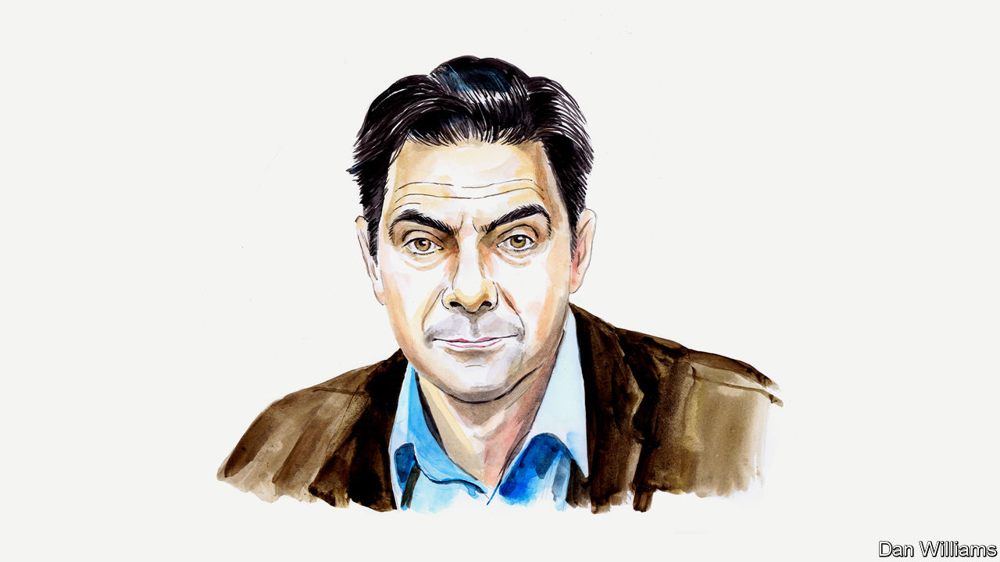

###### Russia and Ukraine

# Kirill Rogov on what Russians really think of the war in Ukraine 

##### The Russian political scientist says it is too early to declare mobilisation a failure 

 

> Oct 5th 2022 

VLADIMIR PUTIN began the war in Ukraine in the belief that it would be a cosplay of triumphs in 1945, that his troops would be marching through Kyiv and he, like Stalin, would be watching the parade in the Red Square. Now it looks as though he is trying to cosplay 1941—the dramatic start of the Great Patriotic War against Nazi Germany. 

This is the third version of the Kremlin’s original plan. The first, a blitzkrieg to capture Kyiv, failed within the first month. The second, the seemingly inevitable offensive, stalled in the summer and was abandoned in early September following the success of Ukraine’s counter-offensive. In the third version, the Russian motherland has been declared in danger and hundreds of thousands of men are being drafted to fight. The “partial mobilisation” declared by Vladimir Putin on September 21st looks like forced improvisation and it is disrupting the balance of interests and loyalties in Russian society, where views on the war are very mixed. 

According to recent opinion polls, conducted by pollsters such as the Levada Centre which has offices in Moscow, 70-75% of respondents in Russia support the war with Ukraine. (These surveys were conducted before Mr Putin announced his mobilisation drive.) But these shocking figures are deceptive. Public opposition to the war can result in criminal prosecution, so people who are critical of the war and the regime are less likely to agree to speak to a pollster. This results in skewed samples and inflates the level of support for the war. 

To understand the nature and composition of the pro-war majority, you need to dig deeper. By analysing some additional questions, taken from a survey by the independent pollster the Russian Field Group, we know that about a third of the Russian population constitutes a solid party of war; some 15% support the war with reservations; another 20% support the war but would have preferred it had the war never happened. Russian state television—instrumental in shaping public opinion—serves all these audiences.

Two main narratives circulate. One is peddled by the best-known talk-show hosts who tell viewers that the “special operation” is part of Russia’s total and existential war with the West—which is, of course, hell-bent on obliterating Russia. This apocalyptic narrative sets up Ukraine as the site of this great battle. The second narrative, prevalent on news programmes, emphasises that the “special military operation” in Ukraine is being conducted by professionals to liberate the Russian people of Donbas and other regions. It is presented as a “just war” predicated upon Russia’s responsibility to help Russians in need. Conflict with the West is a secondary consideration. 

The pro-war party consists of three main groups: one is in favour of total war and a decisive confrontation with the West; the second believes that Russians are fighting a just war under the banner “responsibility to protect”. The third group mostly supports military action, but they conform possibly because they fear to confront Mr Putin and his supporters. The first group passionately supports the way because they feel that the enemy is already on Russia’s doorstep; the other two see the threat as far away.

In his mobilisation speech on September 21st, Mr Putin used choice rhetoric of the party of total war to persuade Russian citizens of the enemy’s proximity and the need to defend the motherland. Many commentators declared that this rhetoric would undermine the fragile support of the majority for the war. I urge more caution. Mr Putin has a long record of masterfully manipulating public sentiment. By siding with the more militant part of the pro-war camp, which has long demanded mobilisation, Mr Putin may force doubters to pick a side and thus polarise society. He calculates that the greater (though still limited) involvement of the Russian population in Ukraine may push Russians to support their boys in uniform more strongly. It will drive a wedge between families whose members fight, and those whose run for the border or curse the war.

In theory, this could work. The educated and the wealthy, many of them urban residents, are fleeing mobilisation. Those with more meagre resources are going to recruiting stations. They may be frightened and apprehensive, and not very keen to fight, but they are not ready to break away from the imaginary “national body” whose will and aspirations are expressed for them by Mr Putin. The fraught nature of their decisions to enlist will increase their hostility toward those who make the opposite choice. The idea may be that the departure of defectors will leave a more faithful nation that will fight and die without hesitation.

In practice, however, the chaotic nature of the mobilisation is throwing off Mr Putin’s calculations. It has undermined the common man’s confidence in the state machine, its efficiency and its dedication to a common cause. Thus it has undermined the very sense of unity and nationhood that Mr Putin hoped to manipulate. For one thing the mobilisation was announced too late, when Russian troops were already being defeated by Ukrainian ones. For another, it has exposed how the centralised administrative machinery, built by Mr Putin, struggles in an emergency. That is because it is built on corruption and sycophancy, not competence. 

Overall, the war’s outcome will depend on the mood of the group who support it and on the group of conformists who go along with it. That is because its most avid proponents, and its most intractable opponents, will not change their minds. If those who see it as a “just” war start to suspect that it is slipping into an existential conflict with the West, or if conformists change their risk calculations because they face being drafted, the balance of opinion may shift decisively. 

That is why recent protests in Dagestan and Yakutia, organised by the relatives of those being mobilised, are more important than the protests in Moscow and St Petersburg organised by anti-war activists. The more radical the narrative justifying the war, the higher the cost and the more hopeless the management of the mobilisation, the more likely it is that the consensus in favour of the war will crack. After the muddled start of the mobilisation campaign, this looks probable. But it would be premature and irresponsible to say that this has already happened, or that it is inevitable. ■


