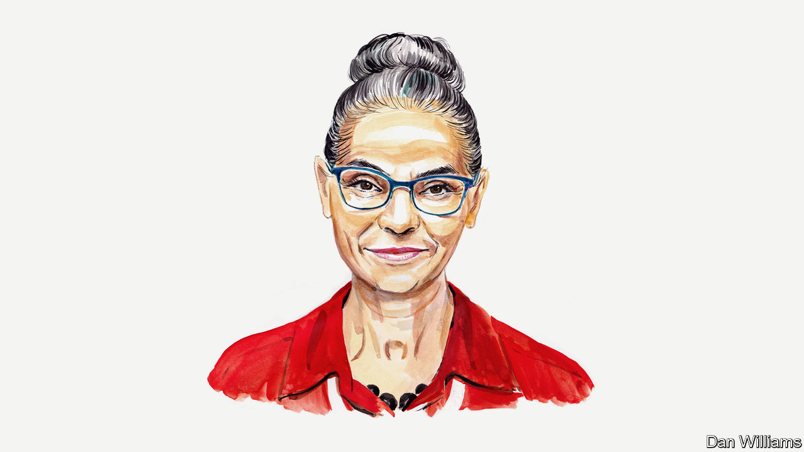

###### Brazil’s elections

# Marina Silva on why Brazil’s presidential contest will decide the Amazon’s fate 

##### The politician and former environment minister urges Brazilians to vote for a change of leader 

 

> Sep 30th 2022 

THE WORLD is going through a series of crises, and we in Brazil are not immune. Of all the threats we face, from pandemics to the war in Ukraine, from disruptive technologies to rising inequality, the most troubling are the erosion of democracy and the destruction of the environment. And in Brazil they are linked.

Supporters of President Jair Bolsonaro are growing in influence. They threaten democracy and promote a rampant increase in carbon emissions from deforestation and fires in the Amazon, as well as the destruction of biodiversity. According to data from a government research unit, deforestation in the Amazon in 2021 was 73% higher than in 2018—the year before Mr Bolsonaro took office. This destruction threatens indigenous peoples and traditional populations, and exacerbates growing social inequality. According to the PENSSAN Network, Brazil, an non-governmental organisation, our country now contains 33.1m starving people, up from 19.1m in 2020. 

Aware of the historic importance of this year’s elections in Brazil—the first round of the presidential contest is on October 2nd—I decided to run for a seat in our lower house, the Chamber of Deputies. I have presented to the former president Luiz Inácio Lula da Silva—the presidential candidate with the greatest chance of defeating Mr Bolsonaro and who is commonly known as Lula— a set of proposals for the recovery of the lost socio-environmental agenda in Brazil. They enhance and update policies that were developed during the eight years of his government, between 2003 and 2010, in which I was environment minister for more than five years.

Based on these proposals, publicly accepted by Lula and his prospective vice-president, Geraldo Alckmin, I have decided to support Lula’s candidacy in the first round of the forthcoming election. I have endorsed Lula in the hope that he can win without the need for a run-off, as the best means to prevent Mr Bolsonaro contesting the election result.

In this article I would like to present some of my proposals for Brazil’s next government. The first is the principle that environmental policies must be implemented in an integrated manner by all national ministries and agencies. A National Climate Authority should be established. It would be responsible for establishing goals and action schedules for the effective reduction of carbon emissions, for adaptation and for increasing the country’s resilience in the face of climate change.

The Plan for the Prevention and Control of Deforestation in the Amazon, conceived and initiated during my term as minister was effective. It reduced deforestation in the region by more than 83% between 2004 and 2012 according to satellite monitoring by the National Institute for Space Research. Both the Amazon plan and a similar one for the , Brazil’s savannah, must be resumed and expanded to other important areas of biodiversity in the country. We should aim for the end of deforestation in Brazil and for significant investment in reforestation. To do this we must rethink our production system for agriculture, livestock and forestry in order to reduce associated emissions of greenhouse gases. This is the path for Brazil to continue contributing to food security around the world.

Threats to indigenous people and territories, which occupy more than a quarter of the Brazilian Amazon and are home to the most protected areas of biodiversity, must end. Traditional communities and — descendants of slaves—have endured serious attacks in recent years, and these have grown in number under the Bolsonaro government. We must fully protect the constitutional rights of these populations.

The development of a national payment system for environmental services and the implementation of a regulated carbon market are essential for advancing decarbonisation in our country. Brazil has the greatest potential for carbon sequestration through reforestation in the world, due to its vast land area, intense sunlight and rainfall patterns. The end of deforestation combined with the regeneration of biomes and the conservation of agricultural soils are keys for Brazil to become a carbon-negative economy, which would benefit the world.

The size, diversity and richness of the country’s biomes and the density and quality of its scientific community and traditional populations, who have deep understanding of our flora and fauna, mean Brazil could become a hub for medicinal discoveries. A National Bioeconomy Policy, combined with increased numbers of international partnerships, could create a new industry in the country. Its growth would be of importance both to Brazil and to South America as a whole.

Finally, Brazil must improve its participation in all multilateral forums, overcoming the years of setbacks under the Bolsonaro government. With regards to climate policy, it must act to promote stronger commitments towards global decarbonisation. Next year Brazil has the opportunity to shift from being a laggard to a leader through new climate, biodiversity and energy policies. Such changes are possible with a change of government. ■


