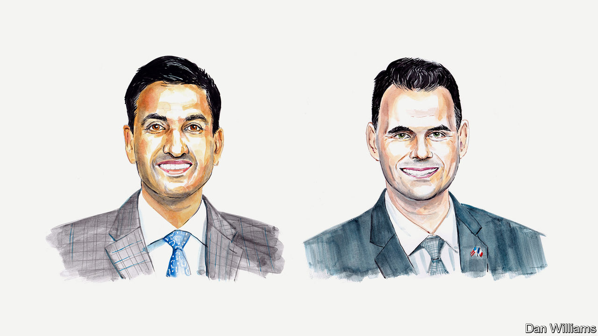

###### America’s 2022 midterms

# Ro Khanna and Zach Wahls on how Democrats can win back factory towns 

##### The two politicians place their hopes in economic policy 

 

> Oct 3rd 2022 

AMERICANS IN AREAS hit hard by deindustrialisation feel abandoned by the Democratic Party. This is a phenomenon outlined by Mike Lux, a Democratic strategist, in a recent study of American factory towns. It is also one that we—a US Representative from Silicon Valley and a state senator from eastern Iowa—recognise. To regain trust, our party must make sure that Americans across the country understand how new legislation will help them through investments in technology and manufacturing. In addition we should own up to, and reverse, the disastrous trade and economic policies (adopted by both parties) that have devastated America’s factory towns. 

In Iowa, as in many other states, a clear divide has grown between voters. Democrats over-perform in large and growing urban and suburban communities and Republicans succeed in small towns and rural areas. The destruction of Iowa’s once-vibrant manufacturing sector over the past 30 years has had catastrophic consequences and accelerated this divide.

Residents of many small cities have seen their jobs shipped abroad and their communities have suffered as a result. There is no better example than Newton in Jasper County, Iowa. Formerly known as the “Washing Machine Capital of the World,” Newton saw Maytag, a major manufacturer, leave in the early 2000s. Jasper County was once a Democratic-leaning place, but Donald Trump carried it with 56% of the vote in 2016 and 60% in 2020. Reinvigorating American factory towns with new, well-paid manufacturing and tech jobs is critical if we are to support such communities and spread wealth. It is only through such gains that Democrats can defeat Donald Trump’s populist narrative.

To be sure, the trade and economic policies of recent decades are not the only factors that have contributed to our country’s manufacturing decline. They are also not the only factors explaining the success of conservative politics in these communities, especially considering Republicans have not implemented effective solutions to fix these problems. But Republican rhetoric about supporting American factory towns has resonated with the people who call these communities home. Democrats have been painted as out of touch and recent polling shows that only 23% of rural voters say that the Democratic Party “cares more about my community” than the Republican Party. To turn things around, we must show people that we care.

That’s why Democrats need to promote what we’ve delivered in recent years to win back sceptical voters. That starts with the American Rescue Plan, a stimulus package signed into law in March 2021, which is funding the deployment of high-speed broadband internet to rural communities, and the Bipartisan Infrastructure Act, signed into law in November, which is helping to repair roads and bridges. Those in Iowa are among the country’s least structurally sound. 

In July, we led the passage of the CHIPS and Science Act. It is the start of a new economic vision for the future that supports American workers by making sure advanced manufacturing and production are done here at home, not offshore. Its aim is not to restrict international trade, but to rebalance production and reduce the existing trade deficit. We are already seeing the results with Intel’s new semiconductor factories in Ohio. They are a $20bn investment and are expected to create at least 3,000 new company jobs in the state and 7,000 construction jobs. Most of these jobs do not require college degrees yet they pay well. 

By contrast Republicans continue to implement and support policies that harm workers in Iowa by eroding unemployment insurance and workers’ compensation programmes. The party’s demagogues also stir racial resentment to divide working-class communities. They oppose legislation like the PRO Act, introduced last year, which would protect and expand workers’ rights. Their priorities are more tax cuts for the ultrarich and big corporations. We saw this clearly with the Trump tax cuts of 2017 and a recent, similar tax giveaway passed by Republicans in Iowa’s state legislature. 

As our country enters a new era of industrial policy, this is the moment to make sure our economy works for every community. Democrats must embrace “inclusive populism”, as Leah Hunt-Hendrix, an activist and writer, laid out in a recent opinion article in Politico. This requires speaking honestly to voters about difficult issues like immigration and race. We should acknowledge that certain communities have been hit harder by deindustrialisation than others. But we can bring people together through a shared goal: creating well-paying jobs and making things in America again. It’s important not to allow ourselves to be divided.

Our economic vision includes fair pay and benefits for working-class families. It transcends geography, party and race, and can help stitch this country back together. There’s no time to waste. With the midterms approaching, Democrats must demonstrate that we are the party that is taking action to revitalise America’s factory towns.■


