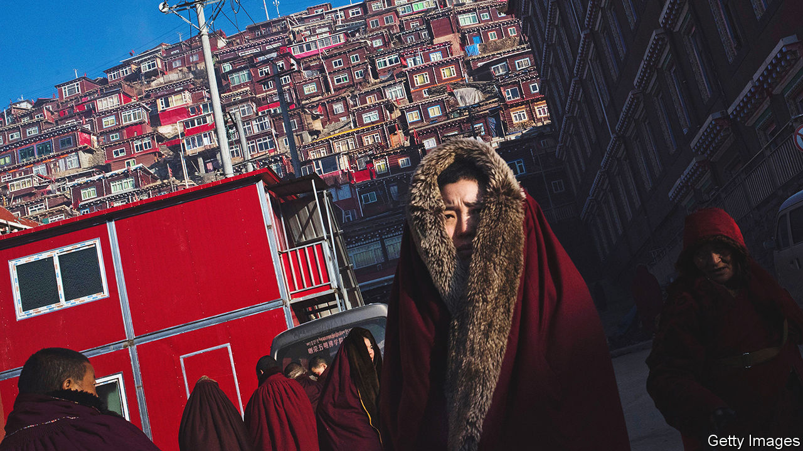

###### Sinifying Shangri-La

# Han Chinese seek spiritual salve in Tibetan Buddhism 

##### And the Communist Party tries to discourage them 

 

> Oct 6th 2022 

Chinese tourists celebrated this summer when it was announced that Larung Gar would soon be open to visitors again. Many had long dreamed of seeing the remote Tibetan Buddhist settlement, home to thousands of crimson-robed monks and nuns living in little red huts sprawled around a monastic centre in the mountains of Sichuan province. The sight alone could cleanse one’s soul, bloggers gushed. Too bad, then, that it was closed again a few weeks later, ostensibly to control an outbreak of covid-19. 

Throughout the pandemic the government had been blocking public access to Larung Gar. It probably has not wanted people to see evidence of its clampdown on the community, whose population had been growing rapidly in recent years. Officials had been demolishing parts of the settlement, evicting many residents and requiring those who remained to undergo “political education”—meaning being taught to obey the Communist Party. 

The authorities’ efforts have not dampened public enthusiasm in China for what some call “the last pure land in China”. Tourists share tips on social media about how to circumvent roadblocks around the academy. Just take a motorcycle up the mountains and then walk in through a back trail, advised one travel vlogger from the central province of Hunan. 

To stifle separatism, the government subjects Tibet to harsh controls. But Tibetan Buddhism has grown increasingly popular among members of China’s ethnic-Han majority, most of whom live far from the Tibetan plateau where Larung Gar is located. Their enthusiasm has been fuelled by Tibetan efforts to spread their faith. The academy at Larung Gar was founded in 1980 by Jigme Phuntsok, a Tibetan Buddhist master. He wanted to revive Buddhism across China, where a non-Tibetan form has a centuries-long history. He gained thousands of followers during a visit in 1987 to Wutaishan, a sacred mountain in the northern province of Shanxi. 

By the late 1990s nearly a thousand Han Chinese disciples were living at Larung Gar. Mandarin interpreters helped them understand Jigme Phuntsok’s teachings, which later spread online. Tibetan lamas occasionally visited disciples in inland China where many Han Buddhists formed study groups, meeting weekly in private homes, offices and local temples.

Officials often turned a blind eye to such gatherings, regarding Buddhism as less threatening than Western-backed Christianity or potentially radical Islam. Few Han followers of Tibetan Buddhism supported Tibetan independence. Buddhist leaders of Jigme Phuntsok’s sect were also carefully apolitical. In 2014 , a state-controlled magazine, featured Khenpo Sodargye, Jigme Phuntsok’s successor, as one of its “people of the year”. 

Today Mr Sodargye is a bestselling author with nearly 3m followers on Weibo. His writings mostly discuss urban middle-class concerns such as money, stress and escaping the rat race—topics that are both popular and politically safe. During a harsh covid-related lockdown in recent months on the Tibetan plateau, which has triggered much online grumbling, he has spoken of the need for forbearance.

But the government is becoming more wary. Activists and scholars in touch with Han followers of Tibetan Buddhism say that the livestreaming of teachings in Larung Gar and other monasteries has been blocked since mid-2021. Pressure has been put on home groups to stop meeting. In Shaanxi and Guangdong provinces, state-affiliated Buddhist associations have banned “illegal preaching by Tibetan monks”. On the plateau, officials have ordered clergy not to travel for religious purposes without permission. Han disciples at Larung Gar, who numbered about 2,000 by 2019, have been forced to leave. The party is trying to “segregate” Buddhism in China, says Tenzin Norgay of the International Campaign for Tibet, an NGO.

Ironically, this is happening amid a party campaign to “sinify” religions, including Tibetan Buddhism. The aim is to make religious leaders and believers identify with the Chinese “motherland”, Chinese culture and the party. This has resulted in tighter party controls over every faith. Last December an article by Zhu Xiaoming, a party scholar of Tibetan affairs, expressed concern about Chinese believers who, he said, had evolved from using religion for utilitarian purposes to embracing it for spiritual sustenance. “The ideological contest between theism and atheism is a struggle for hearts and minds,” said Mr Zhu. Party members should preach more atheism and materialism, he said, to win the Chinese people back.

That may prove an uphill battle. Tibetan Buddhism has attracted many Chinese followers precisely because of their disillusionment with modern materialism. The point of Buddhism is to escape from the empty suffering of secular life, says one Han practitioner who asked to be referred to by his Buddhist name, Puba Duojie. 

Like many other Han followers of Tibetan Buddhism, Puba Duojie thinks Buddhist temples in Han areas have become over-commercialised and too closely linked with officialdom. He says their teachings have become “like diluted milk”. Puba Duojie reckons that the government’s efforts to prevent Tibetans from preaching their faith to Han Chinese will not deter true disciples or their teachers. The party has existed for only a hundred years. Lamas believe they are planting seeds of Buddhism that will bear fruit over many lifetimes. Their patience comes from a much longer-term view. ■


