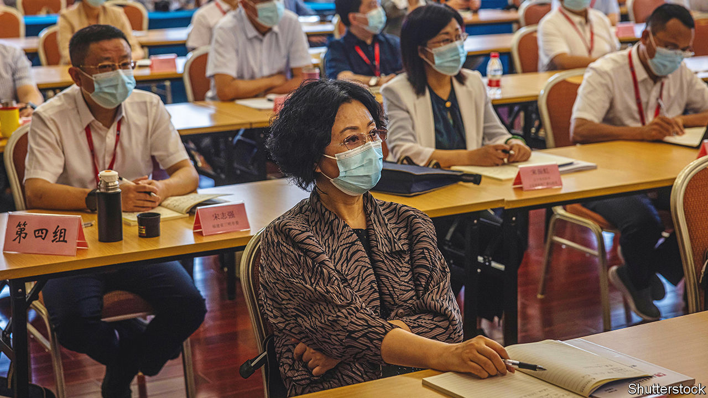

###### Class struggle

# How academies for cadres shape China’s ruling class 

##### Bold, innovative thinking was once encouraged. No more 

 

> Oct 4th 2022 

Communist party congresses are rubber-stamp affairs. The 2,300 delegates who will attend the five-yearly jamboree later this month in Beijing will have almost no chance of scuppering the decisions—already made in secret—that will be unveiled at the event. To ensure that they stay in line, many of them must undergo training. Delivering it is often the job of a vast system of schools that the party uses to transmit skills and ideology to bureaucrats. 

In recent days, several provinces have reported on lessons being given at these schools to congress delegates who have no official titles (model workers, farmers and the like). The classes appear to focus on the need  and on instilling the principle that “whatever the party asks me to do, I will do”, as one account put it. The training typically lasts two days. 

Normally, however, the students are officials. In a recent paper David Shambaugh of George Washington University wrote that nearly all of China’s roughly 50m functionaries, from central government ministers down to township chiefs, have moved through the training system, usually for mid-career stints ranging from one week to two years. Mr Shambaugh described the system, comprising about 7,000 institutions, as a “critical cog in the machinery” of party control. Subjects taught range from Marxist theory to the nitty-gritty of public administration. Some even grant degrees, including MBAs. 

The most prominent types are known as party schools. Before Mr Xi came to power, these sometimes fostered innovative thinking, including in the political domain. Students talked about how to make the party more democratic with freer elections for its leaders. Schools often invited foreign scholars to lecture, even on liberal democracy. At the Central Party School in Beijing, officials “might be discreet in talking to strangers or in public, but their internal discussion in class is unbounded”, , a state newspaper, enthused in 2011—albeit with hyperbole (party rule itself could never be questioned). 

But Charlotte Lee of Berkeley City College, who has written a book on the training system, says the schools have since fallen under greater centralised control, enforced by inspection teams. What freedom party schools might have enjoyed “has faded”, she says. Mr Xi made this clear in a speech in 2015 at the central school. “On the important principle of upholding the party’s leadership, we must be very clear-headed, bright-eyed and firm in our stance, and we must not have any ambiguity or wavering,“ he said. Cai Xia, an exiled former teacher at the school, says that Mr Xi showed “dictatorial” tendencies in 2009 when, as the school’s president but not yet the party’s boss, he warned the faculty against criticising party policies.

The same trend has been evident at schools that specialise in teaching management skills to bureaucrats. These were set up in the 1980s under Deng Xiaoping, who wanted to establish a professional civil service and even (for a while) encouraged efforts to create a wider gap between party committees and the government apparatus. Under Mr Xi, cadres have been incessantly reminded that the committees hold sway. As for delegates to the upcoming party congress, the clear message is that Mr Xi’s will counts more than anything. ■

