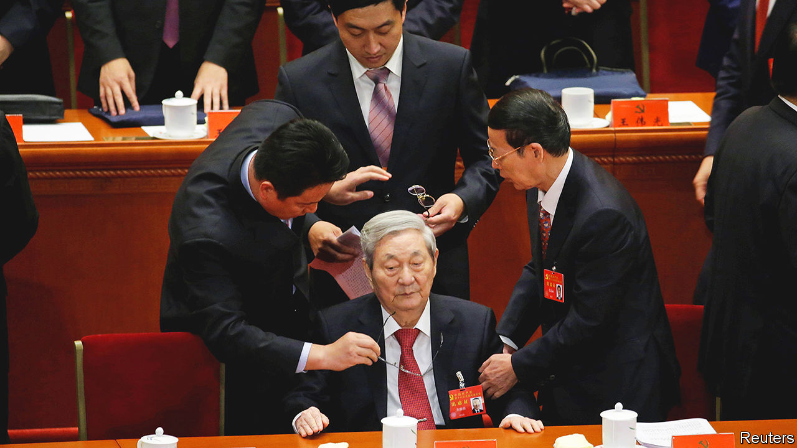

###### Interfering elders

# How retired party officials make themselves heard in China 

##### Under Xi Jinping, their influence is dwindling 

 

> Oct 6th 2022 

Song Ping was too young in the 1980s to have been counted among the “immortals”—a jocular term used at the time to describe Communist Party veterans who were playing a big role in politics despite having retired. Perhaps he deserves the title now. At 105 years old, he is still going strong, making him the doyen of the 20 or so former members of the Politburo Standing Committee—the apex of party power—who are still alive. Those fit enough are expected to appear at a five-yearly party congress that starts on October 16th. How much do such elders matter today? 

Like his fellow retired grandees, Mr Song seldom speaks in public. So when video footage of him addressing a charitable foundation emerged online in September, it caused a stir on Chinese social media and overseas Chinese news sites. Some tried to portray it as a rebuke to China’s leader, Xi Jinping. They quoted Mr Song saying that the only path forward was “reform and opening”—bywords for the economic liberalisation launched by Deng Xiaoping in 1979, which has regressed under Mr Xi. That is probably wishful thinking. The footage provides no evidence that Mr Song uttered those words. Even if he did, Mr Xi has used the same phrase. Mr Song is known as a staunch conservative.

Still, the episode is a timely reminder of the potential for former leaders to cause trouble for Mr Xi, who is expected to be given a third five-year term as party chief right after the congress, in breach of retirement norms. Public criticism from an elder such as the widely respected former prime minister, Zhu Rongji (pictured at the congress in 2017), could be damaging, especially just before a congress—although Mr Zhu is 93 and rumoured to be unwell. 

There is no sign of a direct challenge to Mr Xi. But as he continues to support Russia over its disastrous war in Ukraine, and refuses to abandon his “zero-covid” policy that is crippling China’s economy, many members of the elite now have reason to be deeply unhappy about their own, and the country’s, circumstances. Should Mr Xi ever find himself under political attack, it is more likely to involve the elders rather than a military coup or a mass uprising, according to many academics, diplomats and others who study Chinese politics. 

One such expert is Joseph Fewsmith of Boston University. “I assume there are a lot of people at very high levels who really don’t like Xi Jinping, and covid policy is the obvious attack point,” says Mr Fewsmith. “It doesn’t strike me as out of the realm of possibility that there could be a number of retired leaders who might want to coalesce and say something. But logistically it’s very hard to do.”

For more than three decades after Mao Zedong’s death in 1976, party elders wielded considerable power. Between 1982 and 1992 they sat on a formal advisory body. After that was scrapped, some were still allowed to see the party’s most important secret documents. They regularly met foreign dignitaries. And they gathered annually with incumbent leaders in the beach resort of Beidaihe to discuss policy and personnel decisions. Deng remained hugely influential at least until a year or two before he died in 1997 at the age of 92. 

Since Mr Xi took power in 2012, however, he has curtailed many of the elders’ perks, anxious to avoid the same fate as his predecessor, Hu Jintao, who suffered almost constant meddling from his own predecessor, Jiang Zemin. Mr Jiang (whose early rule had been overshadowed by the elderly Deng) stepped down as party leader in 2002 but remained military chief until 2004 and continued to pull strings from behind the scenes long afterwards.

Mr Xi made it clear he would not tolerate any such interference. In what was widely seen as a warning to Mr Jiang in 2015, the party’s mouthpiece, the , advised retired leaders that “once people leave, the tea cools down”. It accused some elders of trying to promote allies to prolong their influence, and urged them to “adjust their mentality...so as not to fall into endless troubles”. Mr Xi’s anti-corruption campaign has targeted several allies of Messrs Hu and Jiang. Most striking was the downfall of Zhou Yongkang, who in 2015 became the first former Standing Committee member to be convicted of corruption. The threat of similar probes into other elders—or their family members—remains a powerful deterrent. 

Under Mr Xi, party elders are thought to live under close surveillance, and to have to arrange public appearances and meetings with other senior figures through the party’s General Office, which is currently run by a close ally of Mr Xi. Many of the most influential elders are now too old to be socially active anyway. Mr Jiang is 96. He has long been rumoured to be gravely ill. 

And yet in one sign of continuing concern about the elders Mr Xi tightened restrictions on them further this year. In May the party’s Organisation Department, which manages personnel, published new rules demanding that retired officials, especially those who held leadership positions, should not “arbitrarily discuss” policy or spread “politically negative remarks”.

Mr Xi may have allowed the elders a limited say in this month’s leadership shuffle (several Politburo members are due to retire). For its congresses in 2007 and 2012 the party conducted straw polls of 200 candidates for Politburo membership. In 2017, however, candidates were instead selected after face-to-face interviews with incumbents. Mr Xi also sought opinions from 57 leading figures, including elders, state media said. Elders thus retained their right to express views, but Mr Xi gained more leeway as he saw them individually and denied them a chance to join forces or vote, says a Chinese academic who studies the party’s politics. 

The party has not identified the 57 people consulted in 2017. But they are thought to correspond closely with a body called the Standing Committee of the Praesidium, which had 42 members at the most recent congress, including all retirees from the Politburo Standing Committee. It plays a largely ceremonial role at the congress, overseeing the agenda and election of a new Central Committee. 

Mr Xi will probably have used the same system this year, as it was hailed a success in 2017, the Chinese academic says. That means elders will almost certainly be unable to block Mr Xi’s third term but could still influence the new Standing Committee’s membership by nominating protégés. Mr Xi could ignore them. But for the moment, he must be wary of humiliating elders to a point where they feel obliged to speak out, whatever the consequences. By the next congress in 2027, that should be a lesser concern as several more senior elders may have passed on.■


