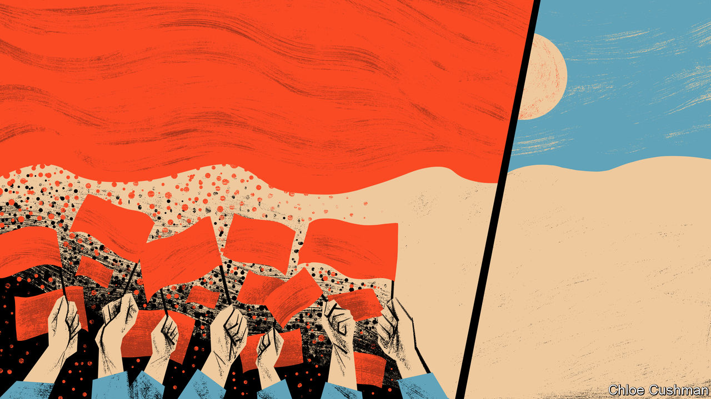

###### Chaguan

# Sino-American relations were in trouble long before Donald Trump 

##### A new book by a veteran scholar explains why 

 

> Oct 6th 2022 

As Communist Party leaders tell it, China’s relations with the West resemble a brawl between heavyweight champions, made vicious by American cheating. This narrative of grievance has been building for years and starts at the top. In July 2018, as China reeled under the first blows of Donald Trump’s trade war, President Xi Jinping hosted European Union leaders in Beijing. In closed-door discussions with his guests, Mr Xi accused America of behaving like a fighter in a “no-rules boxing match”. Since then, Chinese complaints have not been muted by Mr Trump’s defeat and replacement by President Joe Biden. That is odd, because Mr Biden is a politician of the old school, whose diplomatic style—truth be told—involves more back-slapping than eye-gouging.

In part, Chinese grumbling is tactical: a bid to blame bilateral tensions on America. When Wang Yi, China’s foreign minister, met his American counterpart Antony Blinken on the sidelines of the UN General Assembly in September, he urged the Biden administration to “reflect on and change” what he called its efforts to contain China’s rise. In part, a chin-jutting stance serves the self-interest of foreign-policy bureaucrats. When Chinese diplomats portray their country as the victim of Western low blows, and promise to punch back, they are answering calls from Mr Xi to show “fighting spirit”. The Chinese foreign ministry can read opinion polls. Lots of its diplomats know that China’s image has been harmed in liberal democracies by “wolf warrior” colleagues: foreign ministry spokesmen and ambassadors who lash out at critics of China on Twitter and in foreign media interviews. But wolfishness is popular with China’s public. At a recent press conference on diplomacy in the Xi era, a deputy foreign minister, Ma Zhaoxu, growled: “Our diplomatic struggle is aimed at words and deeds harmful to Chinese national interests and national dignity.”

Visions of China and America as two bullies in a ring, in a fight that turned ugly during Mr Trump’s presidency, are shared by many foreign governments, notably in the developing world. In Beijing, it is common to hear diplomats from emerging economies call their countries unwilling bystanders to an ideological feud that threatens to disrupt trade flows and create a global split.

It is true that relations worsened in the Trump era. Though seemingly untroubled by Mr Xi’s autocratic ways (telling China’s leader that he was right to lock up Uyghurs and other Muslims, according to his former national-security adviser), Mr Trump saw populist opportunities in telling American voters that China had stolen their jobs and sent covid-19 in return. More conventionally hawkish American officials took advantage of Mr Trump’s combative instincts to enact policies that treated China as a comprehensive threat to national security.

Yet it is too simple to reduce today’s geopolitical complexities to a slugging-match begun by two men, Mr Trump and Mr Xi. It is also at odds with history, as described in a new book, “Overreach: How China Derailed Its Peaceful Rise” by Susan Shirk, a scholar and former American diplomat who first visited China in 1971.

Drawing on interviews with Chinese officials, military men and at least one (unnamed) government minister, Ms Shirk, a professor at the University of California, San Diego, records how China’s foreign and domestic policies took a hardline turn as long ago as 2006. That was during the tenure of Hu Jintao, Mr Xi’s cautious, wooden predecessor, who in his decade as Communist Party chief had to accommodate powerful factions and interest groups, like a weak emperor ruling at the pleasure of feudal barons.

Many alarming policies associated with Mr Xi began under Mr Hu. In the field of foreign policy, these range from sending warships, fishing fleets and oil-drilling rigs to confront neighbours in the South China Sea and other disputed waters, to declaring an ever-longer catalogue of Chinese “core interests” that foreigners may not challenge. At home, the Hu era saw increased party control over the legal system, stricter censorship, repression of Tibetans and other ethnic minorities and a greater role for state-owned enterprises, notably in sensitive technology sectors.

Mr Xi’s revival of one-man rule is blamed for removing checks and balances on hardline policies, and with reason. But under Mr Hu, control-obsessed factions, from the armed forces to propaganda and security agencies, took advantage of weak, collective leadership to advance their interests by exaggerating threats to internal stability and external security, Ms Shirk writes. Democratic “colour revolutions” in the former Soviet bloc fed paranoia about American-led plots. The global financial crisis provoked nationalist triumphalism about Western decline. The party forgot the advice of Deng Xiaoping, paramount leader of the post-Mao era, that China should hide its strengths and bide its time, to create an environment conducive to economic development.


Tests of American strength began long before Mr Trump’s election. His predecessor Barack Obama sought to work with China on such global challenges as climate change, and made a point of not condemning its political system. China did not reward him. Mr Obama had barely been sworn in when China began harassing American surveillance ships. His first visit to the country involved multiple snubs. First under Mr Hu then under Mr Xi, China bullied America’s allies in Asia, Japan and South Korea. It also broke public commitments to Mr Obama over the militarisation of reefs in the South China Sea and commercial espionage. Ms Shirk’s sources see structural causes for this overreach. In the paranoid, secretive world of elite Communist Party politics, foreign-policy swagger is intended to signal strength in domestic fights.

The book concludes by describing a better model for competition with the West: a race in which each side tries to get ahead, rather than a boxing match designed to hurt or change the other. For now, alas, China’s rulers see more incentives to fight. ■


