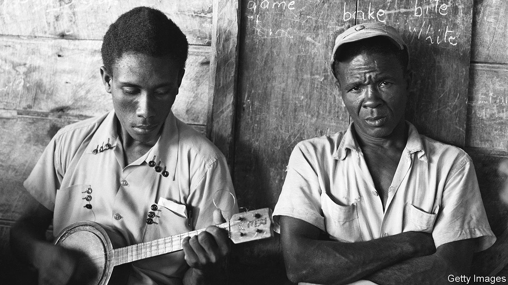

###### American music

# A new book explores the hidden history of the banjo 

##### It was created by enslaved Africans, Kristina Gaddy explains in “Well of Souls” 

 

> Oct 6th 2022 

By Kristina Gaddy. 

Near the beginning of “Deliverance”, a horror film of 1972 about four men from Atlanta who go canoeing in the backwoods of north Georgia, one of the city types takes a guitar from his car and trades melodies with a dead-eyed boy on a porch, who strums a banjo. The locals and visitors smile and dance, but things soon turn sour. What follows helped convince a generation of urbanites to holiday at the beach. It also solidified the banjo’s image as a totem of white rural culture.

Kristina Gaddy’s beguiling new book aims to subvert that reputation by excavating the banjo’s history. Her thesis is simple and well-supported. The banjo was created in America by enslaved Africans, and for much of its history was integral to African-American culture, celebration, spirituality and resistance.

She weaves her story together from sources including paintings, diaries and letters, and tells it chronologically. In a less daring writer’s hands, this might have become a slog, but Ms Gaddy successfully blends archival skills with imagination. The opening, for instance, describes an engraving of a “strum strump”—a sort of ur-banjo made from a hollowed gourd covered in animal hide—found in Jamaica in the 17th century. Ms Gaddy goes on to evoke the island as it was then and the music the instrument would have made.

Her narrative moves across the Americas, following enslaved Africans, their descendants and their instruments. Strum strumps become banzas, banjas and banjers. For most of its history, many people looked down on the banjo. James Hollyday, a landowner in Maryland, sent a “bangeau” to his niece in London in 1758; she thought the artefact was “a great curiosity” on which she hoped to make “pretty music”. Hollyday himself associated it with the enslaved people who played it. He “should not have thought of sending so rude an instrument of music”, he said, had his wife not wanted him to.

Ms Gaddy depicts the ways the enslaved used these instruments in dances and other forms of celebration that were tolerated reluctantly, if at all, by white authorities, who feared rebellion and secret communication through music. The banjo was “sacred”, she writes; “it fit into a cultural complex of music, dance and spirituality.” This part of her narrative is slightly over-egged. Banjos were used in dances and celebration, which often had a spiritual component, but it does not follow that they were wholly sacred rather than secular.

The most heartening aspect of this book is the most contemporary. The last chapter discusses African-American musicians rediscovering the banjo and reclaiming their rightful place in Appalachian, country and old-time music—“white” genres that adopted the banjo, so contributing, over the centuries, to the erasure of its origins. The Carolina Chocolate Drops, an African-American old-time string band whose founder, Rhiannon Giddens, wrote the book’s foreword, won a Grammy. Others will follow the trail they have blazed, and American music and culture will be richer for it, and more whole. ■

