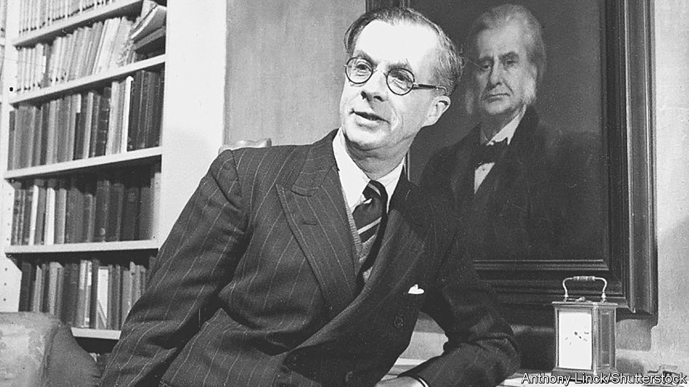

###### Scientific dynasties

# Thomas and Julian Huxley were champions of Darwinism 

##### It was one of many traits they shared, writes Alison Bashford in her double biography 

 

> Oct 6th 2022 

By Alison Bashford. 

In 1958 Julian Huxley fell in love with a gorilla. Then in his early 70s, he had long been a household name in Britain. As Alison Bashford describes in her new double biography, Julian had inherited the role of evolution’s frontman from his grandfather, Thomas Henry Huxley, a Victorian scientist writer. Yet on meeting Guy the Gorilla at London Zoo, Julian found himself undone. “Magnificent in his reserve and silent sense,” he wrote of their first encounter, “he gives you a look of sombre dignity that makes you feel in some real sense his inferior.”

This fellow-feeling for animals, Ms Bashford notes, was a reversion to Huxley type. Thomas had started on the road to agnosticism—a term he coined—in 1860, after his son died in childhood and a tone-deaf curate presiding over the funeral quoted Paul’s epistles: “If the dead rise not again, let us eat and drink, for tomorrow we die.” Ridiculous, Thomas thought: as a zoologist who had observed primates’ treatment of the dead, he doubted that they believed in resurrection. Nor were they inclined to gluttony. Why should people be any different? 

The sea-tide that would pull him away from religion and towards secular science was tugging at his heels. It would sweep him to notoriety as “Darwin’s Bulldog”, arch-debunker of “natural theology” and champion of the descent of man. The same currents bore his grandson from an abortive academic career to national and eventually global fame as a broadcaster and popular-science writer. “A man now cannot be a universal expert,” a colleague told the young Julian, as a warning against imitating his illustrious grandfather. The younger Huxley took that as a challenge. 

Appropriately for acolytes of Darwinism, Thomas and Julian shared what may have been heritable traits: scientific genius, an appetite for culture (both were keen poets), and a tragic tint of mental instability. Thomas was wracked by depression. Julian’s tempestuous ego troubled his marriage and tried his friends; his brother committed suicide.

And although Julian lived until 1975—leading unesco and the London Zoo and mentoring David Attenborough—his life, like his grandfather’s, bore a distinctly Victorian stamp. Both Huxleys tried to instil order in the chaotic, confusing world around them. At best, that meant understanding it; at worst, it involved sinister forms of control, as in Julian’s lifelong enthusiasm for eugenics. Sometimes positive and negative impulses co-existed. Thomas hailed the end of slavery in America but sneered at racial equality. Julian denounced Nazi pseudo-science yet advocated the “semi-compulsory” sterilisation of the disabled almost in the same breath.

Meanwhile, though they spent their professional lives categorising the natural world, both found themselves obsessed with points at which the scientific method broke down. Thomas, a renowned rationalist, confessed a fascination with spiritualism. Julian embraced palmistry and new-age ideals of cosmic convergence. For all their zealous support of evolution, its implications haunted both men. They saw the animal lurking inside man.

And the humanity in animals. Influenced by Darwin’s interactions with orangutans, Thomas hypothesised that the line between apes and people was etched so thinly that a clever ape could best a dull human. Julian was an early, vociferous campaigner for endangered animals and a founder of the modern conservation movement. In Guy the Gorilla, he found a creature he adored “perhaps more than anyone”, Ms Bashford writes, and a mind he felt was equal to his own. 

Julian longed to communicate with Guy, but never could. The Huxleys wrote about evolution as a romance, an epic of progress and transformation. In their own lives and observations they also saw the cruelty of science and the bleaker aspects of inheritance: the madness, the sorrow, the chained ape’s pained, silent gaze. Both sides, and both men, are painstakingly illuminated by Ms Bashford. Balancing scholarly rigour with an eye for the absurd, her book reveals the human drama behind scientific fact. ■

