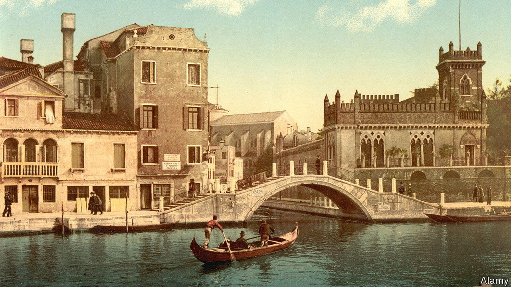

###### British fiction

# William Boyd’s new novel is a rollicking tale of adventure 

##### “The Romantic” is both a vivid portrait of a life and a sweeping panorama of the 19th century 

 

> Oct 6th 2022 

. By William Boyd. 

William Boyd’s extensive back catalogue includes several “whole-life” stories, as he calls them, of which the best-known is “Any Human Heart” (published in 2002). His 17th and latest novel is another cradle-to-grave epic. In “The Romantic”, a flawed yet captivating protagonist again makes his way through the world, interacting with both factual and fictional figures and weathering personal tribulations and historical upheavals. 

This time around, the hero’s life arcs across the 19th century. Cashel Greville Ross is born in 1799, orphaned and brought up in County Cork by his aunt—or so he is led to believe. When he learns the truth of his origins he enlists as a soldier, narrowly escaping the battle of Waterloo with his life. Later, as an officer in the colonial Madras Army, his morality is tested when an engagement with restless locals in Ceylon turns into a massacre.

Back in civilian life, Cashel begins touring Europe with a view to writing a travel book. In Pisa he befriends the Romantic poets, going shooting with Byron (“a warrior without an enemy”) and sailing with Shelley. In Ravenna he embarks on an all-consuming love affair with Raphaella, a married until a secret from her past comes to light. And in London, he enjoys literary fame—until he is swindled by his publisher and sent to a debtors’ prison.

Again and again, Cashel’s streaks of luck or contentment are jeopardised by cruel twists of fate. His expedition to discover the source of the Nile results in a rival stealing his glory. A late-career stint as a diplomat in Trieste comes to a shocking end when he realises he has been made an unwitting middleman in a smuggling racket. Cashel devises plans to get even with those who double-crossed him. Eventually, though, his determination to settle scores is supplanted by a yearning to track down Raphaella after decades of separation. But is seeing out his days with her “the coda that his life was waiting for?”

Not every stage of Cashel’s life is equally engaging. But most are packed with passion, adventure, suspense, comic interludes and a range of colourful characters. The war scenes are visceral (“lancers were shredded, as if they were carrots in a grater or turnips in a cutter”), and a sense of urgency powers Cashel’s mission to win back his lost love. The rollicking work of a masterful storyteller, “The Romantic” is both a vivid portrait of a life and a sweeping panorama of an age. ■

