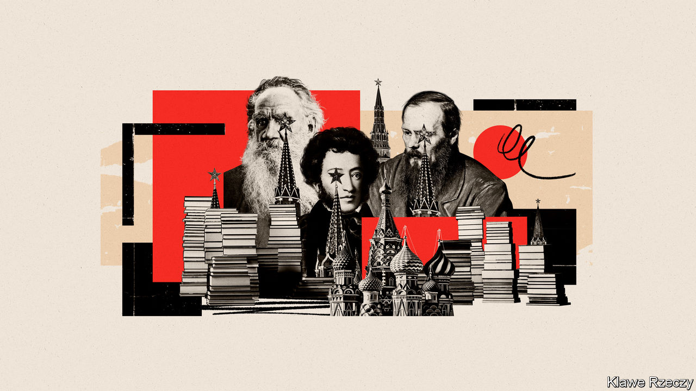

###### Russian literature after the invasion

# Yes, the Russian literary canon is tainted by imperialism 

##### That doesn’t mean you should stop reading it 

 

> Oct 6th 2022 

For many in the West, the masterworks of 19th-century Russian authors such as Fyodor Dostoyevsky and Leo Tolstoy have inspired awe. These writers often seem to stretch up their hands to heaven, grappling with universal profundities of faith, power and injustice. The British novelist D.H. Lawrence, for instance, said that Russian literature explored “the phenomenal coruscations of the souls of quite commonplace people”. But in some circles Russia’s invasion of Ukraine has called into question not just the value of reading these books, but also the morality. 

In the , Oksana Zabuzhko, a Ukrainian writer, argued powerfully that Western readings of major Russian authors had ignored their imperialist attitudes and indulged their drastic moral relativism and sympathy for criminals. Literature, she observed, “is of one flesh with the society for which and about which it writes”. Books are “the camouflage net” of Russia’s tanks in Ukraine. Meanwhile Volodymyr Yermolenko, a Ukrainian philosopher, wrote in  that the Russian classics were “chock-full of imperialist discourse” and “cruelty”.

Proposing a direct link between classic fiction and today’s military aggression is a stretch. The tomes that helped inspire Vladimir Putin’s invasion were altogether more esoteric and extreme than “Anna Karenina” or “The Gambler”. All the same, these critics have a point. 

Russia’s best-loved writers are cherished in part for chronicling the country’s social ills. But unsettling, even dangerous ideas appear in their writing too. Naturally, the same is true of revered British and American authors, among others. Yet readers who are sensitive to imperialism and prejudice in Western works have in the past turned a blind eye to them in Russian literature. They are less attuned to twisted views of the Ukrainian steppe than of, say, the American West in the 19th century. 

Take the national poet, Alexander Pushkin, whom Russians sometimes refer to as (“our everything”), a moniker that reflects his extraordinary use of the Russian language and his commitment to championing the “little man” in the face of tsarist power. Pushkin spent several years in exile because of the anti-authoritarian spirit of his works, which were appreciated by the Decembrists, participants in a failed uprising against Nicholas I in 1825.

However, Pushkin also wrote patriotic verse that trumpeted Russia’s imperial might. Mr Yermolenko cites “To the Slanderers of Russia”, written in response to the Polish uprising against tsarist rule of 1830-31. The poem decries supposed European aggression—“Why do you threaten Russia with curses?”—and proclaims that the country’s enemies will meet their ends should they venture onto Russian soil. The sentiments echo Mr Putin’s rhetoric today. 

Pushkin’s imperialist bent also shows up in “The Prisoner of the Caucasus”. The poem describes a young Russian officer who is captured in the Caucasus before being saved by a Circassian woman. In the epilogue the narrator celebrates Russia’s violent subjugation of the region and declares that “everything is subject to the Russian sword”. Here, too, it seems that Pushkin’s critique of tsarist power does not extend to its imperialism.

Something similar can be said of Dostoyevsky. His books enter the minds of cerebral murderers and call conventional morality into question. They are also laced with colonialist ideas.

Egregious examples arise in his “Diary of a Writer”, a genre-bending collection of fictional and non-fictional sketches produced towards the end of his life, in which he enthused about the then-ongoing Russian conquest of Central Asia. In a passage written in January 1881, he celebrates the Russian army’s victory at Geok-Tepe (now Gokdepe in Turkmenistan), a bloody battle that cemented the empire’s authority in the region. As Olga Maiorova of the University of Michigan notes, in the book Dostoyevsky hopes Russia will continue its conquest into Asia, so that people “all the way to India” might “become convinced of the invincibility of the white tsar”.

Dostoyevsky’s Russian chauvinism is often expressed in spiritual rather than militaristic terms. Following his lengthy exile in Siberia during the 1850s—the result of his association with the Petrashevsky Circle of radical intellectuals—he became a devout Orthodox Christian. In his thinking, those who rejected the Orthodox God, such as Catholics or Jews, were anathema. Dostoyevsky’s long-standing hostility to both crops up in his novel “The Idiot”. The protagonist, Prince Myshkin, calls Catholicism an “un-Christian” scourge that Russia must vanquish. “Our Christ”, he avers, “must shine out as a rebuff to the West.”

The map and the territory

Russia, the author came to believe, was destined to be the vanguard of a spiritual revolution. It was a messianic force that would vanquish Western decadence and unite humankind under God. Again, amid Mr Putin’s anti-Western rants, that sounds nauseatingly familiar. In the past readers have seen Dostoyevsky as a sublime guide to the darkest, most secret reaches of the human heart. Today he and other Russian writers can instead seem to point the way to the front in Donbas. 

So while blaming long-dead authors for the depredations of Mr Putin’s army is unreasonable, some of their work has indeed reflected, even fed, rumbling pathologies that have erupted into violence once again. But that is not all these books mean or say. 

Consider the work of Tolstoy, for many Russia’s finest novelist, and the world’s. Yes, it has imperialist blind spots, including in “War and Peace”, his chronicle of the Napoleonic invasion of Russia in 1812. As Ewa Thompson of Rice University says, the book neglects the perspectives of the colonised peoples of eastern Europe, particularly Poles, who often supported Napoleon against their Russian overlords. 

Yet elsewhere Tolstoy repudiates militarism and violence of all kinds. His exquisite late novella “Hadji Murat” tells the story of a Caucasian warrior trying to save his family amid a Russian conquest; it sympathises with his plight and excoriates tsarist aggression. As the mix of patriotism and pacifism in Tolstoy’s work shows, literature is an inherently ambiguous medium. Great books can rarely be simplified to a single meaning or moral. The best expose and anatomise human flaws, whether of character, narrator or indeed the author.

That is true of Pushkin’s compassionate tales, such as “Eugene Onegin” and “The Queen of Spades”, and, for all his ugly views, it goes for Dostoyevsky too. Mikhail Bakhtin, a Russian philosopher, described Dostoyevsky’s novels as “polyphonic”, meaning that his characters embody distinct, often clashing ideas. The author’s messianic world-view gets a hearing, but is often ascribed to scoundrels, low-lifes and fools. In doing so he puts his ideas to the “strictest test”, says Sarah Young of University College London. The reader is encouraged less to admire his philosophy than to challenge it. Ignore Dostoyevsky’s works, and you forgo this invitation.

Those who detest Mr Putin’s invasion of Ukraine need not throw away their copies of the Russian classics. There is too much beauty and wisdom in them for that; abjuring them would be a self-inflicted wound. But readers might revisit them with more critical eyes and a renewed sensitivity to imperialist sentiments. In the best sense of the term, this is what scholars are referring to when they talk (as many now do) about “decolonising” the canon. 

That need not mean dismissing influential works on political grounds; instead it can involve approaching literature from a fresh perspective. It means acknowledging the troubling parts of books without reducing them to those aspects alone. It means more reading, not less. ■

