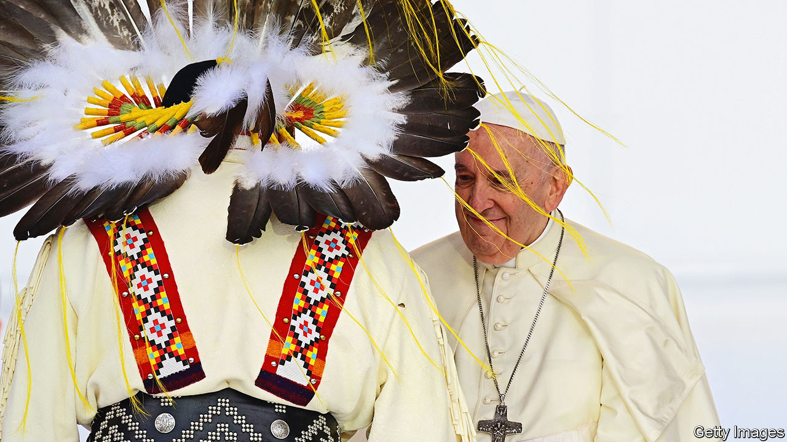

###### Religion in the modern world

# “To Sanctify the World” revisits the Second Vatican Council 

##### Disputes over the meaning of the momentous gathering are really about Catholicism’s future 

 

> Oct 6th 2022 

By George Weigel. 

For many historians of faith, it was the greatest religious gathering of the 20th century, setting a new course for the largest branch of the world’s most widely followed creed. Starting in 1962, the Second Vatican Council deliberated in Rome over three years, producing 16 landmark documents on sensitive topics such as the Catholic view of Judaism and other religions. It embraced religious freedom and liberal democracy as well as the use in services of vernacular languages (instead of Latin) and simpler forms of worship.

Nearly 3,000 bishops from over 100 countries were invited. Such was the importance of Vatican II, as it is generally called, that Catholics still argue furiously about it. Each disputatious camp presents its own vision of Christianity’s future as the correct interpretation of the council.

For liberals, Vatican II was a start, but only that, in dismantling the church’s authoritarian power structures and becoming more responsive to the ordinary lives of the world’s Catholics, who now number over 1bn. For conservative thinkers such as George Weigel, the council was a visionary effort to prepare the church for a post-Christian world, in which values rooted in theism would be absent from the corridors of power even in heartlands of the faith. In his latest book, Mr Weigel—one of the most confident voices on America’s moderate religious right—insists that the end of “Christendom” is a reason to be more zealous, not less, in defence of venerable doctrines and practices.

Since it has little to gain from pandering either to the mighty or to the lazily liberal majority, Mr Weigel argues, Christianity has no choice but to be counter-cultural—and conservative. With characteristic fluency, he defends not only Vatican II but the entire centuries-old process by which bishops, meeting in council and praying for divine guidance, have wrestled with subtle doctrinal points and expressed them in complex texts that took decades to digest fully.

Meanwhile he connects the woes of the 20th century, from the two world wars to the threat of nuclear annihilation, with the onward march of technology-driven secularism. The argument is artful but fails to account for the strange episodes in the current century in which religious figures—from Russia’s Patriarch Kirill to Iran’s ayatollahs and American evangelists warning of Armageddon—have shown a distinct fascination with the dark arts of atomic science. Some religious hotheads see divinity in a mushroom cloud.

Conservatives such as the author often recall that their heroes, including popes John Paul II and Benedict XVI, were active participants in Vatican II who in subsequent years never ceased to invoke the council’s spirit. To their admirers, both men had a keen sense of secularism’s advance, and of the need for the church to counter-attack. As early as the 1950s Joseph Ratzinger—the future Benedict—understood that Catholicism in superficially pious Bavaria, his homeland, was little more than a hollowed-out shell. 

For their part, supporters of Francis, the current pontiff, praise his revival of the progressive spirit of Pope John XXIII, who launched the council at the end of a life chastened by service as a roving diplomat. In the 1960s, it seemed radical to devolve power from the papacy to bishops; Francis has invited representatives of indigenous people in Latin America, including women, to sit alongside the robed prelates as they ponder the future of Catholicism, and indeed the planet. For conservative thinkers, Francis’s offer to “accompany” individuals who lead unconventional marital or sexual lives goes beyond Vatican II, which was really, in their view, a call to arms in defence of core beliefs.

In today’s information-overloaded age, it can seem odd that people should still be arguing over the minutiae of arcane documents issued 60 years ago (which in turn rested their authority on events that unfolded almost 2,000 years before that). A rough corollary in the modern era may be Communist Party congresses in the Soviet Union, which also aspired to chart the future by teasing out the real meaning of old axioms. Mikhail Gorbachev’s generation of reformers claimed to be “children of the 20th congress” of 1956, at which Stalin was denounced. By 1990, when the party held the last of its solemn gatherings, it was obvious that communism itself, not merely its “wrong interpretation”, was dying.

For all its woes, not least the rolling child-abuse scandals, Catholicism is not about to expire. But for anyone observing its internal debates, it is hard to resist the feeling that both the main camps—doctrinal conservatives such as Mr Weigel and liberal experimenters of the pro-Francis faction—are behind the curve of history, despite their best efforts to keep up. ■

