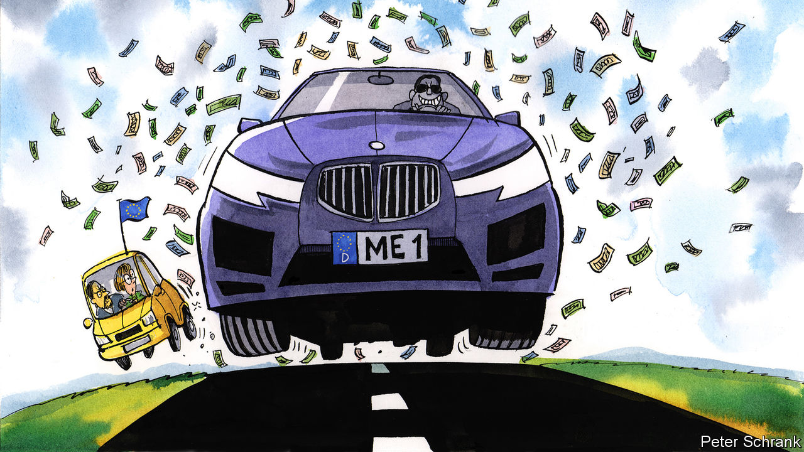

###### Charlemagne

# A German aid package revives calls for solidarity with poorer EU countries 

##### The single market is looking wobbly 

 

> Oct 6th 2022 

Imagine queuing up at a food bank only for a millionaire to rock up in a BMW and announce he is snapping up the entire supply of grub. That is roughly how Europe feels these days. Amid a continent-wide energy crunch, governments from Athens to Warsaw have spent months figuring out how to keep homes warm and factories running. European politicians have shared their best ideas, and tried to make sure whatever they did at home would not beggar their neighbours too much. The sense of everyone being in the mire together at least reinforced the unity forged in response to Russia’s invasion of Ukraine. Until, that is, Germany on September 29th flashed its cash with a surprise €200bn ($197bn) energy package to secure its own economic prospects. So long, suckers!

Governments across Europe have helped businesses and households deal with soaring power prices. Utility bills have been capped, taxes trimmed, benefits boosted. Most would love to do more, but there is only so much they can afford, especially after years of spending freely to keep the economy afloat during covid-19. Germany last week in effect proclaimed that such limits don’t apply to it. Because of healthy state finances, it can afford to borrow up to 5% of GDP to create a “protective shield” that will insulate Germans from the cost of higher energy. While everyone else in Europe will have to cut back on gas or suffer the consequences, those in Europe’s biggest economy will be able to behave as if not much is going on. In case anyone felt their nose insufficiently rubbed in German success, Christian Lindner, the finance minister, proclaimed: “We are economically strong, and we mobilise that economic strength when it is needed.”

A splurge that big is a problem not just because it prompts envy among the neighbours. The real problem is that a lot of the German largesse will go to businesses; precisely how much will only be known once the plan is fleshed out in the coming weeks. The result will be a large distortion to Europe’s single market. How can a Spanish steelmaker, whose heavily indebted government cannot afford to shield it from high gas prices, compete with a German rival whose energy bills are being subsidised? Wait long enough and Europe’s only thriving companies will be those based in countries whose governments can afford to back them.

In normal times, the EU’s answer is to forbid state handouts to businesses. (Spanish football clubs have been berated by Brussels for receiving undue tax breaks: it would be unfair for taxpaying German clubs to try to compete.) State-aid rules were suspended during covid-19, as national governments bailed out everything from airlines to pizzerias. The problem of excessive generosity in Germany and other places that could afford it soon emerged. Variable domestic capacity to help was incompatible with Europe being a “level playing field” for business, the goal of decades of political effort. The way to square the circle was to spread some of Germany’s financial power to the rest of the EU. Thus, as the pandemic raged, a novel form of European solidarity was agreed in the form of a €750bn bail-out fund, Next Generation EU (NGEU). The money is a form of redistribution: it is borrowed by the EU, but will in effect be paid back by its richest members while being doled out to its poorest. This gave fiscal capacity for southern Europeans to stimulate their own economies in the recovery. 

Is another NGEU the answer to the German splurge? Some are laying the groundwork for it. Mario Draghi, who will soon depart as Italian prime minister but will remain the continent’s economic wonk-in-chief, warned of “unjustified distortions” to the single market. Bruno Le Maire, France’s finance minister, on October 3rd argued that Europe’s response to the pandemic should serve as a blueprint for thinking about the energy crisis. European commissioners from France and Italy argued for some element of the game plan of 2020 to be revived as part of a “Europe of solidarity”.

An NGEU 2.0 is hardly a new idea: issuing common debt at EU level is the euro-federalists’ answer to every problem these days. For that reason alone it is unlikely to happen. “Frugal” countries, led by the Netherlands and to some extent Germany, only signed up to the original NGEU on the condition it be a one-off. Even claims that war on the continent and the ensuing energy mayhem are as unprecedented as covid will not abate penny-pinchers’ fears that redistribution would become a standard part of dealing with any future EU recession. If countries want to spend their own ways out of recession, Germany in effect says, they are free to run up surpluses in good times. (Easy to do when you scrimp on defence for decades and guzzle cheap Russian gas, comes the response.)

Deutsche mark my words

The plan’s bark may be worse than its bite. Having bigged up the €200bn figure for a domestic audience, Olaf Scholz, the German chancellor, tried to play it down for foreign consumption. The aim is still to cut energy use, the money will be spent over two years, and some might never leave state coffers. That would put German largesse on par with others, he argued. France’s price cap, say, gives no incentive for households to lower their thermostat settings—though it does little for big businesses, thus limiting the harm to the internal market. In contrast Germany aims to “protect [its] economic fabric”, at a time when that of others risks being torn to shreds. Worse, the rest of Europe had no idea it was coming. Many had hoped Mr Scholz would agree to an EU-wide price cap on imported gas (as will be discussed at a meeting of EU leaders on October 7th). Instead, he has served up a domestic one.

A new NGEU is unlikely while the existing scheme still has lots of money to dole out. A compromise might be to revive another covid-era EU scheme, which allowed countries with high interest rates to borrow cheaply by having their loans guaranteed by those with better finances. That would go some way towards reassuring Europeans that, although Germany is putting its own interests first, it has not entirely forgotten it is part of a union. ■


