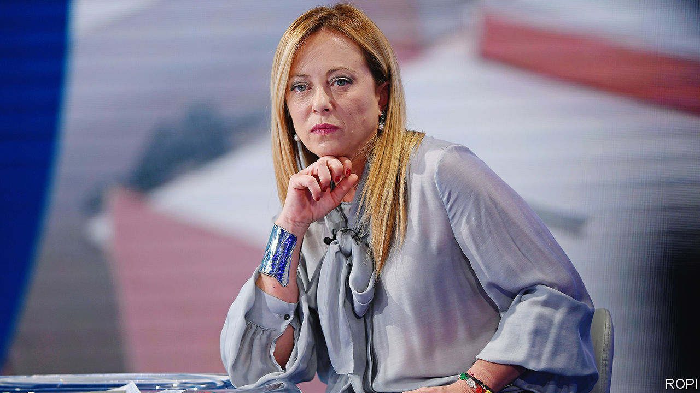

###### What’s the plan?

# Can Italy’s Giorgia Meloni afford the things she wants? 

##### The probable next prime minister has not yet explained her sums 

 

> Oct 6th 2022 

Giorgia Meloni and her conservative allies won Italy’s election on September 25th with an economic programme not unlike the one unveiled two days earlier by Britain’s new chancellor of the exchequer, Kwasi Kwarteng. Its central aim was to boost the economy with large tax cuts. Employees’ welfare contributions would be cut. An unpopular regional corporation tax would be scrapped. And a flat-tax regime for the self-employed would be extended so that those with gross earnings of up to €100,000 would pay as little as 15%. The right also pledged earlier retirement for some and an increase in minimum pensions and child benefits. How was all this munificence to be paid for? Since the programme would boost growth, wages, profits—and thus the tax take—there was no need to worry too much about fiscal sustainability, the plan promised.

Oxford Economics, a consultancy, calculates that the right’s stimulus could add around 1.6 percentage points to GDP growth next year. But even assuming that some of the measures were phased in gradually, the increase in output would come at the cost of higher inflation and a budget deficit of about 6.2% for the next five years.

The calamitous reaction to Mr Kwarteng’s mini-budget showed that investors do worry. And with Italy owing more than half as much again as Britain relative to its GDP, a similar response from the markets could have grave consequences for the entire euro zone. So much, you might think, for Plan A. But is there a Plan B?

Because of Italy’s unhurried provisions for changing governments, Ms Meloni is not expected to become prime minister until late October. Her immediate concern will be to tackle a multi-faceted crisis that would daunt even the most experienced government leader: a toxic brew of energy and cost-of-living crises against a background of war and the threat of recession. The preliminary official estimate of annual inflation in September was 8.9%. Some utility bills have tripled. In public squares across Italy people have been burning their bills and joining lightning strikes and spontaneous demonstrations to demand higher pay.

But Ms Meloni, coached by the outgoing prime minister, Mario Draghi, is more reluctant than her ally, the Northern League leader, Matteo Salvini, to increase Italy’s already vast public debt. She and her advisers are reportedly planning to mitigate the effects of the cost-of-living crisis with a package of measures worth 1.25% of gdp. That would be modest compared with recent efforts by Germany and Britain, but the aim would be to fund it entirely with the extra revenue that has flowed into the treasury largely because of inflation.

So far, so prudently pragmatic. But there are already signs that Ms Meloni will face resistance if she simply tries to ditch the right’s original plans. On October 4th Mr Salvini and a senior member of the third main group on the right, Silvio Berlusconi’s Forza Italia party, both argued for persisting with the flat tax extension.

Much will depend on the composition of Ms Meloni’s cabinet. A team long on technocrats would reassure markets and Italy’s EU partners. But her allies want seats at the table. The more they have, the greater will be the pressure on Italy’s next prime minister to stick to Plan A. ■

