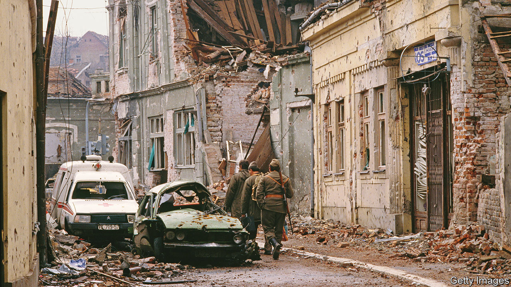
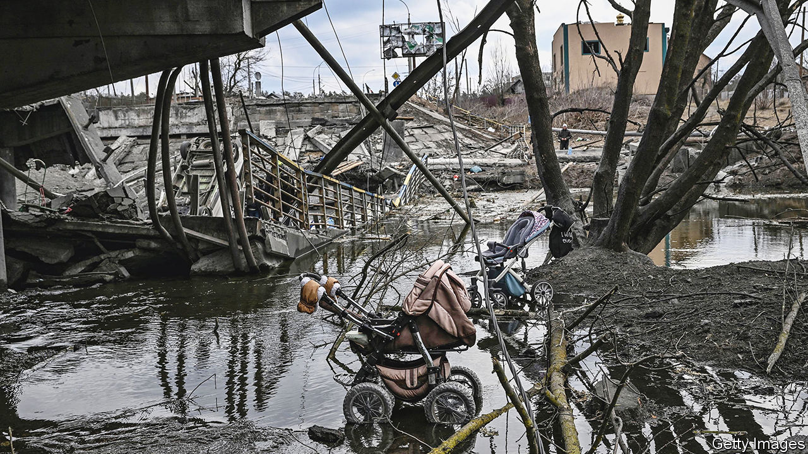
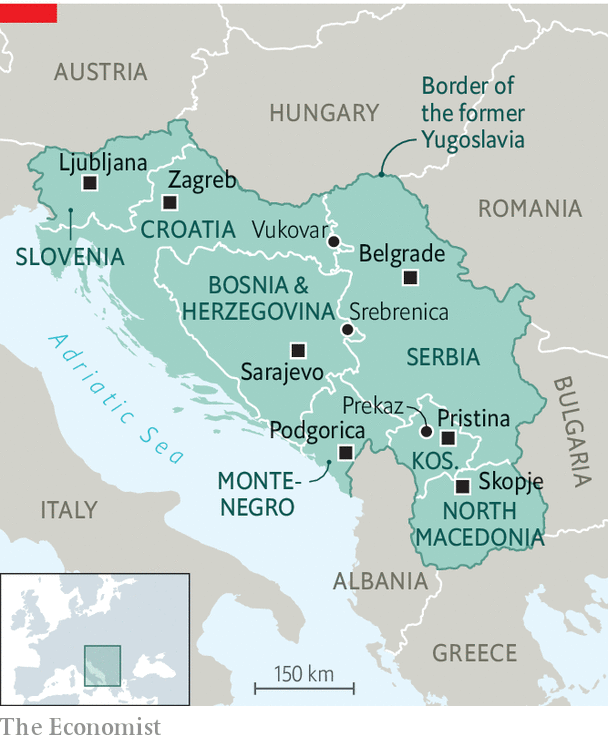

###### Shadows of the past

# The war in Ukraine has awakened memories in the Balkans 

##### There are parallels and contrasts 

 

> Oct 6th 2022 

Outsiders today have mostly forgotten the Balkan wars of the 1990s. As communism collapsed in Europe, the despotic glue that held together Yugoslavia, a multi-ethnic state, dissolved. The country fell apart. Unscrupulous political entrepreneurs won or cemented power by stirring up ethnic paranoia. Battles were fought over which group controlled which land. Atrocities multiplied. By the time the fighting was over in Slovenia, Croatia, Bosnia-Herzegovina and Kosovo, some 4m people had fled their homes and 140,000 were dead. To former Yugoslavs, says Ivan Krastev, a political scientist, the world’s amnesia “is kind of an insult”. 

One man who has by no means forgotten is Vladimir Putin. For him NATO’s use of air power, despite Russian objections, to stop ethnic cleansing by Serb forces in Kosovo in 1999, marked the nadir of Russia’s post-Soviet weakness and humiliation. And Mr Putin’s continued support for Serbia is one reason why today, two hours’ drive from Vukovar, the main pedestrian boulevard of Belgrade, Serbia’s capital, sports mugs and t-shirts of Mr Putin, along with “Z” baseball caps to show support for his invasion of Ukraine this year. 

The war in Ukraine has sent tremors across the Balkans. It has horrified most, but thrilled Serbian nationalists who believe that a Russian victory will somehow allow them to reverse the setbacks of the 1990s, including the loss of Kosovo. 

In Prekaz, a village in Kosovo, there is a ruined house, preserved as a memorial, where the Serbian police killed the extended family of one of the founders of the guerrilla Kosovo Liberation Army in 1998. At a café alongside it Gresa Sefaj, a Kosovo Albanian, recalls February 24th, the day on which the Russian invasion of Ukraine began. She was with friends, all of them staring at their phones with tears streaming down their faces. “It all came flooding back to us,” she said. “We knew exactly what would happen.” 

During the Kosovo war Ms Sefaj and her family fled from then-Serbian-controlled Kosovo. When they returned, it was to find that their house had been torched by Serbian policemen, apparently in revenge for the family’s involvement in the Kosovo independence movement. “The war will be a disaster,” Ms Sefaj said. “They will lose family members, they will be traumatised and they will never forget.” 

Recalling Vukovar

Take another example. In March the Croatian press was filled with grim comparisons. Mariupol, the Ukrainian port city that the Russians were blasting to cinders in their bid to capture it, was, it was said, the “new Vukovar”—a port on the Danube whose name is etched deep on every Croat heart. In 1991, as Serbian forces closed in on Vukovar, they levelled it. Today it is remembered by Croats as the martyred city of their four-year “Homeland War”. What is left of Mariupol may one day play the same role for Ukrainians. 

Vukovar fell in November 1991. Just as Mr Putin now talks of liberating Russians in Ukraine, Slobodan Milosevic, Serbia’s leader, talked of liberating Serbs in Croatia, then 12% of the population. A large proportion lived, mixed and intermarried with Croats. Like many in Ukraine before 2014, when Mr Putin first started grabbing Ukrainian territory, many in former Yugoslavia had never even thought of what ethnicity they were until war forced them to decide. 

When Serbian militiamen seized Vukovar in 1991 a third of the population identified as Serb. From then until 1996 it was under the control of a breakaway statelet in Croatia, just as Mariupol is under the control of the breakaway Donetsk People’s Republic in Ukraine, now illegally annexed to Russia. By the end of 1991 a third of Croatia was controlled by the Republic of Serbian Krajina. In 1995 Croatia, by then properly armed and with American backing, snuffed out the statelet. The Serbs then agreed to the peaceful reintegration back into Croatia of the last remaining chunk of it, which included Vukovar. 

Vast sums have been poured into Vukovar’s reconstruction since then. Monuments dot the city and surrounding countryside. When the city fell, Serbian soldiers dragged patients from the hospital and murdered some 200 of them. Now the underground wartime hospital is a shrine and museum packed with coach-loads of Croatian children learning about what Croats call the years of Serbian aggression. Ghostly mannequins lie in or try to struggle out of their beds. 

Whoever controls Mariupol in the future though, and whatever the similarities, Vukovar risks being a sad role model. In 1991 it was home to nearly 47,000 people. Now, calculates Drago Hedl, a local journalist, there may be barely 18,000. This region has never recovered from the war. Vukovar’s streets are neat, tidy and empty. 

Crimes and punishments

The events of the 1990s still play out in Balkan politics, imagination and fears. Forgetting is not an option. On June 8th a court in Belgrade confirmed a war-crimes indictment against four Croatian officers for allegedly ordering an air attack on Serb civilians during their flight from Croatia in 1995. A special court set up in The Hague to try former Kosovo Albanian guerrillas began trials just last December.

Today, war-crimes investigators are fanning out across Ukraine, and the International Criminal Court has opened investigations there. In 1993 the UN Security Council mandated the creation of the International Criminal Tribunal for the Former Yugoslavia (ICTY). It indicted 161 people, of whom 91 were found guilty. 

The core philosophy of the ICTY was that crimes would be attributed to individuals rather than nations and that this in turn would lead to reconciliation. There is not much evidence that this has worked. Most Serbs are convinced that the tribunal was stacked against them and point to the high-profile acquittals of several Bosnian Muslims, Croats and Kosovo Albanians. 

 


Ukraine has already filed a case at the International Court of Justice (ICJ), which tries countries rather than individuals, under the 1948 Genocide Convention. Mr Putin says Russia is acting in Ukraine to halt a genocide being committed by Ukrainians in Donbas. Ukraine says that Russia is the one committing genocide in Ukraine. Mr Putin’s claim is nonsense; Ukraine’s will be hard to prove. In the Balkans only the slaughter at Srebrenica was ruled to be an act of genocide by the ICTY and the ICJ. In 2015 the ICJ threw out claims by Croatia and Serbia, both of which had accused the other of committing genocide. The wheels of international justice grind slowly; Ukrainians may be as disappointed with the results as many in the Balkans are. 

“It is 27 years since the end of the Bosnian war,” muses Miroslav Lajcak, the EU’s top diplomat in the region. “Twenty-seven years since the end of world war two was 1972 and where are the Balkans? They are still in the past, mentally pointing fingers at each other.” The difference was that “Germany never denied what it did and this helped Europe get over the past. Germany absolutely accepted responsibility.” 

 


In the Balkans virtually no one accepts responsibility for anything bad that happened during the wars of the 1990s; or if they do it comes with a caveat. Yes, Bosnian Serbs may have murdered 8,000 Bosniaks (Bosnian Muslims) when Srebrenica fell in 1995 (“may” because many Serbs don’t believe this is what happened, or dispute the numbers), but in any case they often retort: “what about the 3,000 Serbs around Srebrenica who died during the war?” In reality, there is a big difference. The vast majority of those were active-duty soldiers, unlike the rounded-up Bosniaks who were murdered in cold blood. 

Dejan Jovic, a political scientist from Zagreb, says that politicians from all sides in Bosnia are revisionists, in that they think the war ended badly for them and their nation and would welcome the opportunity to change that. They just can’t agree how. Milorad Dodik, the Bosnian Serb leader, has long called for the dissolution of the Bosnian state. Everyone in the former Yugoslavia has a different interpretation of what happened in the 1990s, and that will not change soon. What is happening in Ukraine will similarly poison relations between Ukrainians and Russians for generations. 

A little good news

The lessons are not all gloomy. Since the end of the wars the countries of the former Yugoslavia have at least been at peace. The war in Bosnia ended with a deal, brokered by America in Dayton, Ohio. The Serbs gave up their attempt to wrench as much of the country away from Bosnia as possible and unite it with Serbia; Bosniaks accepted a decentralised state; and Bosnian Croats gave up their separatist ambitions. Bosnia today is an unwieldy construct, with leaders who agree on little. But inter-ethnic violence has not returned.

Twenty-seven years after the end of the Bosnian and Croatian wars, and 23 years after the Kosovo war, progress has been made. Many of those who fled their homes have returned. Properties lost were restored, even if those who had fled from them chose not to go back. Some of the billions given or lent by donors and international financial organisations was filched, but much has been put to good use. New motorways criss-cross the region and signs indicating that the EU has funded this or that project are ubiquitous. 

On paper the Balkan countries remain poor, and compared with western Europe they are; but their grey and black economies are huge. They are far better-off than the numbers imply. Garden centres, which have mushroomed across the region, are evidence that locals have enough spare cash to plant flowers for fun. Construction is booming, fuelled in part by diasporas and money-laundering. Tourism is a huge earner and not just on the seaside in Croatia and Montenegro. Cars, arms and farm products are among Serbia’s main exports and IT is growing fast. Ukraine’s far bigger economy, as it happens, is not dissimilar.

In June Ukraine was conditionally accepted as a candidate to join the eu. But the Balkans show how long the process can be. Slovenia and Croatia, the richest ex-Yugoslav countries, joined the club in 2004 and 2013, respectively. Others are stuck on the outside. Serbia and Montenegro have been negotiating to join for years. North Macedonia gained candidate status way back in 2005. Kosovo and Bosnia have not yet even been accepted as candidates. 

The post-war Balkans have seen successes, Mr Krastev says, but if the West promises Ukraine that “we are going to do for you what we did for the Balkans”, the response may be less than ecstatic. When it comes to EU enlargement he says: “what are we promising Ukraine? To stay in the waiting room for the next 30 years?” 

Won’t you stay?

Whatever happens on the battlefield, Ukraine shares a big, long-term problem with the Balkans. Even before the exodus of some 7m refugees Ukraine, like most Balkan states, had a rapidly shrinking population. In 2019 its fertility rate was 1.23 babies per woman, per lifetime. Bosnia’s was 1.25. These are among the lowest numbers in the world. The EU’s was 1.5 in 2020. A country needs 2.1 births per woman to maintain a stable population, unless it has a hefty inflow of immigrants. Neither Ukraine nor the Balkan countries attract many of those. 

The longer the war goes on, the fewer Ukrainian refugees are likely ever to return. Ukraine is poorer than any Balkan country, and even before the war it was losing brain and brawn to the EU. 

Alida Vracic, a think-tanker who grew up in Sarajevo during the war, says it alarms her to hear how confident her Ukrainian friends sound about their country’s prospects. “They should brace themselves for lots of disappointments…People who are not on the front lines will become rich,” and Ukraine, like Bosnia, will be bled dry by war profiteers and new political elites who will come to power thanks to the conflict, she says, adding hyperbolically: “These disappointments will hurt them more than the actual war.” ■


