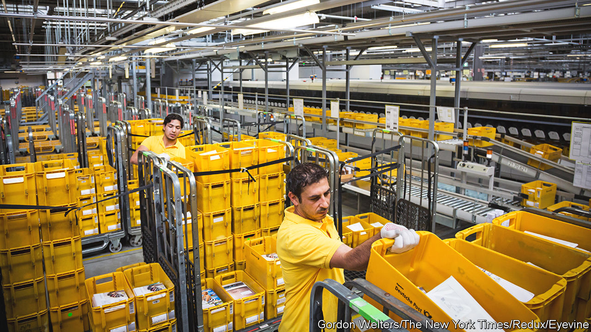
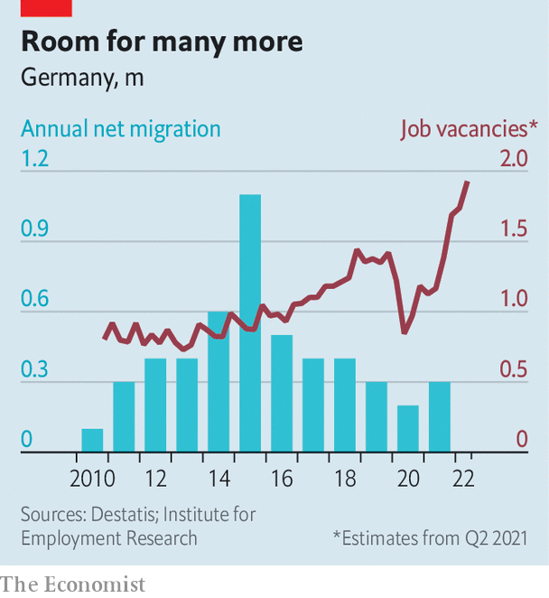

###### Willkommen

# There are not enough Germans to do the jobs Germany needs 

##### The government is mulling making it easier to hire immigrants 

 

> Oct 6th 2022 

Perhaps Friederich Merz thought he was being clever. The head of Germany’s main opposition party recently claimed on television that many of the 1m Ukrainians who flooded into Germany this year came not as refugees but as what he called “social tourists”, to take advantage of government benefits. He should have known better. Even his own Christian Democrats (CDU) said their leader had overstepped the mark. He was forced to apologise.

But this was not just a slip of political judgment. Whether Mr Merz likes it or not, Germany needs immigrants. It needs them urgently. Even as Russia’s energy squeeze pushes Europe’s largest economy towards recession, an acute labour shortage looms. A pair of surveys in the second quarter of this year illustrate the trend. The Institute for Employment Research, a government agency, estimated job vacancies in Germany at a record 1.93m, 66% more than last year. Meanwhile IFO, a think-tank in Munich, found that 49.7% of German companies cannot secure enough skilled workers, up from 30% in 2019 and the highest level since the surveys started in 2009.

 


The surge will not be short-lived, says Herbert Brücker of Humboldt University in Berlin. Without changes to participation rates, retirement dates, or immigration, Germany’s workforce is set to shrink by 15m-16m by 2060. “We have never had such a situation since the early 1970s,” says Mr Brücker, noting that raising the retirement age or bringing more women into the workforce would do little to reverse the problem. “Assuming we want instead to keep employment stable, and to keep the dependency ratio down, the only answer is more immigration.”

The current left-of-centre coalition recognises the challenge. It has floated the idea of creating a Canadian-style points system to assess immigrants, easing rules on professional qualifications, and letting skilled immigrants hunt for jobs in Germany rather than insist they seal job contracts first. But none of these changes has yet been made. Nor is it clear that tinkering with rules designed largely to keep non-Europeans out and to prevent a replay of the wave of Syrian refugees in 2015 that raised fears of  (getting overwhelmed by foreigners) can produce the volume of newcomers actually needed.

Germany is not the only rich country to have more people retiring than entering the workforce. Due to severe shifts in population dynamics after the second world war, however, it faces a particular challenge. Depressed birth rates in the 1950s were followed by a rapid spike to 1.4m births a year in 1964, and then by a steep fall to half that by 1975, explains Wido Geis-Thöne, an economist at the Institut der Deutschen Wirtschaft in Cologne. The swollen baby-boomer generation is now retiring, just as the children of the “skinny” 1970s generation, who were born in the 1990s, are seeking their first jobs. 

A study in 2020 showed that for every 100 Germans in the about-to-retire age bracket of 60-64, there was a corresponding cohort of just 82 in the about-to-start-careers range of 20-24. More alarmingly, for every 100 aged 55-59 there were only 59 aged 15-19, and for every 100 Germans aged 50-54 there were just 56 future workers aged 10-14. For comparison, the averages across the EU were 83, 74 and 72 per 100. 

At its natural rate of decline Germany’s workforce would shed some 350,000-400,000 people a year, a falling trend that Dr Brücker expects to last a decade before slowing. The national statistics agency agrees, predicting that without immigration Germany’s population could tumble nearly 25% over the next 40 years, from 85m to 65m. This would strain not only productive capacity, but the country’s ability to support the elderly.

Can imported labour fill the gap? Marcus Winter is sure it can. Of the 750 staff in the local outsourcing and services firm he runs in the prosperous southern state of Baden-Württemberg, three-quarters are already foreign-born. This includes not just unskilled labour but top managers, a trend increasingly common across the country. Research by Dr Geis-Thöne shows that while 51% of all cleaners and 35% of restaurant staff are foreign-born, so are a quarter of medical and science faculty in German universities. Some 58% of Indian-origin wage-earners hold jobs requiring specialist skills or university degrees, double the rate among native Germans. 

Mr Winter would be happy to hire more immigrants. But workers from the poorer fringes of the European Union, who can enter Germany visa-free, are increasingly needed at home. Skilled would-be immigrants from countries such as Brazil or Bangladesh still face hurdles despite immigration reforms, introduced in 2000, that were meant to make Germany a talent magnet like Canada or Australia. Low-skilled workers, whom Germany also needs, have few legal ways of coming at all. “The laws are too hard,” says Mr Winter. “They can only come to Germany if they have a comparable qualification, but our system is very special and we don’t accept foreign degrees.”

The bar is set too high for both companies and workers, agrees Julia Beise-Gehrmann, who runs a programme to help integrate foreign workers in the relatively poor state of Mecklenburg-West Pomerania, in former East Germany. On the plus side, she says, attitudes to foreign workers have relaxed. Local companies that were sceptical of hiring outsiders now see that they have no other choice. Their new concern is to keep them happy. 

Vu Thanh Van, whose family settled in Mecklenburg-West Pomerania’s seaport of Rostock in 2008, agrees that things are better now. Thirty years ago, soon after Germany’s unification, a mob of locals surrounded and then torched a building housing foreign workers and their families. Most were Vietnamese who had been brought to East Germany as “guest workers” and then stayed on. Now, says Ms Vu, the worst foreigners face in Rostock is impoliteness, such as when second-generation immigrants are asked how they speak such good German. ■

