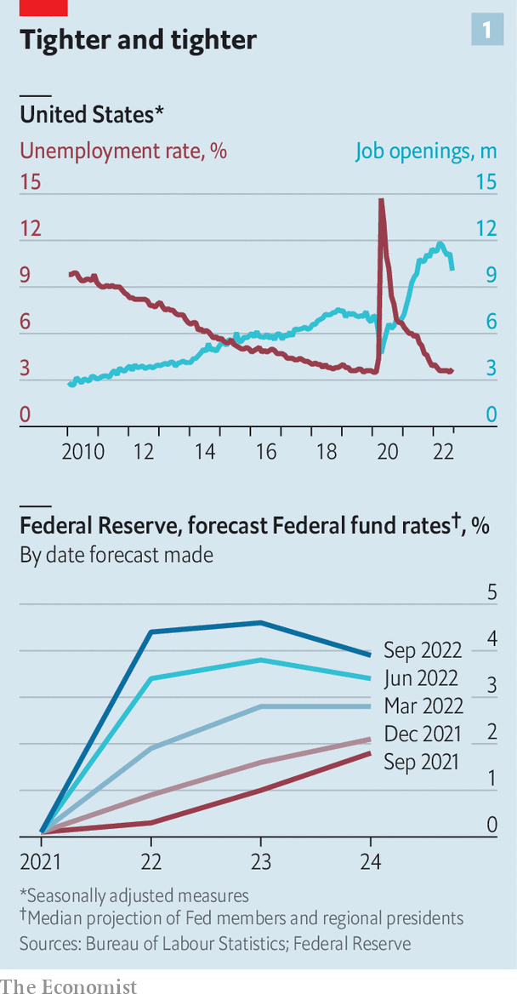
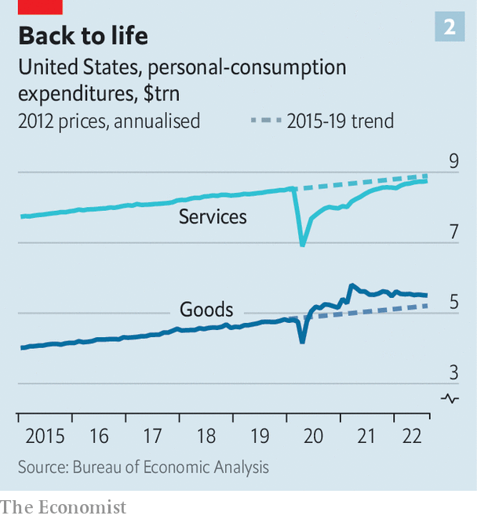

###### US economy

# America’s economy is too strong for its own good 

##### Despite market turmoil, the Fed is set on relentless rate rises 

 

> Oct 2nd 2022 

Two days after the latest interest-rate rise, the seven governors of the Federal Reserve met with some businessfolk. Any misgivings about the effects of tighter monetary policy would have been quickly dispelled. Cara Walton of Harbour Results, a consultancy, spoke of a plastics processor who hired 14 new employees, only for a mere three to show up on their first day (and one of those to quit before lunch). Cheetie Kumar, a restaurateur, said her peers were struggling to make rent as food and labour bills mounted. Tom Henning of Cash-Wa, a distribution company, explained his firm was passing costs onto customers. Demand was holding up, he said, thanks to the amount of money “floating out there in the economy”.

Misgivings may, however, have crept back in as the governors watched the markets over the past fortnight. The central bank’s goal is to tame inflation, which is running at more than 8% year on year, just shy of a four-decade high. The realisation that it is still far from that goal, and that monetary tightening will thus continue, is causing havoc. American stocks have fallen for three consecutive quarters, and sharply recently. Bond prices are tumbling, reflecting tremors in the credit markets. The ratcheting up of rates in America is driving the dollar’s appreciation, adding to inflationary pressure elsewhere and impelling other central banks to follow the Fed’s lead, no matter the state of their economies. On September 30th Lael Brainard, the Fed’s vice chair, called for her fellow governors to proceed “deliberately”, a word denoting caution in the central bank’s argot. She also said the Fed would take its international impact into account. 

 


This was an acknowledgment of the risks of the current approach—it was not an indication that the central bank is about to change tack. The Fed simply cannot ignore the strength of the domestic economy. Even with the financial upheaval, America’s economy is straining at its limits in critical dimensions. In the labour market there are nearly two jobs available for every unemployed person. Wages, up roughly 7% compared with a year earlier, are rising at their fastest pace since the early 1980s, according to the Atlanta Fed. Although house prices declined month on month in August, new home sales jumped, confounding expectations. Corporate profits are at their highest in decades as a share of gdp. Despite higher rates, consumer confidence has been climbing. 

This constitutes a serious challenge for America’s central bankers. The more resilient the economy, the harder they will have to push to rein in inflation. There is always a lag between shifts in monetary policy and their impact on real activity; recent rate rises will inevitably take a toll on the American economy over the coming year. Yet additional jumbo rate rises remain on the cards (see chart 1), heightening the risk of a monetary mistake and an eventual recession. To get a sense of why, despite the brewing trouble, the Fed is still hawkish, it is crucial to understand why the economy has remained insulated this far. 

Fuel in the tank

The most obvious factor explaining this insulation also explains America’s inflation: the government was a lot more aggressive than others in stimulating the economy during the covid-19 pandemic. America’s primary budget deficit—the difference between government spending and revenues, excluding interest payments—averaged 10.5% in 2020 and 2021, more than triple its level before the pandemic and higher than all other big rich countries. 

Formally, this stimulus ended some time ago. The last big short-term fiscal package was President Joe Biden’s American Rescue Plan (ARP) in March last year. But in reality, stimulus is still working its way through the system. Hefty dollops of ARP cash are only just hitting the economy. States were granted about $200bn in direct emergency funding. In August, they had yet to draw on a fifth of that. And they are still doling out the funding they have claimed. In the past couple of weeks alone, Louisville, Kentucky announced it would spend ARP funds on affordable housing; Monroe Country, New York directed some of its money to health services; and Cumberland Country, Tennessee splashed out on water and sewer projects.

Even more important is how the stimulus continues to puff up the balance sheets of both people and firms. Households sit on about $2trn in excess savings (relative to their pre-pandemic norm). They are now beginning to eat into this buffer—savings rates are well down this year. But the reserves have enabled them to spend at a decent clip even as inflation has eroded their incomes. It has been a similar story for businesses. At the start of the third quarter, they had about $2.8trn of cash in hand, down from the start of the year but about a quarter more than before the pandemic. They have also taken advantage of robust demand to pass on inflated input costs to customers, protecting their margins and then some. Post-tax corporate profits reached 12% of GDP in the second quarter, the highest since at least the 1940s. So long as companies are making profits, they look to hire, not fire, workers.

Nor has growth been hindered, as it has in Europe, by soaring energy costs following Russia’s invasion of Ukraine. Indeed, America has, in one sense, benefited from the invasion. Exports of both crude oil and petroleum products are at an all-time high. In net terms America has exported about 1m barrels a day of crude and petroleum products since Russia’s invasion of Ukraine—all the more remarkable given that America was a net importer to the tune of 10m barrels a day at the start of the century. The boom in oil-export earnings has contributed to a narrowing of America’s trade deficit, which may flatter its growth figures over the rest of this year.

American consumers have been considerably less enthusiastic about higher prices at the pump. If they compared themselves with their peers in Europe, they might be more sanguine. Natural-gas prices have historically been a smidgen higher in Europe than America. These days they are about five times higher. Europe has been gradually cut off from Russia, its main gas supplier; America is awash with its own energy. It has only limited liquefaction capacity, which is needed for exports, meaning the gas it releases from the ground is mostly consumed domestically. In Europe monetary tightening is compounded by the negative shock from soaring energy prices, which is why forecasters expect a deeper recession. In America the Fed can more or less look beyond the ructions in the energy markets.

House correction

Sooner or later, continued rate rises will drag on the American economy. That, after all, is the Fed’s intention. The most rate-sensitive sectors are already being hit. Rates on 30-year fixed mortgages have reached 7%, the highest in more than a decade. A steep rise in credit-card balances suggests that some households are starting to exhaust their savings. Higher interest rates will only make debts more onerous. Corporate profits also look set to flag—one reason for the recent stock-market plunge.

Nevertheless, a slow, steady return to normality after covid acts as something of a buffer against these dangers. Take the property market. The inventory of homes available for sale remains very low by historical standards, in part because the supply of building materials, just like other goods, has been badly constrained over the past few years. A leap in mortgage rates would usually be expected to lead to a precipitous slowdown in construction activity. This time, though, builders are still building, trying to work through the backlog of unfinished homes.

 


Meanwhile, goods consumption shot up during the pandemic as people bought new sofas, bigger televisions and fancier exercise bikes for their homes. Now they are returning to cruises and concerts (see chart 2). This shift matters for the job market because services tend to be more labour-intensive. Even if consumers spend less in aggregate, they are spending more on the kinds of things that require lots of workers, boosting employment.

Spread over the entire economy, this is a powerful trend. America’s workforce today is roughly the same size as in 2019. Its composition is, however, very different. There are 1m more workers in transport and warehousing, reflecting the rise and rise of online shopping. At the other end of the spectrum, more than 1m workers have left the leisure and hospitality sectors over the past three years. According to the National Restaurant Association, a lobby group, roughly two in three restaurants are understaffed. Thus the slowdown in growth may lead to a smaller rise in unemployment than would otherwise have been expected. Companies suffering from worker shortages have little fat to trim.

In one sense, this resilience is to be welcomed. It implies that a recession, if one arrives, is likely to be mild. Yet the Fed is determined to get inflation down, and is focused on wage growth as a proxy for underlying price pressures. Continued labour-market tightness therefore inclines the central bank towards a tougher, longer bout of monetary tightening.

The Fed has already raised rates by a full three percentage points this year, its steepest increase in four decades. As turmoil sweeps through financial markets, some economists have criticised the central bank for going too far, too fast. Some Fed officials also seem to be getting cold feet. But their hawkish colleagues have the upper hand after a year of upside surprises. The baseline expectation among investors is that the Fed will deliver at least another percentage point of rate increases before the end of the year. That may well be a conservative guess. Even after half a year of monetary tightening and a slowdown in growth, the economy still suffers from a shortfall of supply and a surfeit of demand—most especially for workers. In the face of such a mismatch, the only direction for interest rates is up. ■


