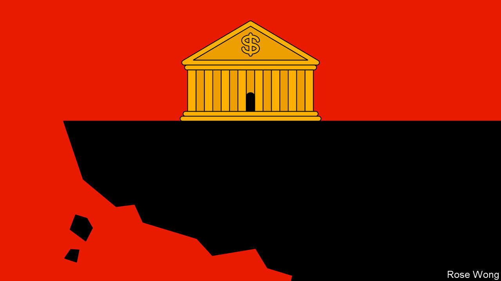
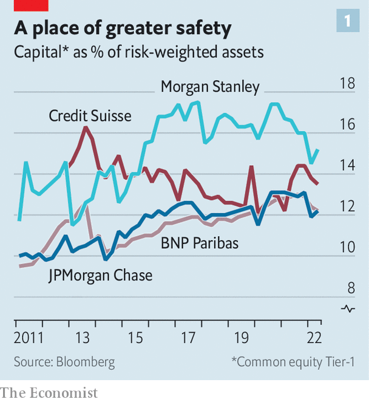
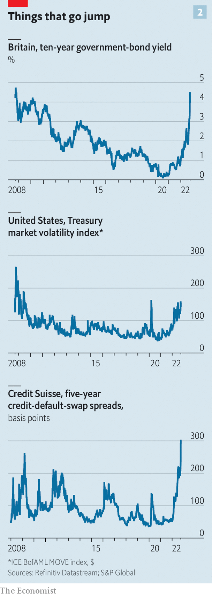

###### The rumbling draws near

# Financial markets are in trouble. Where will the cracks appear? 

##### The first big test of a new-look financial system 

 

> Oct 4th 2022 

It is hard not to feel a sense of foreboding. As the Federal Reserve has tightened policy, asset prices have plunged. Stocks, as measured by the Wilshire 5000 all-cap index, have shed $12trn of market capitalisation since January. Another $7trn has been wiped off bonds, which have lost 14% of their value. Some $2trn of crypto market-cap has vanished over the past year. House prices adjust more slowly, but are falling. Mortgage rates have hit 7%, up from 3% last year. And this is all in America—.

Rising rates will slow the American economy and should break the back of inflation. But what else will they break? Since the Federal Reserve raised rates again on September 22nd, global markets have been in turmoil. When the British government announced unfunded tax cuts a day later, fire-sales by pension funds caused the yield on government bonds (or “gilts”) to spiral out of control. Contagion then spread to the , which is as volatile and illiquid as it was at the start of covid-19. The cost to insure against the default of Credit Suisse, a global bank, has risen sharply. These ructions indicate the world is entering a new phase, in which financial markets no longer just reflect the pain of adjusting to the new economic context—pricing in higher rates and lower growth—but now also spread pain of their own. 

The worst pain is felt when financial institutions fail. There are two ways they do so: illiquidity or insolvency. Tighter monetary policy is likely to prompt or reveal both. It is illiquidity that comes first—and it has well and truly arrived. Take the British pension funds. They use a strategy called “liability-driven investing” to hedge against interest-rate moves. When rates shot up they faced margin calls, which they met by selling gilts. Yields moved so fast that this became a fire-sale, with prices spiralling downwards. The Bank of England had to step in to buy bonds. At least American pension funds do not treat their liabilities in the same way, meaning they are unlikely to face similar blow ups.

But pension funds are not the only bond holders that may face liquidity issues. On October 4th the imf sounded the alarm about open-ended bonds funds, which hold $41trn in assets, a quarter of financial assets outside the banking system. Investors can sell their holdings once a day, “but it may take fund managers several days to sell assets to meet these redemptions, especially when financial markets are volatile,” warned the IMF. That exposes them to moves in market pricing. Outflows are amassing. Investors have pulled 8% of their assets from these funds this year. 

Credit costs are rising quickly, as would be expected in such circumstances. Betsy Graseck of Morgan Stanley, a bank, highlights how abrupt the shift has been: “In the most recent senior-loan-officers survey every single question they asked bankers about financial conditions flipped to tightening, all at once. I have never seen that before.” Yet the real problem is when credit is unavailable—no matter the price. British traders report there were “no bids” for gilts in the days after the government announced its plans. Measures of liquidity in the Treasury market have deteriorated, too. “We are seeing what happened in March 2020 again. The same Treasury bonds are trading at different prices, bid-ask spreads are widening,” says Darrell Duffie of Stanford University. Strategists at Bank of America describe their index of credit stress as “borderline critical” .

Stockmarkets have been just as turbulent, but they have at least continued to function. “You might not have liked the price you were seeing,” says Tal Cohen of Nasdaq, a stock exchange, “but you were always seeing a price.” He has yet to witness “demand destruction”, the thinning out of the order book that occurs when buyers and sellers begin to pull their orders en masse. This is despite the fact that Bank of America strategists think markets have fallen to levels at which losses may be forcing funds to sell assets to raise cash, accelerating the sell-off. 

Illiquidity in credit markets is enough of a problem. It can morph into a total lack of lending. Last week British banks rushed to pull mortgages from their proverbial shelves. If this dynamic gets out of hand it can typically be solved by central banks stepping in and operating as a lenders of last resort, as the Bank of England did. The risk of doing so is not trivial, however. Such an intervention employs quantitative easing, buying securities using central-bank money—the path used by central banks to ease monetary policy. Thus it might undermine faith in central bankers’ commitment to fighting inflation. 

Market-watchers now wonder whether all this pressure will lead to insolvencies, which happen when the value of an institution’s assets falls below its liabilities. It is the fate which befell insurers, including AIG, and banks, including Lehman Brothers, in 2008. Homeowners across America defaulted on their loans, meaning mortgage-backed securities, assets many firms had bought, were no longer worth anything close to their original purchase price. Insolvency is fatal, and only resolvable by bankruptcy or bail-outs. 

The current tension is the first big test of a new-look financial system. Regulators have sought to make systemically important institutions—as Lehman Brothers surely would have been designated—too safe to fail. They have done this by compelling firms designated as such to follow stringent capital, liquidity and risk-taking rules, as well as by stress-testing them in hypothetical economic breakdowns. Regulators have also tried to reduce opacity and counterparty risk—the channels through which fears about Lehman morphed into suspicion of the entire banking system. 

The result is that there are layers of protection around the financial system’s most important institutions. At the heart of markets are clearing houses, which settle trades in stocks and derivatives between their members (mostly big banks). To join a clearing house a member must post an “initial margin” in case of default; that margin can climb if markets move. The system is stress-tested against the default of even the clearing houses’ largest members, such as JPMorgan Chase or Citigroup. 

 


The banks, which stand between the clearing houses and other financial institutions, are also in better shape. The issues that precipitated the fall of Lehman Brothers were that the firm did not have enough capital (at times leading up to its demise it held capital worth just 3% of assets), had taken on too much borrowing (holding debt worth 30 times its equity), had a dubious business model (making enormous bets on the American housing market), and had taken on vast amounts of risk. 

Today there are 30 banks designated as systemically important by regulators, some 28 of which are in the kbw Nasdaq Global Bank Index, which tracks bank stocks. These 28 banks are funded with capital worth 13% of their risk-weighted assets (see chart 1), and have debt worth five times their equity. Despite this, they do not get an entirely clean bill of health: some business models look fragile. On average the banks returned profits worth 9% of their equity last quarter, but the worst (other than Credit Suisse) returned just 4%. It is hard to know whether any have taken huge risks. 

 


“American banks are unequivocally much stronger,” says a bank boss. Few are making such statements about European banks, and certainly nobody is about Credit Suisse. The firm had a return on equity of minus 14% last quarter, its share price has tumbled and its market capitalisation is now just $12bn. Yet even Credit Suisse is not near a Lehman-style collapse. It is funded with capital worth 14% of its risk-weighted assets. Although Credit Suisse credit-default swaps, which act like insurance against default, have leapt (see chart 2), they still suggest the chance of default is in the low to mid-single digits.

Big banks head into the new era fortified. But the regulation that has strengthened their defences has also diminished them. High capital demands make it hard for them to compete. Because they must add risk weights to all kinds of assets, they now hold only boring stuff. Leverage ratios constrain their size. By contrast, financial institutions that are not systemically important are unencumbered by these rules. 

The impact can be seen on balance sheets. In 2010, after the financial crisis, banks held $115trn of financial assets. Other financial institutions, such as pension funds, insurers and alternative asset managers, held roughly the same amount. In the years since, the non-banks’ slice has grown. By the end of 2020 they held assets worth $227trn, a quarter more than the banks. Similarly, four-fifths of American mortgages came from banks before the financial crisis. Today only around half do, and most of these are sold on to investors.

Thus the dodgy stuff is probably in other institutions. Which ones? In 2007 problems started in real estate. This time Americans have far less mortgage debt, but the sheer pace of price growth in residential housing suggests some buyers will face difficulties. Indeed, three-quarters of those who bought in the past two years regret their decision. Other forms of real estate are also vulnerable. Firms are downsizing their offices to adapt to working from home, posing problems for highly leveraged commercial developers. Charles Bendit of Taconic Partners, a developer in New York, notes that lots have opted for floating-rate debt, meaning their debt-servicing costs have already doubled. 

Michael Burry, who shot to fame in 2008 after shorting mortgage-backed securities, is concerned by unsecured consumer finance given the growth of “buy-now-pay-later” providers and the ease with which consumers have been able to tap credit-card lines. Goldman Sachs, a bank, ventured into consumer credit in 2019, helping to launch the Apple card. It now has an unusually high default rate of 3% over the past six months. Ms Graseck of Morgan Stanley points out that, because this is an interest rate-shock driven cycle, trouble will probably first arrive in the loans that reprice to higher rates quickly: “Floating rate debt, like credit cards, is immediate, then commercial real estate, autos and eventually mortgages.”

One of the fastest-growing parts of private credit has been that offered to software-service firms, notes Seth Bernstein, boss of AllianceBernstein, an asset manager. “These have been fantastic cash machines, because they have subscription models.” The cash flows they provide have been used to secure financing, meaning many firms are now highly leveraged. They are also untested in a downturn. Mr Bernstein compares the situation to the securitisation of housing debt, in that there is very little information available about the debt. 

It is companies more broadly that appear most at risk. They owe debts worth 80% of gdp, compared with 65% in 2007. A third of American corporate debt is rated BBB, the lowest investment-grade rating. Firms downgraded any further are not eligible for many investors’ portfolios. Defaults are now arriving. Bausch Health, a health-care provider, gave up the ghost on September 30th, taking the default rate for high-yield issuers to its highest since June 2020. There is little to no appetite for fresh high-yield debt—banks that agreed to fund Elon Musk’s Twitter takeover in April will struggle to issue it without taking losses.

Who holds these bad assets? Financial firms that have grown lots over the past 15 years are the first place to look. Alternative assets, which include private equity, real estate and hedge funds, have grown from just 8% of total financial assets in 2006 to 15% now. They have taken paper losses of 11% on their investments this year, a much smaller fall than in the public markets. This might reflect sensible investment—or an unwillingness to adjust to reality. 

Firms that have escaped the full weight of regulation are another place to look. The Financial Stability and Oversight Council, an outfit established by the Treasury to watch important financial institutions, tried to claim oversight of the big insurance companies, including MetLife, AIG and Prudential. But MetLife won a lawsuit to have the designation overturned, and the council then rescinded its designations of the rest.

If lots of investors are washed out, as they would be if a non-bank financial institution failed, well, “who cares?” quips one bank boss. Given reforms since the last financial crisis, it seems unlikely that there will be failures of institutions that are so big and important that governments need to bail them out. The systemic institutions will survive another event like the blow-ups of the hedge funds LTCM (in 1998) and Archegos (in 2021). But that does not make life any easier for central banks. It is their job to tighten policy enough to cool inflation without causing seriously disruptive activity in financial markets. And it is looking increasingly difficult to do both. ■


