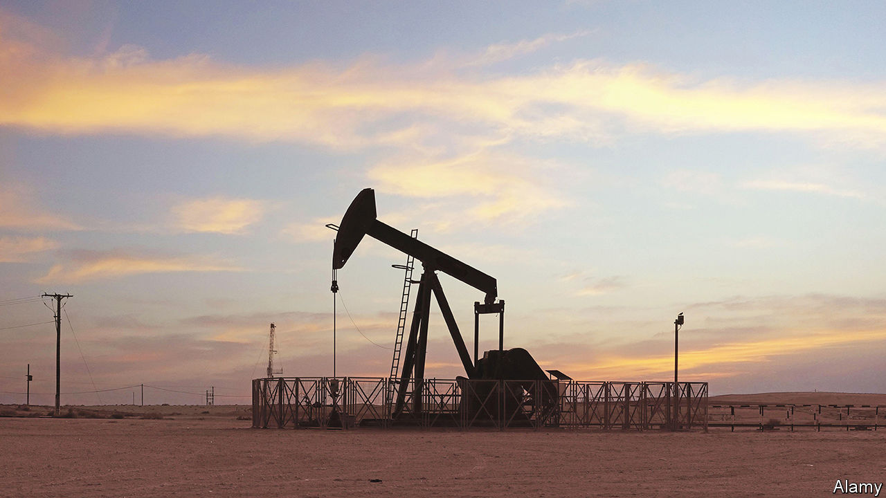
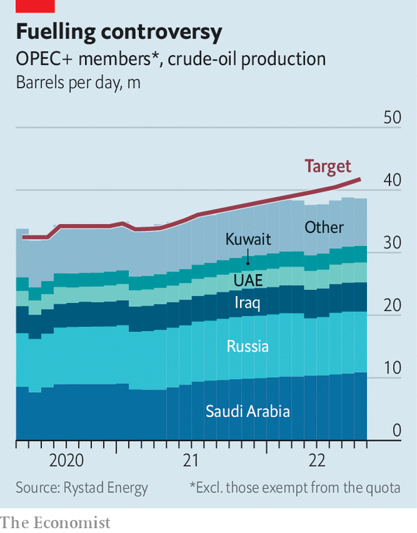

###### Striking oil producers

# OPEC defies Joe Biden with a big output cut 

##### Will it backfire? 

 

> Oct 5th 2022 

The organisation of the Petroleum Exporting Countries (OPEC) is sometimes called the oil market’s central bank. Every month the cartel and its allies, a group of 23 countries that produce 40% of the world’s oil, meet to decide on production targets. The aim is to keep prices . But just as  governors argue about the speed of , members of opec+, as the wider group is known, disagree on how fast to turn the spigots.

The summit on October 5th was a short one, but it nevertheless produced a controversial decision. Ending a series of online meetings and timid tweaks to output, opec+—which includes Russia—met in person for the first time since the covid-19 pandemic. Emerging from a Viennese boardroom, ministers confirmed that they would cut production by 2m barrels a day (b/d), an amount equivalent to 2% of the world’s total output. After months of  and missed targets, the cartel is determined to restore its credibility and regain control of the oil price. 

Members are worried about falling demand. Brent crude, the global benchmark, has dropped to $93 a barrel, down from $125 in June. Pricey petrol has led to lower consumption. Europe’s gas crunch, China’s covid policies and property troubles, and rising interest rates augur a global recession. The strong dollar, in which oil prices are denominated, makes the fuel still less affordable outside America. opec+ does not explicitly say so, but its members want a floor under the price at a time when increased spending at home implies a higher break-even price. Experts place that floor at between $80 and $100, compared with $70 to $80 before covid. 

The cartel has rarely had such an opportunity to set prices. No country apart from its biggest members has the capacity to increase output fast, and global stocks are low. Crude inventories in the oecd, a club of mostly rich countries, remain well below their five-year average; China is running down its stockpiles in a bid to satiate its thirsty refiners. The volume of oil on water may be rising, but that is only thanks to the longer tanker journeys that are required as the market adjusts to sanctions, rather than growth in floating storage, notes Giovanni Serio of Vitol, a trader. 

 


The problem opec+ faces is that its credibility is in tatters. Even the cut announced on October 5th is not what it seems. Its members have failed to invest in production, leading to a gap between target and actual output (see chart). In reality the cut will apply only to members that are hitting or are near to their targets. Ehsan Khoman of MUFG, a bank, expects the revision to deliver a real cut of up to 1.1m b/d.

The tactic is nevertheless working—at least for now. The oil price has risen by 11% since September 26th, when rumours of the cartel’s plans first emerged. That makes the reduction worthwhile even for Saudi Arabia, which will trim its output by 5%, but ought to benefit from an increase in price twice the size. Jorge León, a former opec analyst now at Rystad Energy, a consultancy, reckons that Brent could surpass $100 by the end of the year. After the meeting, the Saudi energy minister said that, unless the market changes, the supply curbs will remain until the end of 2023. 

But the decision is not without risk. opec+’s  from huge cuts it made in 2020 to shore up prices amid a collapse in demand. Trimming production again may further erode the cartel’s market share. The cut is also a snub to President Joe Biden, who recently visited Saudi Arabia in an attempt to cajole it into pumping more, before tough midterm elections next month. The White House accused the cartel of “aligning with Russia”, and announced that America would release another 10m barrels from its strategic reserve next month. The decision also provides fuel to nopec, a congressional bill that would allow the cartel to be sued under antitrust law, although it will have to overcome opposition from lawmakers and oil firms who fear tit-for-tat measures. 

opec+’s loss of market share should be partly reversed when it eventually cranks up output again. Thus it is the decision’s impact on demand, with higher prices likely to further reduce consumer appetite, that will probably do more damage to opec+’s position. Cutting output in a tight market also creates more volatility, not less—and the extra uncertainty will discourage investors and lenders, reducing liquidity in the paper oil markets. 

The decision may also reignite diplomatic tensions within the cartel. Since quotas no longer reflect actual output, the latest cuts are being shouldered by just a handful of members—Iraq, Kuwait, Saudi Arabia and the uae—that were already prevented from producing quite as much as they ideally would. The uae, which secured a small increase in July but plans to expand its production capacity from 4m b/d today to 5m b/d in 2025, will almost certainly agitate for a rejig in future negotiations. This will be resisted by underperformers such as Angola and Nigeria, says Robin Mills of Qamar Energy, another consultancy, in the hope that they can one day rebuild their capacity.

Ironically, Russia could offer the cartel a solution. The country has long been a staunch advocate of higher production. But its output is now likely to fall, both soon, as a result of a  set to start in December, and in the long run, as sanctions prevent it from getting access to vital partners, people and parts. Saudi Arabia and the uae are in bed with “a weakening business partner”, says Karen Young of Columbia University. Russia will be reluctant to give away some of its quota. The question is whether, in a world where it has ever fewer friends, doing so is a price worth paying to remain inside the tent. ■


