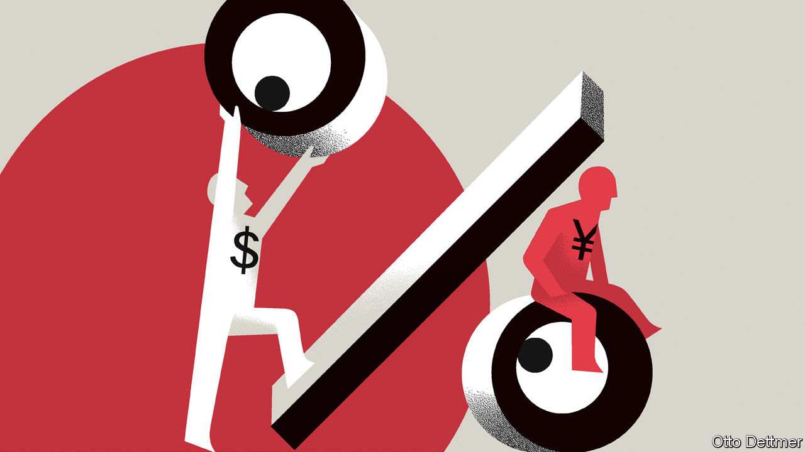

###### Free exchange

# Why China’s policymakers are relaxed about a falling yuan 

##### They have learnt how to walk down stairs 

 

> Oct 6th 2022 

In 1988 paul krugman, a Nobel-prizewinning economist, wrote that it was “fairly likely” the world would soon shift away from freely floating exchange rates. Governments would instead adopt a system of “broad target zones”, promising to stop their currencies wandering too far above or below a fixed exchange rate.

He was wrong—but a version of this future can be seen in China. Each morning its central bank sets an exchange rate for the yuan known as the “fix”. China’s currency can float 2% above or below this rate each day. The zone is narrower than Mr Krugman expected and its mid-point moves each morning in discrete steps. Yet it is similar enough that economists at Hamburg University have called it a staircase-shaped “moving Krugman band system”.

The stairs have been steep of late. Since mid-April, the yuan has declined by about 10% against the dollar; a decline slowed (but not stopped) by the morning fix. On its way down, the currency has passed psychologically important thresholds. In August it crossed 6.8 to the dollar, close to the level at which the yuan was pegged after the global financial crisis of 2008-09. On September 26th the central bank set the fix at more than seven yuan to the dollar for the first time since the early stages of the covid-19 pandemic.

The reason for this descent is clear. America’s Federal Reserve has raised interest rates aggressively to curb inflation. To stabilise the yuan, China’s central bank could raise interest rates in tandem. But tighter monetary policy would be at odds with the needs of its weak economy, which is hampered by a property slump and draconian covid controls.

What is less clear is where the bottom of the staircase lies, and how sure-footed the descent will be. Some analysts fear a repeat of 2015, when a poorly executed devaluation of the yuan provoked capital outflows that further undermined the currency. But a rerun is unlikely. The yuan is no longer overvalued. Its target zone is better managed and its capital controls are better enforced. In the past China kept its currency anchored to the dollar, because it feared that a conspicuous drop would trigger a run on its currency. The yuan’s decline against the dollar is now less likely to become disorderly. For that reason, China will try less hard to prevent it. 

In assessing China’s currency choices, economists sometimes invoke the “impossible trinity”. A country might want exchange-rate stability, monetary independence and free capital flows, but it can have only two of these. Rich countries typically make clear-cut choices. As Joshua Aizenman of the University of Southern California has pointed out, emerging economies are more ambivalent. Many have adopted mixed positions, embracing none of the objectives in full, nor rejecting any entirely. By imposing limited controls on capital, say, they can provide some stability to their exchange rate, without entirely forgoing monetary independence. 

China has clung to exchange-rate stability more than most. The yuan has been less volatile than India’s rupee, let alone South Africa’s rand or Brazil’s real. But China has also adopted tighter capital controls, especially since 2015. This can be inefficient and inconvenient. It is, however, not outlawed by the impossible trinity.

China can also take comfort from the economic fundamentals. Despite its insulation from market forces, its exchange rate is reasonably well priced. Adjusted for inflation, it is about 10% below its fair value, according to the Institute of International Finance. It has remained stable this year against a broader basket of currencies. If only the fundamentals applied, it ought not to plummet.

Unfortunately, financial markets are not respectful of such calculations. “Few will heed fundamentals...in times of turbulence and turmoil,” as Zhou Xiaochuan, then China’s central-bank governor, put it in 2016. Expectations of yuan declines can become self-fulfilling, regardless of the underlying state of the economy.

Mr Krugman showed that target zones, if credible, could ameliorate this problem, by converting speculators into stabilisers. As the exchange rate reaches the bottom of the zone, its room for further declines is limited. Knowing that, speculators would push it back to the middle. The mere prospect of intervention by the authorities could make actual intervention unnecessary.

That did not work in China in 2015 partly because of the way its stairs were built. Each morning’s fix was supposed to reflect the currency’s value at the end of the previous trading session. Thus any speculative declines during trading could be embedded in the following morning’s fix. Within any single day, the zone might constrain the speculators. But from one day to the next, the speculators could move the zone.

In need of a fix

To restore stability and credibility, China sold more than $700bn of foreign-exchange reserves in 2015-16 and enforced its capital controls more zealously. It introduced a mysterious “counter-cyclical factor” in its calculation of the morning fix, intended to offset any speculative momentum. It also imposed a reserve requirement on banks that made it costlier to bet against the yuan. That requirement was removed in 2020, only to be restored last month.

Having taken these measures, China now seems more confident that the yuan can fall against the dollar without the fall becoming self-reinforcing. For this reason, the yuan now seems less anchored to America’s currency. Economists have looked at how faithfully the yuan mimics movements in the dollar against other currencies. In the dark days of 2015, it moved one to one. In recent years, the dollar’s influence has steadily declined, according to Chen Zhang of the National University of Singapore and colleagues, falling from one to about 0.3. 

China might cling more tightly to the dollar in a period of great financial stress. But it is otherwise unlikely to intervene heavily to defend any particular value of the yuan to the dollar. The country’s policymakers do not mind if the yuan walks steadily down the stairs. Just as long as it does not tumble. ■


