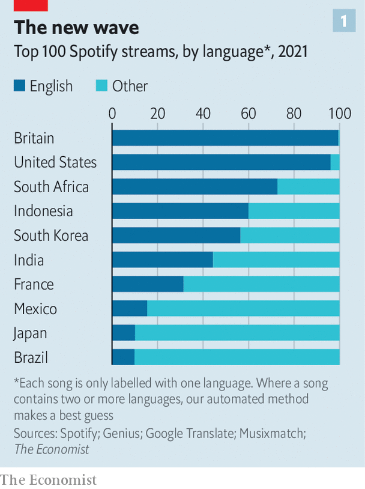
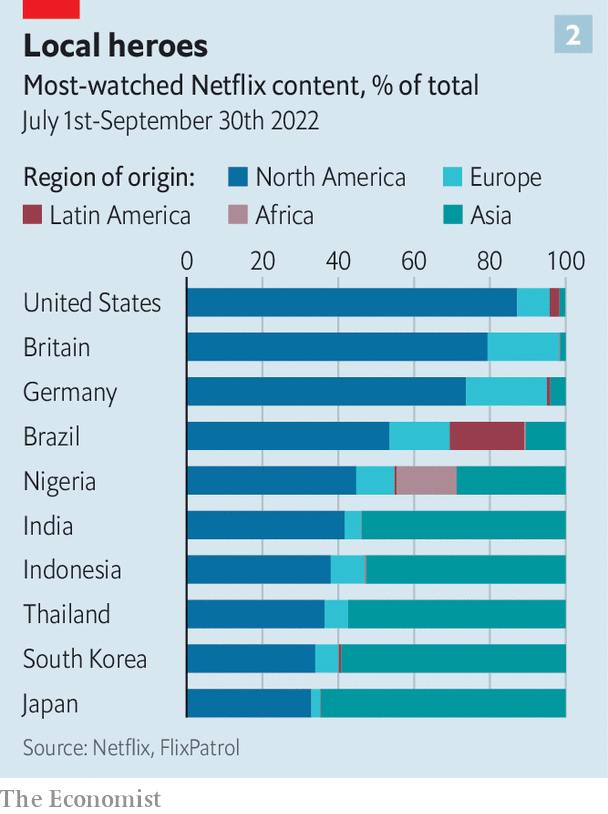

###### Capitals of cool

# How pop culture went multipolar 

##### Fears that globalisation would lead to a worldwide monoculture have proven utterly wrong 

 

> Oct 6th 2022 

Throngs descended on the Jamsil Arena in Seoul, the South Korean capital, in July to see Super Junior, a band that exemplifies the “Korean Wave”. The crowd reflected the global reach of k-pop. Melonie was visiting from Ecuador. When asked about her “bias”, the term fans use to discuss which band member is their favourite, she pulled her top aside to reveal a tattoo of the name of the group’s leader, Leeteuk, on her chest. Karen, from Peru, is doing a master’s degree in South Korea. She thinks she likes Super Junior even more than she likes Korea itself.

Once the show began it was clear why Super Junior appeals to people around the world. The band’s rotating membership are dewy-faced heart-throbs recruited from South Korea, China and America. With backgrounds in acting and dance, they are consummate performers. Songs were punctuated with banter and skits. The strutting and pouting was directed not just at the screaming women in the stadium but also at cameras dotted around the stage, streaming the performance to audiences in other time zones.

Helped by government money and savvy marketing, South Korean popular culture has taken the world by storm. Besides music are films such as “Parasite”—which became the first film in decades to win both the Palme d’Or and a Best Picture Oscar—dramas such as “Squid Game”, and a bevy of fashion and beauty brands. But it is only part of a broader transformation. Throughout the 20th century, cool was mostly a Western thing. From flappers to hip-hop, people looked to cities like London, New York and Paris for fashion, music and entertainment. After the cold war, as the world grew richer and more connected, says Marty Kaplan, a professor at the University of Southern California, many people feared that the West’s cultural dominance would keep growing and ultimately produce a global monoculture.

The opposite has happened, says Dr Kaplan. Today, a teenager sitting in New York is as likely to listen to k-pop and Afrobeats tracks, a sort of west African pop, as American hip-hop. A young Mumbaikar logging onto a video-streaming platform for an evening’s entertainment is as likely to watch “Made in Heaven”, an Indian-made romantic drama about two wedding planners in New Delhi, as “Call My Agent”, a French comedy about a talent agency in Paris. Pop culture has gone multipolar. 

This can be seen even in deeply uncool things such as trade data. The World Trade Organisation and the oecd, a club of mostly rich countries, produce estimates of the trade in “audio-visual services”, which includes films, radio and television. Their data suggest that, across the oecd, imports from America were 25% of the total in 2020, down from almost 40% a decade earlier. America’s cultural imports, meanwhile, have risen almost six-fold, and are coming from all over the world. 

Say goodbye to Hollywood

To look more closely at the music industry,  examined , the world’s largest music-streaming firm, covering 70 countries between 2017 and 2021. English-language songs, many of which are produced by American and western European artists, still dominate. Of the 50 most-streamed songs on Spotify over the past five years, 47 were in English. But that dominance is slipping. In countries with a strong local music industry, such as India, Indonesia and South Korea, the share of English-language tracks in the top 100 has fallen from 52% to 31% over the past five years (see chart 1). In Spain and Latin America the figure dropped from 25% to 14%, as local artists, many of whom sing in Spanish, won acclaim.

 


A similar diversity is evident in what people watch. FlixPatrol, a Czech firm, tracks the most-watched programmes and films every week in almost 90 different countries on Netflix, a video-streaming service. By its estimates, North American programmes still dominate in rich, English-speaking countries like America, Australia and Britain, where they make up 80% to 85% of the most popular shows and films (see chart 2). But in Argentina, Brazil and Colombia only around half of the most-watched shows were North American. In Japan and South Korea the share was lower still, at less than 35%. 

Two things have driven the emergence of multipolar pop culture. The first is economic growth in countries that until recently were poor. Rising incomes give consumers more money to spend, much of which goes to local musicians and film-makers. More money in turn means more artists. With that virtuous spiral comes self-confidence. Scott McDonald, head of the British Council, a government-backed body that promotes Britain abroad, recalls his most recent trip to China, just before the pandemic. Rather than questioning him about the latest trends in the West, as they had done on previous visits, the people he met were keen to show off chic local shops, restaurants and social-media stars. “Every single person was telling me: we don’t care what’s happening around the rest of the world anymore because we have the coolest stuff here,” Mr McDonald says.

 


The second factor is the rise of the internet, which has created many more opportunities to put out content. On traditional television and radio channels, executives carefully chose what would air in the limited number of time slots available each day. Online-streaming firms are free from such scheduling constraints, and can host far more content. tv and radio transmissions are usually restricted to the country a channel is based in. Netflix, Spotify and the like are global, which makes it easier for local productions to earn fans overseas. 

Most democratic of all are social-media platforms such as Instagram, TikTok and YouTube, which let aspiring performers anywhere in the world create songs or art that can be distributed at no cost. Recommendation systems that sift through millions of accounts every day offer an automated alternative to record-company talent scouts or tv commissioners. 

The upshot is that there is far more entertainment and culture out there than there used to be, and that borders matter much less than they used to. The biggest account on TikTok, for instance, belongs to Khaby Lame, a Senegalese-Italian. His light-hearted posts, which mock social-media trends and generally have no words, have an international appeal that has won him over 150m followers. It is hard to imagine Mr Lame, who was laid off from a factory job in 2020, achieving that sort of success in the old-media world. T-Series, an Indian record label and film company, has 226m subscribers on YouTube, the most of any account. India’s hundreds of millions of internet users propelled T-Series to fame. But these days a third of its audience is based outside its home country. Burna Boy, a Nigerian singer, became the first African to sell out Madison Square Garden in New York City this year.

The more consumers in one country are exposed to culture from other countries, the more adventurous they get. Young people today, accustomed to scrolling through posts produced across the globe on social media, are not put off by subtitles, says Brian Graden, a former head of programming at mtv, a music channel, who now runs his own production company. Nor do they expect a uniform style across the videos they watch. Much of the entertainment industry, he says, realised this only after “Squid Game”, a Korean-language drama with a largely Korean cast, became one of the most watched shows on Netflix last year. 

The decentralisation of cool is forcing change on the arts and entertainment industry, which is coming to recognise that many of today’s most influential tastemakers come from the developing world. As Jeremy Zimmer, who runs United Talent Agency (uta), a Los Angeles-based group, puts it: “you have to wake up every day and think about your business not as Los Angeles and New York but as wherever culture is and wherever the audience is.” Earlier this year, uta, whose clients had traditionally been American actors based in Hollywood, began representing Anitta, a singer, who has since become the first Brazilian to win a prize at the mtv Video Music Awards.

The winds of change are even blowing through European luxury fashion, one of the most hidebound corners of the cultural industry. Launchmetrics, an analytics group, studied celebrities talking about Paris Fashion Week this year and found half of the ten most valuable voices, in terms of the boost they gave to advertising, came from emerging markets. They included a Filipino actress, and a Brazilian football player. Only one French influencer—and no Americans—made the list. 

All that may explain why Balenciaga, a fashion firm founded in Spain in 1919 and which sells $2,000 handbags, decided to take its collection to Shanghai in 2021, when covid-19 restrictions prevented Chinese influencers from going to Paris Fashion Week. When Celine, another high-end fashion brand, closed Paris Fashion Week this year, the crowds that formed outside Palais de Tokyo were there as much for the K-pop stars on the guest-list as for the French fashionistas. 

It’s only rock and roll, but I like it

Killjoys might be tempted to dismiss pop culture as mere frippery. But as Andrew Breitbart, a right-wing American journalist, once observed (in a very different context), politics is downstream of culture. Pop culture can be a vector of “soft power”—a country’s ability to shape the preferences of others using attraction rather than coercion. Films and music can draw people to visit a country, study there, learn the language and sympathise with its ideals. 

Super Junior’s rollicking performance at Jamsil Arena was about catchy tunes, baby-faced heart-throbs and a screaming mass of young women. But it was also about soft power. Midway through the spectacle, Donghae, the lead vocalist, thanked the audience in English, Korean, Japanese and Mandarin. All the while, his headset dangled nonchalantly over his shoulder, the South Korean flag emblazoned conspicuously on the earpiece. ■

