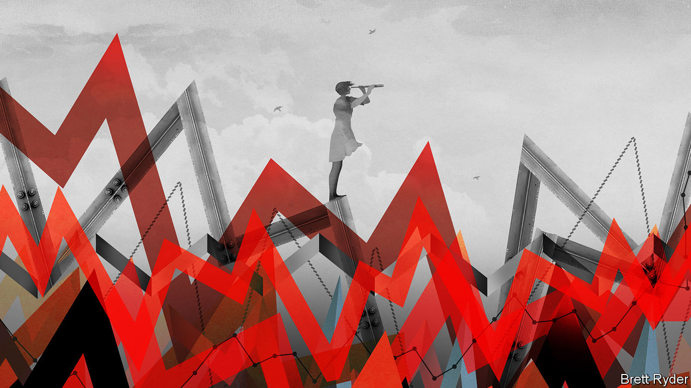

###### After the chaos

# A new macroeconomic era is emerging. What will it look like? 

##### A great rebalancing between governments and central banks is under way 

 

> Oct 6th 2022 

For months there has been turmoil in financial markets and growing evidence of stress in the world economy. You might think that these are just the normal signs of a bear market and a coming recession. But, as our  this week lays out, they also mark the painful emergence of a new regime in the world economy—a shift that may be as consequential as the rise of Keynesianism after the second world war, and the pivot to free markets and globalisation in the 1990s. This new era holds the promise that the rich world might escape the low-growth trap of the 2010s and tackle big problems such as ageing and climate change. But it also brings acute dangers, from financial chaos to broken central banks and out-of-control public spending.

The ructions in the markets are of a magnitude not seen for a generation. Global inflation is in double digits for the first time in nearly 40 years. Having been slow to respond, the Federal Reserve is now cranking up interest rates at the fastest pace since the 1980s, while the dollar is at its strongest for two decades, causing chaos outside America. If you have an investment portfolio or a pension, this year has been gruesome. Global shares have dropped by 25% in dollar terms, the worst year since at least the 1980s, and government bonds are on course for their worst year since 1949. Alongside some $40trn of losses there is a queasy sense that the world order is being upended as globalisation heads into retreat and the energy system is fractured after Russia’s invasion of Ukraine.

All this marks a definitive end to the age of economic placidity in the 2010s. After the global financial crisis of 2007-09 the performance of rich economies assumed a feeble pattern. Investment by private firms was subdued, even at those making monster profits, while governments did not take up the slack: the public capital stock actually shrank around the world, as a share of gdp, in the decade after Lehman Brothers collapsed. Economic growth was sluggish and inflation was low. With the private and public sectors doing little to stimulate more activity, central banks became the only game in town. They held interest rates at rock-bottom levels and bought huge volumes of bonds at any sign of trouble, extending their reach ever further into the economy. On the eve of the pandemic central banks in America, Europe and Japan owned a staggering $15trn of financial assets. 

The extraordinary challenge of the pandemic led to extraordinary actions which helped unleash today’s inflation: wild government stimulus and bail-outs, temporarily skewed patterns of consumer demand and lockdown-induced supply-chain tangles. That inflationary impulse has since been turbocharged by the energy crunch as Russia, one of the largest exporters of fossil fuels along with Saudi Arabia, has isolated itself from its markets in the West. Faced with a serious inflation problem the Fed has already raised rates from a maximum of 0.25% to 3.25% and is expected to take them to 4.5% by early 2023. Globally, most monetary authorities are tightening too. 

What on earth comes next? One immediate fear is of a blow-up, as a financial system that has become habituated to low rates wakes up to the soaring cost of borrowing. Although one mid-sized lender, Credit Suisse, is under pressure, it is unlikely that banks will become a big problem: most have bigger safety buffers than in the past. Instead the dangers lie elsewhere, in a  that relies less on banks and more on fluid markets and technology. The good news is that your deposits are not about to go up in smoke. The bad news is that this system for financing firms and consumers is opaque and hypersensitive to losses.

You can already see this in the credit markets. As firms that buy debt shy away from risk, the interest rate on mortgages and junk bonds is soaring. The market for “leveraged loans” used to finance corporate buy-outs has seized up—if  the resulting debts may become a big problem. Meanwhile investment funds, including pension schemes, face losses on the portfolios of illiquid assets they have accumulated. Parts of the plumbing could stop working. The Treasury market has become more erratic () while European energy firms have faced crushing collateral calls on their hedges. Britain’s bond market has been thrown into chaos by obscure derivatives bets made by its pension funds. 

If markets stop working smoothly, impeding the flow of credit or threatening contagion, central banks may step in: already the Bank of England has done a U-turn and started buying bonds again, cutting against its simultaneous commitment to raise rates. The related belief that central banks will not have the resolve to follow through on their tough talk is behind the other big fear: that the world will return to the 1970s, with rampant inflation. In one sense this is alarmist and over the top. Most forecasters reckon inflation in America will fall from the present 8% to 4% in 2023 as energy price-rises ebb and higher rates bite. Yet while the odds of inflation going to 20% are tiny, there is a glaring question about whether governments and central banks will ever bring it back down to 2%. 

A moving target

To understand why, look beyond the hurly-burly to the long-term fundamentals. In a big shift from the 2010s, a structural rise in government spending and investment is under way. Ageing citizens will need more health care. Europe and Japan will spend more on defence to counter threats from Russia and China. Climate change and the quest for security will boost state investment in energy, from renewable infrastructure to gas terminals. And geopolitical tensions are leading governments to spend more on industrial policy. Yet even as investment rises, demography will weigh ever more heavily on rich economies. As people get older they save more, and this excess of savings will continue to act to depress the underlying real rate of interest.

As a result the fundamental trends in the 2020s and 2030s are for bigger government but still-low real interest rates. For central banks this creates an acute dilemma. In order to get inflation down to their targets of roughly 2% they may have to tighten enough to cause a recession. This would incur a high human cost in the form of job losses and trigger a fierce political backlash. Moreover, if the economy deflates and ends up back in the low-growth, low-rate trap of the 2010s, central banks may once again lack enough stimulus tools. The temptation now is to find another way out: to ditch the 2% inflation targets of recent decades and raise them modestly to, say, 4%. That is likely to be on the menu when the Fed begins its next strategy review in 2024.

This brave new world of somewhat higher government spending and somewhat higher inflation would have advantages. In the short run it would mean a less severe recession or none at all. And in the long run it would mean that central banks have more room to cut interest rates in a downturn, reducing the need for bond-buying and bail-outs whenever anything goes wrong, which cause ever-greater distortion of the economy. 

Yet it also comes with big dangers. Central banks’ credibility will be damaged: if the goalposts are moved once, why not again? Millions of contracts and investments written on the promise of 2% inflation would be disrupted, while mildly higher inflation would redistribute wealth from creditors to debtors. Meanwhile, the promise of moderately bigger government could easily spiral out of control, if populist politicians make reckless spending pledges or if state investments in energy and industrial policy are poorly executed and morph into bloated vanity projects that drag down productivity. 

These opportunities and dangers are daunting. But it is time to start weighing them and their implications for citizens and businesses. The biggest mistakes in economics are failures of imagination that reflect an assumption that today’s regime will last for ever. It never does. Change is coming. Get ready.■


