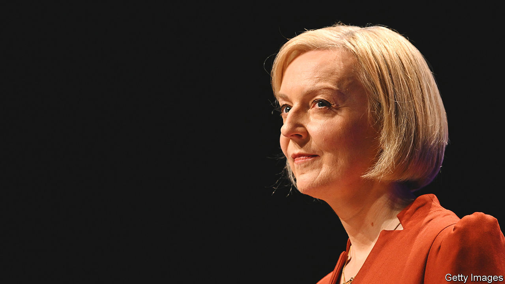

###### Truss deficit

# Britain’s Conservatives do not understand how much things have changed 

##### The markets are a little calmer. The mess remains 

 

> Oct 6th 2022 

“Iget it,” said Liz Truss, the prime minister, in an address to the  in Birmingham on October 5th, “and I have listened.” She doesn’t, and she hasn’t. On September 23rd Britain’s government spooked markets because it decided to embark on a borrowing spree to pay for big tax cuts. That caused a  on British government bonds and prompted the Bank of England to intervene in markets. At this week’s conference the Tories offered a small change of policy, a masterclass in internecine warfare and little sign that they understand how much things have changed.

Start with the change in policy. By  of the top rate of income tax, Kwasi Kwarteng, the chancellor of the exchequer, headed off an immediate revolt among Tory MPs and calmed markets a little. But that reversal undoes only a small part of the damage. Giving rich people a tax break would have cost the Treasury an estimated £2bn ($2.3bn, or 0.1% of gdp) in receipts; the tax cuts that remain will cost £43bn, and that is on top of an even bigger As Ms Truss said herself this week, abolishing the top rate of tax was not a core part of her plan, even if it was a totemic one. The fundamental question—how the government is going to pay for those tax cuts—remains. 

The evidence suggests that the government itself does not know. Ms Truss and Mr Kwarteng have committed to producing a medium-term fiscal plan in the next few weeks, which will be scrutinised by the Office for Budget Responsibility (OBR), an independent watchdog. But the OBR is very unlikely to buy the government’s line that tax cuts pay for themselves, and Ms Truss has opposed compensating tax rises as a matter of moral principle as well as economic policy. That leaves the option of  and the hope of supply-side reforms.

Slashing spending would be hard in the best of circumstances. Departmental budgets have already been squeezed by inflation. Cutting back on capital spending would be a bizarre thing for a pro-growth government to do. But it has become harder still because of the ungovernability of the Conservative Party. Having forced a U-turn on the top rate of tax, rebellious Tory MPs are lining up to oppose the possibility of real-terms cuts to welfare payments. Cabinet members are breaking ranks, too; the principle of collective responsibility no longer applies. 

As for promised supply-side measures to boost growth, Ms Truss is right that they are badly needed. But the risk is growing that a bodged set of tax cuts will be followed by a cartoonish mix of deregulation and posturing. A blanket commitment to repealing EU laws either means ditching good rules as well as bad, or a cosmetic exercise in relabelling European laws as British ones. Plans for investment zones appear to be focused on left-behind places rather than the country’s growth engines. Where there is local opposition to plans to build more homes and fast-track infrastructure projects, Tory MPs will be much less inclined to face it down on behalf of a prime minister who is already less popular than Boris Johnson at his nadir. 

If the prime minister realises how much trouble she is in, she is not showing it. In her speech she railed against an “anti-growth coalition” of Remainers, protesters and pundits. She skated past the disastrous impact of the mini-budget and equated her critics with “enemies of enterprise”. Those lines might get her applause from the same party members who elected her Tory leader, but the audiences she has to win round now have changed: Tory MPs who never much rated her; homeowners whose expected mortgage rates have jumped appreciably; and, scariest of all, bond-market investors who might once have trusted British policymakers to get on with things and now do not. The government lost credibility on September 23rd. The party conference has dented it further. That is not just bad news for Ms Truss, but for the economy she wants to invigorate. ■

