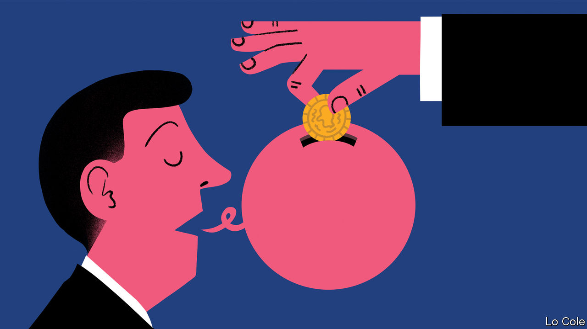

###### Consultants under fire

# Do McKinsey and other consultants do anything useful? 

##### Though hated, they often provide a valuable service to the economy 

 

> Oct 5th 2022 

If a list were made of the most reviled species in the professional world, only investment bankers would stand between management consultants and the top spot. Sceptics portray these corporate consiglieri as snake-oil salesmen, bamboozling chief executives and politicians with management gibberish and glossy charts while gorging on fat fees. Indeed, the profession was once the subject of a five-season skewering in a star-studded tv series. Its title: “House of Lies”.

Recent events have provided even more . “When McKinsey Comes to Town”, an exposé published on October 4th, drags its subject through the mud with evidence of decades of scandalous behaviour. On September 30th prosecutors in South Africa brought . (McKinsey says the book is a misrepresentation and denies the charges brought against it.) Its two big rivals, Bain &amp; Company and the Boston Consulting Group (bcg), have also faced controversies. In France President Emmanuel Macron has come under attack after an inquiry this year found the government had spent $1bn on consulting firms with “tentacular” links with the state. 

Despite evidence of dubious conduct, business has never been better. The big three firms’ total revenue has tripled since 2010, to about $30bn; the trio now employ around 70,000 people. That implies revenue per employee of over $400,000, hinting at juicy pay packets for the people at the top. By comparison, the figure for the big four accountancy firms—Deloitte, pwc, ey and kpmg—is a comparatively meagre $140,000.

What explains the boom? A shroud of secrecy makes it hard to calculate how much value the industry adds: few bosses or politicians would credit consultants for a successful turnaround. As a result there is a widespread view that all consultants are parasites and those who hire them are fools. In fact the firms have grown because they provide two services that bosses want—one more economically beneficial than the other. 

The first is an outside opinion. When firms or governments make decisions, it can pay to buy in rigorous analysis. The danger is that this becomes a self-protection racket. When bosses want to push through controversial decisions, from firing staff to breaking up a firm, a consultant’s backing can bolster their credibility. And legitimate scrutiny, whether from political opponents or board directors, can be easier to dodge using consultants’ reports in pleasing fonts with scientific-looking tables.

The second service is unambiguously good, both for the people in charge and the wider economy: making available specialist knowledge that may not exist within some organisations, from deploying cloud computing to assessing climate change’s impact on supply chains. By performing similar work for many clients, consultants spread productivity-enhancing practices. 

One defence against an explosion of bogus advice would be better disclosure. Companies are already required to reveal how much they spend on their auditors and on investment bankers’ fees on deals. The sums that individual firms spend on consultants often exceed this, running into the tens of millions of dollars a year, and should be made public too. 

So far the industry has escaped the formal rules that govern lawyers and bankers. If it wishes to keep it that way, it should adopt a second measure: a code of conduct that all responsible consultancies adhere to. They should eschew providing advice that helps bigwigs at the expense of the institutions they run, or helps autocrats oppress their people. They should also police the revolving door between government jobs and consultancies. Consultants have much to offer, but also much still to prove. ■

