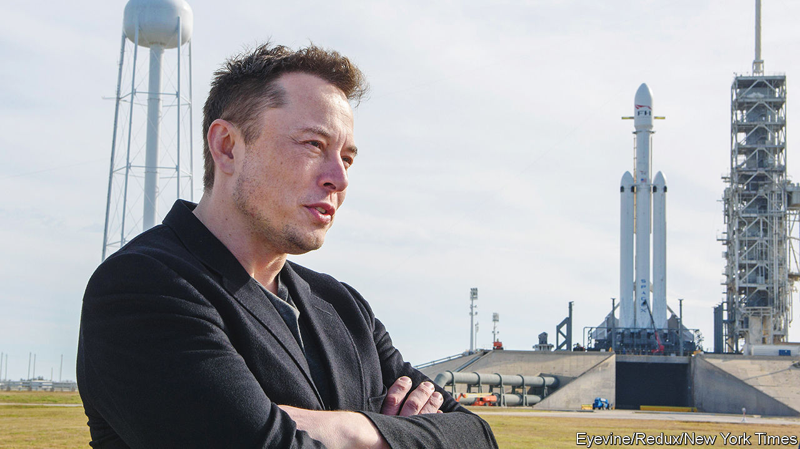

###### Iron Man with a dodgy peace plan

# How worried should you be about Elon Musk’s superpowers? 

##### With great technological power comes great political responsibility 

 

> Oct 6th 2022 

As the boss of Tesla, the world’s most valuable carmaker, and SpaceX, the world’s second-most valuable unicorn, Elon Musk is the stuff of business legend. As a gifted technologist with an enduring air of misfit adolescence he also has more than a whiff of the comic book about him. When he is talked about as an inspiration for Tony Stark in the “Iron Man” and “Avengers” movies, it is not just because he too is a fabulously rich, frequently irritating egotist with a saviour complex. It is because he has every intention of using the remarkable technological capabilities under his control to change the future course of history. 

Mr Stark wanted to put a suit of artificially intelligent armour around the world. Mr Musk wants to help stabilise its climate (hence his focus on electric cars) and to establish an outpost of civilisation on Mars (hence the rockets, one of which sent four astronauts to the International Space Station on October 5th). To help fund the Mars effort, SpaceX launched Starlink, a huge constellation of satellites that provide internet access to isolated users. Meanwhile, Mr Musk said on October 3rd that he would, after all, buy , a social-media platform—a move he portrays as a civilisation-preserving defence of free speech.

Given Mr Musk’s desire to change the future, it is hardly surprising to see him using the powers he is accruing to intervene in the present, too. After the invasion of Ukraine,  and switched on satellite coverage. Ukraine has been vocal in its gratitude for this intervention, which helped its cities restore vital services and its forces prevail on the battlefield. But it was less thrilled when Mr Musk took to Twitter this week to suggest a “peace plan” that would give Crimea to Russia, and possibly other occupied territories, too. Volodymyr Zelensky, Ukraine’s president, asked his own 6.7m followers whether they preferred a pro-Ukraine Mr Musk or a pro-Russia one—a reminder, if one were needed, of Twitter’s influence in shaping global perceptions of the war.

The fact that Mr Musk can, in a single week, get into a Twitter spat with the president of Ukraine, in an online discussion forum that he has just agreed to buy, while also sending people into orbit, demonstrates the extent to which his growing technological superpowers have granted him geopolitical clout. Should that be cause for admiration or concern?

In themselves, Mr Musk’s political musings on Twitter matter little. But given the platform’s important role in the febrile world of politics, his decisions about Twitter itself (such as whether to reinstate Donald Trump’s access), will matter a lot more. So will decisions about Starlink. Whatever your politics, it is worrying that one man can choose whether to extend internet access to anywhere on Earth, can decide who can use it—and can turn it off at will. 

There is no commercial case against Mr Musk’s accumulation of power. Starlink is not a monopoly; nor is SpaceX’s satellite-launch business (though it is currently the West’s only option for launching astronauts into orbit); nor is Twitter. But all three have global importance, and will do for some time to come. 

Mr Stark’s attempt to put armour round the Earth led to its near destruction; the chastened billionaire subsequently accepted un oversight. Mr Musk seems unlikely to follow suit. Comic-book fans must hope instead that he takes to heart the wisdom imparted to Peter Parker, aka Spider-Man: “With great power comes great responsibility.” As Robert Caro observed in response to Lord Acton’s famous dictum, power may not always corrupt, but it always reveals. What Mr Musk’s power reveals will bear close inspection. ■

