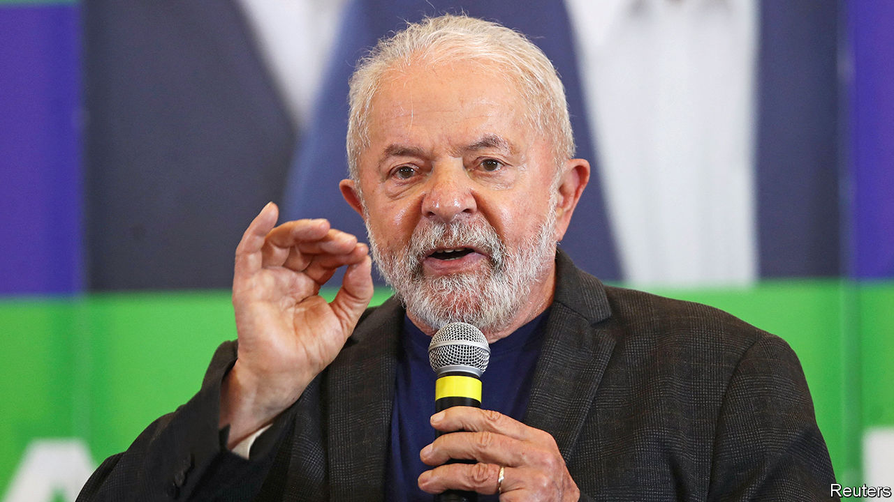

###### On a knife-edge

# To win Brazil’s presidency, Lula should move to the centre 

##### Another term for the populist Jair Bolsonaro would be bad for Brazil—and the world 

 

> Oct 4th 2022 

Like a sudden encounter with an anaconda, it was tighter than expected.  had shown Luiz Inácio Lula da Silva, a leftist former president, beating Jair Bolsonaro, the right-wing incumbent, by double digits. Some predicted that Lula would win over 50% in the first round of Brazil’s presidential election, making a second round unnecessary. But in  on October 2nd he won only 48% to Mr Bolsonaro’s 43%. (The reason the polls undercounted Mr Bolsonaro’s supporters , but it may be that many are “shy”, or suspicious of pollsters and reluctant to share their views with them.) The two candidates will face a , and Brazil faces a further month of polarisation .

Lula remains the narrow favourite, not least because Mr Bolsonaro repels so many voters: he is crass, bragging about his virility and sneering at women he deems unattractive. He is a Trumpian populist, who lies as easily as he breathes and imagines conspiracies everywhere. He makes no effort to stop the destruction of the Amazon rainforest. His handling of covid-19 was disgraceful. His circle overlaps with organised crime. He undermines institutions, from the Supreme Court to democracy itself. He hints that the only way he can lose the election is if it is rigged, and that he will accept no result except victory. He openly incites violence. In a recent poll, nearly 70% of Brazilians said they feared physical harm because of their political views.

Yet despite Mr Bolsonaro’s manifest unfitness for high office, Lula is only a few points ahead. Much of this comes down to two reasonable fears about him: that he may be too soft on corruption and . 

Lula spent 18 months in prison for taking bribes and was freed in 2019 after his convictions were overturned. He maintains his innocence. But in the eyes of many voters the taint of graft still hangs over both him and his Workers’ Party because of “Lava Jato” (Car Wash), a vast bribery scandal centred on the state oil giant. Lula has never apologised for Lava Jato, for which he bears some political responsibility. He should do so—and vow that if elected, he will pick a fearless attorney-general from the list recommended by the public prosecutor’s office. 

On economics, Mr Bolsonaro’s record has been fair. Inflation is falling, growth is picking up and the state has this year dished out extra aid to roughly 20m poorer families. Lula, when president, governed pragmatically and presided over a commodity boom, but failed to address underlying fiscal problems, such as out-of-control pensions. He chose an inept successor, Dilma Rousseff, on whose watch the economy crashed. This time, Lula would start with tougher fiscal conditions than he faced when last in power. And his platform, though vague, includes troubling streaks of old-fashioned leftism. He sees the state as the engine of growth; he wants to “Brazilianise” petrol prices. 

To convince swing voters that he can be trusted with their future prosperity, he should move closer to the centre. He should publicly name a moderate economist as his pick for finance minister. He should reassure farmers that he will not tolerate land invasions organised by social movements close to his party. (These are rarer than landowners claim, but widely feared.) He should promise not to nationalise any industries. He should stop toying with the idea of interfering with media freedom. 

Such a shift would help him win—and govern. Many of Mr Bolsonaro’s allies won office this week in Congress or as state governors. For Lula to muster a legislative majority, he will need help from the centre. Encouragingly, the two main candidates who were knocked out of the presidential race, both moderate, have endorsed him. 

Jair today, gone tomorrow?

But the coming month will be tense whatever he does. Mr Bolsonaro has convinced a lot of Brazilians of terrifying falsehoods about Lula, such as that he would close down churches. The president has primed his supporters to distrust both Brazil’s electronic voting system and its traditional, fact-checking media. If he loses, he may claim that he won and urge his supporters to take to the streets. A second term for such a man would be bad for Brazil—and the world. Only Lula can prevent it. Claiming the centre ground is the best way to do so. ■

