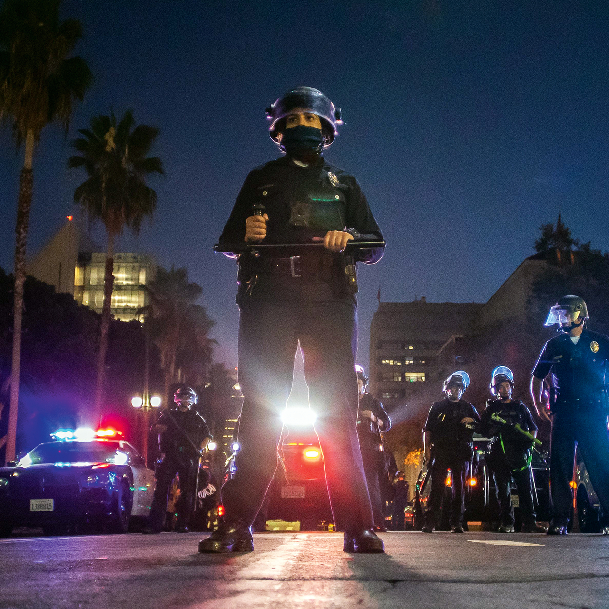
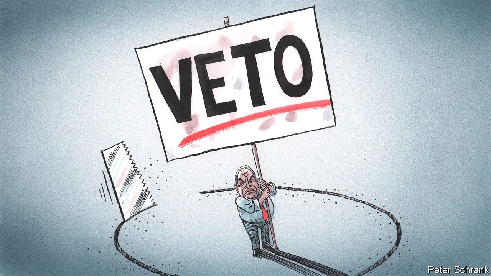
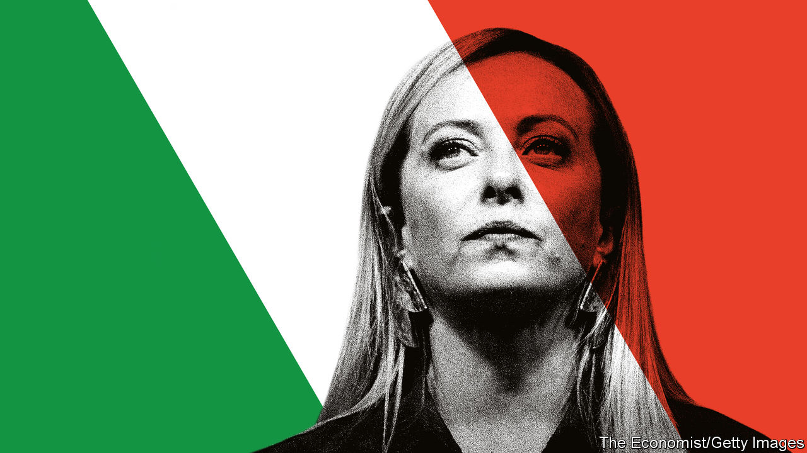
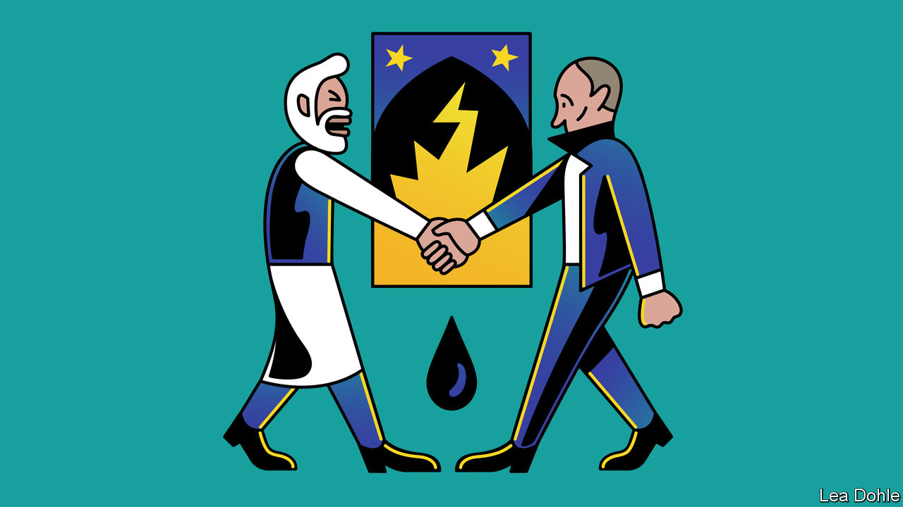

###### On the police in America, qualified-majority voting, Agatha Christie, Italy, Myanmar, Janus words

# Letters to the editor 

##### A selection of correspondence 

 

> Oct 6th 2022 

Guns and crime

The American public’s loss of faith in the police, which varies between communities, is a contributing factor to the rise in violence in recent years (, September 17th). But so are irresponsible efforts by the gun lobby, politicians eager for donations, and Supreme Court justices who reject reasonable gun regulations. Gun manufacturers encourage a vicious cycle by arguing that the more people have guns, the more unarmed people need to buy a weapon for protection. 

The understandable default assumption among the police who engage directly with an individual or a group for whatever reason, legitimate or not, is that they are in a situation where guns are present and easily accessible. Like any human, their natural precaution is to be ready to respond as rapidly and promptly as possible to any movement that may be a reach for a weapon. 

Imagine how much worse the situation may become if Republicans succeed in passing a federal law to require all states to honour gun-carry permits issued by another state, including in locations where alcohol is served and spirits, both literal and metaphorical, flow freely.

Martyn Roetter


 Clearly, the police are not as sensitive as they ought to be in America. More focus should be paid to the “warrior” police culture, which is inculcated in police academies. The relatively brief, localised police-academy training emphasises the zealous enforcement of community service and a gung-ho spirit. Police trainers should realise that their graduates, who will come into daily contact with cultures of criminality and the like, can become hardened to the more delicate sensibilities needed to deal with racial diversity, human rights, and so on. 

Indeed, the police must belong more genuinely to the society they serve. A good model is the military academies, which ingrain value systems in cadets before they graduate and are assigned to duty, putting a firm emphasis on the public-service aspects of their role. 

Douglas Sikorski


Ricky Usher should be highly commended for his efforts to curb violence among young men in Atlanta. He mentioned that he knows various relatives of the young men he is trying to help. But the one relative missing was fathers. Until young men grow up with a stable father figure in their home, no amount of policing, social services, or money will solve the problem.

Paul McNulty


 


Seeking unity in the EU

The use of qualified-majority voting (qmv) and the veto in the European Union is complicated (, September 24th). For one thing the Luxembourg Compromise of 1966 was a misnomer from the outset. It was not a compromise but an agreement to disagree. France held that a single member state’s assertion of its vital national interest could override a qualified majority; the other five member states said that it could not. So the Luxembourg Compromise could not, can not and will not be turned into a legally binding text. 

Moreover, there are fundamental differences in negotiating culture that derive from a treaty providing for QMV and one requiring unanimity. In the case of QMV the risks perceived by individual member states to their interests have to be avoided by a process of negotiation and compromise (often successfully, which is why so few EU decisions actually require a formal vote). Unanimity, on the other hand, encourages intransigence and a refusal to negotiate.

Perhaps the most notable example of circumventing the unanimity requirement was when Nicolas Sarkozy and Angela Merkel persuaded their colleagues to find a way round an attempted veto of a fiscal treaty by David Cameron’s government (to extract concessions over single-market financial-services legislation). But using this tactic is fraught with many difficulties and limitations, particularly in cases involving new accessions, foreign policy and security and tax.

That is why we can expect the EU to continue to struggle over the scope of QMV. Most of the focus is on the use of what is called the  clause in the existing treaty, which allows some limited extension of QMV without the need for treaty ratification by member states. 

David Hannay

House of Lords


 


Dissociative literature

If Agatha Christie did indeed experience a dissociative fugue for 11 days in 1926 (“”, September 10th), she may have preferred to keep secret the sort of traumatic background that tends to accompany dissociative disorders—usually severe childhood emotional or physical neglect or abuse. I have treated dissociative patients for nearly 40 years, and I am repeatedly struck by their secretiveness. Often, they don’t tell their spouse (or their therapist) many details of their dissociation, or of their childhood trauma. 

Some of our greatest writers show evidence of highly creative, adaptive forms of dissociation. There are many such stories about pseudonymous authors in recent books that have been written by Carmela Ciuraru, John Mullan, Marcy North and Julie Phillips. Fernando Pessoa famously claimed it was his “heteronyms” that did his writing, and that he was merely the “empty stage” they lived their lives on.

Richard Waugaman

Clinical professor of psychiatry

Georgetown University

 

 


Political roots

The Brothers of Italy (FdI) has its roots in neo-fascism, you say (“”, September 24th). True, there is an undisputable link between them. However, Italy’s main opposition, the leftist Democratic Party, a sort of fusion between the Italian Communist Party and the left-leaning part of the Christian Democratic party, has very deep non-democratic communist and Stalinist roots. Benito Mussolini has been dead for almost 80 years, whereas the Soviet Union, with its illiberal principles and gulags, was active until 1991. Should we also consider these political roots as a threat to Europe? I don’t think so. The same, I dare say, with the FdI. 

Francesco Fransoni

Retired Italian ambassador


 


Myanmar and Ukraine

 said that “only two Asian governments, the dictatorships of North Korea and Myanmar” cheered Vladimir Putin’s aggression when Russia invaded Ukraine in February (September 24th). To give credit where credit is due, not only did Myanmar not cheer on Mr Putin’s aggression, its ambassador at the United Nations also joined 140 other member states and voted for the resolution deploring Russia’s actions, from which India and China abstained.

Steven Hong


 


Fulsome praise

’s column on Janus words, which have two opposite meanings, was deliciously intriguing (September 10th). In French we have quite a few of them. , for instance, can mean “more” or “no more” depending on how it is used.  can mean “host” or “guest”. , means “to rent” or “to rent out” with no way 

to differentiate. 

Florent Courau


I thought Johnson’s piece on words with opposite meanings was sick.

Aaron Schad


