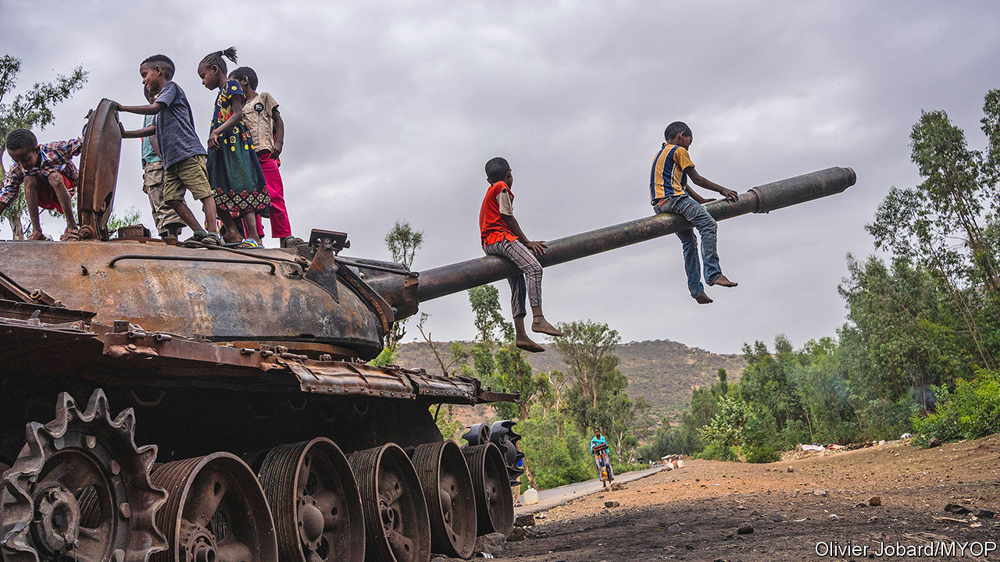
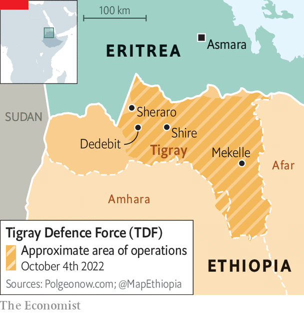

###### Dashed hope

# Eritrea has called up thousands of reservists to fight in Tigray 

##### The escalation complicates efforts to end Ethiopia’s senseless civil war 

 

> Oct 6th 2022 

For years he counted himself lucky. Tekle (whose name we have changed for his safety) had gone through his training in the Eritrean army and learned how to handle a gun. Then he was released, unlike most of his classmates who had been conscripted for indefinite national service in the army or in virtual slavery for the state. Many others fled the country. Tekle stayed put, one of the few people allowed to run a private business in Eritrea’s capital, Asmara. He kept his head down.

But Tekle’s luck ran out in September when Eritrea’s dictator, Issaias Afwerki, called up reservists aged 40-65 to fight against Tigray, a rebel region of next-door Ethiopia. Probably tens of thousands have already been sent into battle there. “Nobody wants to fight,” he says in resignation. “But life is not fair sometimes.” 

Eritrea’s mobilisation marks a new chapter in Ethiopia’s bloody civil war, now about to enter its third year. It dashes hopes of a peace deal between the Tigrayan People’s Liberation Front (tplf), which runs Tigray, and Abiy Ahmed, Ethiopia’s prime minister. The needless conflict, which pits the tplf’s self-styled Tigray Defence Force (tdf) against Ethiopian federal forces backed by allied militias and Eritrean troops, has taken thousands of lives since a five-month truce ended in August. Millions of civilians in Tigray are under blockade. Hundreds of thousands may be starving. Almost no food or medicine has come in since the fighting resumed. 

 


It is hard to gauge the full extent of the suffering or to assess independently what is happening on the front, because the government has blocked telecommunications across Tigray and prevents journalists from travelling there. Yet it is clear that Eritrean troops are fighting alongside Ethiopian ones in several places. The most significant of these is in the north-west of Tigray near the towns of Sheraro and Dedebit, the symbolic home of the tplf, which began there as a guerrilla movement in the 1970s (see map). Eritrean forces have also been shelling Tigray at various other points and have reportedly tried to attack Tigray’s capital, Mekelle, from the east via the Afar region.

The tdf claims to have inflicted huge losses on Ethiopian forces at Dedebit and to have halted an offensive towards the strategic town of Shire. “We’re starting to see the light at the end of the tunnel,” says Mulugeta Gebriwot, a former tplf leader currently in Mekelle. “They’re losing division after division on the north-western front.” On September 28th the tdf also claimed to have wiped out five mechanised Eritrean divisions in Afar. This seems unlikely since Eritrea has not got much armour—unless it has recently been resupplied from abroad.

The tdf’s claims are also hard to square with its recent setbacks. Eritrean troops have captured Sheraro, though Tigrayan sources say they are planning a counter-attack. On October 3rd the TDF said it was retreating from the Amhara region to free up troops needed elsewhere. Overall, the TDF appears to be holding its ground on most fronts, reckons a Western diplomat. “But I can’t imagine they’re not going to face supply issues soon,” he added.

The Tigrayans hope to bleed Ethiopia dry. “The war will stop when they don’t have numbers to fight,” says Mulugeta. Yet even without the thousands of conscripts being sent from Eritrea by Issaias, Ethiopia has no shortage of potential troops. After all, it has a population of about 110m people to Tigray’s 6m. It has better equipment, including armed drones, which it uses to attack tdf supplies and heavy weapons (as well as civilians, from time to time). And it has allies, such as Turkey and the United Arab Emirates, which may be willing to resupply and re-equip it. 

“We are very bullish,” says an official in Ethiopia’s ruling party in Addis Ababa, Ethiopia’s capital. At secret peace talks in Djibouti in September Ethiopia rejected a tplf offer of a “cessation of hostilities” in exchange for lifting the blockade and returning land. The government’s plan, suggests the official, is rather to capture Mekelle and install a friendly administration there—an ominous prospect, given that its previous failed attempt to do this involved large-scale looting, murder and rape. 

Tigray’s gambit seems to be to try to push across to the border with Sudan by recapturing territory it lost at the start of the war. “We will definitely take western Tigray,” says Getachew Reda, the TPLF’s spokesman. Doing so would open up a supply route to ease the blockade and possibly force Abiy back to the negotiating table. 

Much would then depend on how Sudan responds. Since the Sudanese junta is not on good terms with Abiy’s government, the Sudanese army has been providing covert assistance to Tigray, for instance by letting a tdf unit organise and train inside Sudan. But overt intervention by Sudan could draw it into confrontation with both Ethiopia, which Sudan accuses of wanting to grab some of its territory, and Eritrea, which has a history of supporting Sudanese rebel groups. “The question is: will the Sudanese actively engage?” asks a European diplomat. 

Abiy’s government has agreed to meet the tplf in peace talks organised by the African Union. Both ought to want a deal. Tigray is starving. Ethiopia’s economy is tanking and public support for the war is dwindling. Inflation is close to 30% and sources close to the central bank reckon that Ethiopia’s foreign reserves cover just three weeks’ worth of imports. “Business is slowing,” sighs a bank manager in Addis Ababa. “The TPLF and the government need to stop the war and negotiate.” 

Yet Eritrea’s Issaias, who was not invited to the talks, may try to spoil any peace deal before it is reached, since he sees the tplf as a threat to his own rule. Moreover, his paranoia is kindled by the tplf‘s hints that it may indeed march on Asmara to topple him. “As long as both Issaias and the TPLF are in power, the war will not stop,” says the hapless Tekle, now miserably waiting to be ordered to the front. ■

