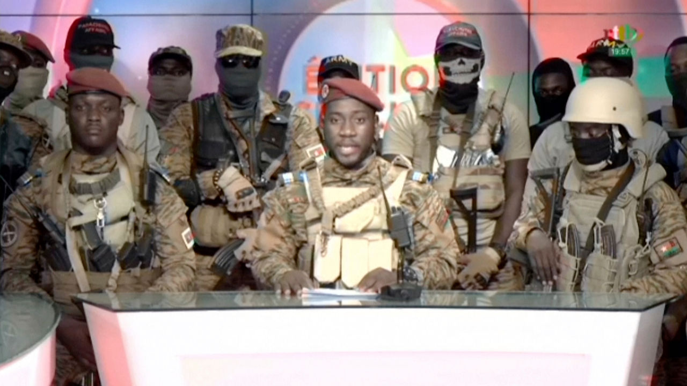
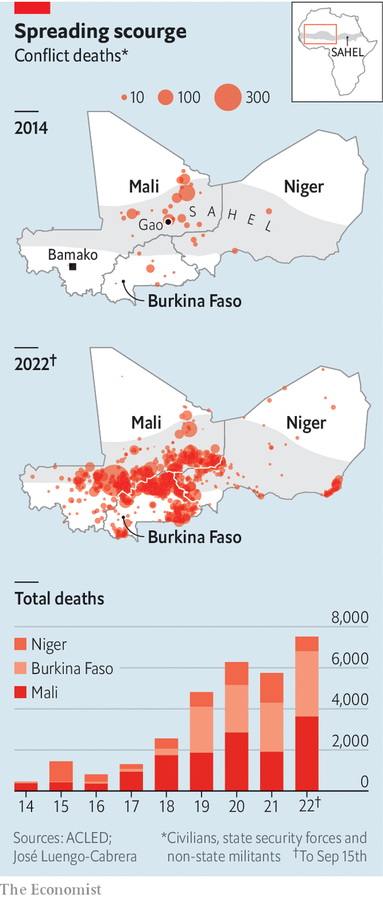

###### Not a chance in Sahel

# For the second time this year, soldiers stage a coup in Burkina Faso 

##### Jihadists are wreaking havoc. More army infighting will not help 

 

> Oct 1st 2022 

At first glance the images of soldiers in a television studio on September 30th, some of them masked and bristling with guns, were almost indistinguishable from those broadcast in Burkina Faso in January, when the army overthrew Roch Kaboré, the elected president. Yet this was a different coup. Eight months ago the leader of the first Burkinabé putsch of 2022, Lieutenant-Colonel Paul-Henri Sandaogo Damiba, sought to justify it by saying that the government was failing to defeat jihadists who had overrun much of the country. This time Captain Ibrahim Traoré used much the same reasoning. 

Burkina Faso is, indeed, struggling badly in its fight against jihadists loosely affiliated to al-Qaeda and Islamic State. By mid-September over 3,100 people had been killed in the fighting this year, a third more than in all of last year. Nearly 2m people have been forced from their homes overall. Yet the two coups seem to be setting Burkina Faso on a similar path to that of its neighbour, Mali, which is teetering on the edge of chaos and is shunned by others in the region after coups in 2020 and 2021.

 


Colonel Damiba, an experienced officer, had raised expectations that he could make the country safer. Instead, the army has floundered. Soldiers complain of inadequate kit and support. Jama’at Nasr al-Islam wal Muslimin (jnim), an al-Qaeda offshoot, controls large swathes of territory, including towns such as Solenzo in western Burkina Faso, says Héni Nsaibia of Menastream, a risk consultancy. Perhaps reflecting the army’s divisions, on September 12th Colonel Damiba sacked his defence minister and took the role himself. Two weeks later a 150-truck convoy carrying supplies was wiped out by jihadists.

During the coup troops surged onto the streets of Ouagadougou, the capital, firing their weapons, even as the army was supposed to be conducting a big anti-jihadist operation. Soldiers who spend their time scheming presumably have little left for stopping terrorists.

The coup is likely to deepen Burkina Faso’s isolation from democratic neighbours such as Ivory Coast and Niger, whose help the country desperately needs to police its porous borders. Colonel Damiba had agreed only in July with the Economic Community of West African States (ecowas), a regional bloc, to return Burkina Faso to civilian rule in March 2024. That deadline will surely be missed.

The latest putschists tried to justify their act by lambasting “red tape”—hardly a reason to storm the national broadcaster. They also claimed Colonel Damiba had failed to bring security. Yet eight months is barely enough time to organise a wedding, let alone end an insurgency. This was Burkina Faso’s 11th coup or attempted coup since 1946. Few have brought stability.

The coup raises questions over the future of for Burkina Faso’s military co-operation with France, which has a special-forces base on the edge of Ouagadougou and worked closely with Colonel Damiba. After the coup, protesters attacked the French embassy amid accusations that France was harbouring the colonel, who appeared in Togo days later. Captain Traoré may well turn from France to Russia (he says he will call in any power that is “willing to help”). Some putschist soldiers waved Russian flags. The captain should think twice. In Mali, where Russian mercenaries from Wagner Group have replaced French forces, security has grown worse. Russian gunmen have been accused of involvement in atrocities. 

Before the coup, Colonel Damiba was trying to hold peace talks with jihadist groups, with the aim of demobilising rebel fighters. Captain Traoré emphasises fighting over talking: he thinks the army should be reorganised for “counter-offensives”. He criticised the “political adventures” of his predecessor, whose “risky choices” had weakened Burkina Faso’s security system.

ecowas declared the coup “inopportune”. More candidly put, it is the latest grim sign that jihadists are winning both on and off the battlefield in the Sahel, and that Burkinabés will continue to suffer. ■

