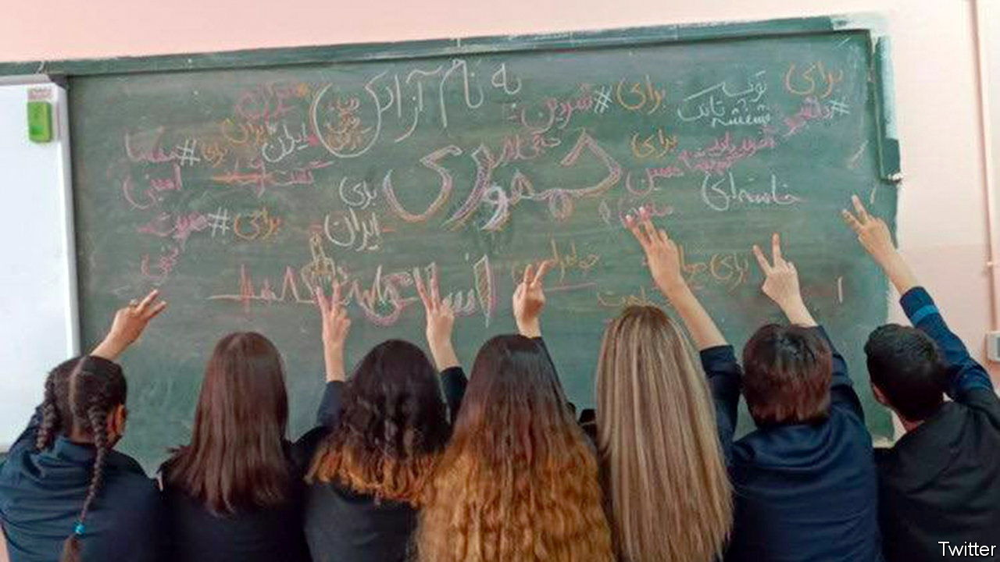

###### An anti-ayatollah anthem

# Iran’s repressive regime is being rocked by a song 

##### “Baraye” lists 28 reasons why clerical rule is uncool 

 

> Oct 6th 2022 

The protests against the shah of Iran were in their infancy in the autumn of 1978 when Mohammad-Reza Shajarian, a famous singer, stirred the hearts of millions with a song called “Jaleh Khoon Shod” (“The dew turned to blood”). It became an anthem of the revolution that soon toppled the monarch. “Bring down the reign of madness,” he crooned.

Nowadays a new chant is catching on. Shervin Hajipour’s song, “Baraye”, meaning “for”, is no more than a string of tweets. Inspired by the death of an “improperly veiled” 22-year-old Kurdish woman in the custody of the religious police three weeks ago, each tweet gives a reason why people should rebel—“for dancing in the streets”, “for our fear when kissing”, “for my sister, for your sister, for our sisters”. 

The songster chants a litany of 28 grievances, ranging from the degradation of Iran’s environment, to poverty and repression. In essence, his song is a cry for Iran to become a normal country.

Mr Hajipour puts the blame for Iran’s ills squarely on the clerics. “For all their meaningless slogans,” he laments. “For the girl who wishes she’d been born a boy.” His lyrics chime with a society, long alienated from theocratic rule, that has become increasingly secular.

Few had heard of Mr Hajipour before. He studied economics at a provincial university on the Caspian Sea. By the time of his arrest on September 29th, less than 48 hours after he had put his song on Instagram, it had been heard 40m times. His jailers made him remove it but it was already beyond their control.

Women sing it in the face of riot police who come to club them. Schoolgirls chant it in classrooms and write its lyrics on their whiteboards. Commuters play it on their car stereos in the morning rush hour and blare it out through the night from their housing estates after work. Iranian exiles sing it as they march through the streets of cities in Europe and elsewhere.

Beatings, arrests and shootings have failed to silence the anthem. It has helped turn the anger that swelled at the excesses of the morality police into a nationwide demand for regime change. Since the reopening of universities on October 1st, campuses have also resounded to cries of “death to the dictator”, often led by women. 

The authorities seem to be dithering, as they did in the last months of the shah. They have jailed hundreds yet have freed Mr Hajipour on bail. Meanwhile, his song fills the campuses, streets and airwaves. And after four decades of mandatory veiling, women are still defiantly walking bareheaded past the police.■

